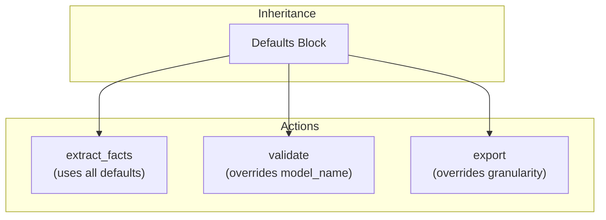

# Defaults

What happens when you have 20 actions that all use the same model? Do you really need to specify `model_vendor: openai` twenty times? The defaults block solves this problem—it defines configuration values inherited by all actions in an agentic workflow. Actions can override any default value, enabling DRY (Don't Repeat Yourself) configuration.

Think of defaults like CSS inheritance: you set base styles on a parent element, and children inherit them unless they explicitly override.

## Overview

Let's explore what defaults provide:

- **Reduced repetition** - Set common values once
- **Consistency** - Ensure all actions share base configuration
- **Flexibility** - Override specific values per-action
- **Maintainability** - Change shared config in one place

## Syntax

```yaml
defaults:
  model_vendor: openai
  model_name: gpt-4o-mini
  json_mode: true
  granularity: record
  run_mode: batch

actions:
  - name: action_using_defaults
    prompt: "..."  # Inherits all defaults

  - name: action_with_override
    model_name: gpt-4  # Override just this value
    prompt: "..."
```

## Defaultable Fields

| Field | Type | Description |
|-------|------|-------------|
| `model_vendor` | string | LLM provider (openai, anthropic, etc.) |
| `model_name` | string | Model identifier |
| `json_mode` | boolean | Enable JSON output mode (see [Non-JSON Mode](../../guides/non-json-mode.md)) |
| `output_field` | string | Field name for plain-text output when `json_mode: false` (default: `raw_response`) |
| `granularity` | string | `record` or `file` processing |
| `run_mode` | string | `batch` or `online` execution |
| `context_scope` | object | Default context visibility: `observe`, `drop`, `passthrough`, `seed_path` |
| `temperature` | float | LLM temperature (0.0-2.0) |
| `max_tokens` | integer | Maximum response tokens |
| `top_p` | float | Top-p (nucleus) sampling (0.0-1.0) |
| `stop` | string/list | Stop sequence(s) to end generation |
| `record_limit` | integer | Max records per file (default: unlimited) |
| `file_limit` | integer | Max files to walk per action (default: unlimited) |
| `enable_prompt_caching` | boolean | Enable Anthropic prompt caching to reduce costs on repeated prompts (default: `false`) |

:::note Schema vs Runtime
The `DefaultsConfig` schema defines only the core defaultable fields above. Additional fields like `api_key`, `context_scope`, `is_operational`, and `prompt_debug` are resolved at runtime through configuration merging and may not be explicitly defined in the defaults schema.
:::

## Example

```yaml
defaults:
  json_mode: true
  granularity: record
  run_mode: batch
  model_vendor: openai
  model_name: gpt-4o-mini

actions:
  - name: extract_facts
    prompt: $my_workflow.Fact_extraction
    schema: candidate_facts_list
    # Inherits: model_vendor, model_name, json_mode, granularity, run_mode

  - name: score_question_quality
    model_vendor: anthropic
    model_name: claude-sonnet-4-20250514
    # Overrides model settings, inherits everything else
```

## Inheritance Rules

The following diagram shows how defaults flow to actions. Notice that each action can selectively override specific fields while inheriting everything else:



This means you can have one action using Claude while others use GPT-4, all inheriting the same execution settings.

### Resolution Order

1. Action-specific value (if defined)
2. Workflow defaults value (if defined)
3. System default (built-in fallback)

```yaml
defaults:
  model_name: gpt-4o-mini  # Workflow default

actions:
  - name: standard_action
    # Uses: gpt-4o-mini (from defaults)

  - name: premium_action
    model_name: gpt-4  # Override: uses gpt-4
```

## Context Scope Defaults

Here's where it gets interesting. The `context_scope` in defaults applies to all actions, which is particularly useful for seed data that multiple actions need:

```yaml
defaults:
  context_scope:
    seed_path:
      syllabus: $file:exam_syllabus.json
      rubric: $file:grading_rubric.yaml

actions:
  - name: extract_facts
    # Has access to seed.syllabus and seed.rubric
    prompt: |
      Using syllabus: {{ seed.syllabus.exam_name }}
      Extract facts from: {{ source.content }}

  - name: score_quality
    # Also has access to same seed data
    context_scope:
      observe:
        - extract_facts.facts  # Add action-specific scope
    # seed_path is merged with defaults
```

### Context Scope Merging

You might wonder what happens when an action defines its own context_scope. Action context_scope is **merged** with defaults (not replaced)—this is different from how most fields work:

```yaml
defaults:
  context_scope:
    seed_path:
      config: $file:config.json

actions:
  - name: my_action
    context_scope:
      observe:
        - upstream.field
      passthrough:
        - source.id
    # Result: seed_path from defaults + observe/passthrough from action
```

## Overriding Patterns

### Override Single Field

```yaml
defaults:
  model_vendor: openai
  model_name: gpt-4o-mini

actions:
  - name: complex_task
    model_name: gpt-4  # Only override model_name
    # Still uses openai vendor from defaults
```

### Override Multiple Fields

```yaml
defaults:
  model_vendor: openai
  model_name: gpt-4o-mini
  run_mode: batch

actions:
  - name: interactive_task
    model_vendor: anthropic
    model_name: claude-sonnet-4-20250514
    run_mode: online
    # Overrides all three
```

### Conditional Override

```yaml
defaults:
  granularity: record

actions:
  - name: per_item_process
    # Uses record from defaults

  - name: aggregate_results
    granularity: file  # Override for aggregation
    dependencies: per_item_process  # Input source
```

## Tool Actions and Defaults

Tool actions inherit relevant defaults, but some fields like `run_mode` don't apply to tools since they don't make LLM calls:

```yaml
defaults:
  granularity: record
  run_mode: batch

actions:
  - name: validate_data
    kind: tool
    impl: validate_function
    # Inherits granularity: record
    # run_mode doesn't apply to tools

  - name: aggregate_data
    kind: tool
    impl: aggregate_function
    granularity: file  # Override for this tool
```

## Best Practices

Let's walk through some patterns for effective defaults configuration.

### 1. Set Common Model Configuration

```yaml
# Good: Centralize model settings
defaults:
  model_vendor: openai
  model_name: gpt-4o-mini
  api_key: OPENAI_API_KEY

# Avoid: Repeating in every action
actions:
  - name: action1
    model_vendor: openai  # Repetitive
    model_name: gpt-4o-mini
```

### 2. Use Defaults for Consistency

```yaml
# Good: Ensure consistent settings
defaults:
  json_mode: true
  granularity: record
  run_mode: batch

# All actions will use these unless explicitly overridden
```

### 3. Document Overrides

```yaml
actions:
  - name: premium_analysis
    model_name: gpt-4  # Override: complex task needs better model
    intent: "Deep analysis requiring GPT-4 capabilities"
```

### 4. Group Related Defaults

```yaml
defaults:
  # Model configuration
  model_vendor: openai
  model_name: gpt-4o-mini

  # Generation parameters
  temperature: 0.7
  max_tokens: 2000

  # Processing configuration
  json_mode: true
  granularity: record
  run_mode: batch
```

### 5. Set Generation Parameters at Defaults Level

Generation parameters like `temperature`, `max_tokens`, `top_p`, and `stop` follow the same inheritance rules. Set sensible defaults and override per-action:

```yaml
defaults:
  temperature: 0.7
  max_tokens: 2000

actions:
  - name: creative_writing
    temperature: 0.9  # Override: more creative
    max_tokens: 4000  # Override: longer output

  - name: classification
    temperature: 0.1  # Override: more deterministic
    stop: ["\n"]      # Stop at newline
```

### 6. Use Limits for Test Runs

Cap processing to validate pipelines quickly before committing to full data:

```yaml
# testing config
defaults:
  record_limit: 10    # Process only 10 records per file
  file_limit: 3       # Walk only 3 files per action

# production config — remove limits
defaults:
  # record_limit and file_limit omitted = unlimited
```

`record_limit` applies at any action — start nodes, mid-pipeline, or leaf actions. Use it to test a single downstream action without re-running the full pipeline. `file_limit` applies at all stages. If you change limits between runs, actions automatically re-execute instead of being skipped.

### 7. Environment-Specific Defaults

Create separate config files for different environments:

```yaml
# development.yml
defaults:
  run_mode: online
  model_name: gpt-4o-mini

# production.yml
defaults:
  run_mode: batch
  model_name: gpt-4
```

## Validation

**How does Agent Actions catch configuration errors?** It validates that:

1. Default field names are recognized
2. Default values are valid types
3. Required fields are present (either in defaults or actions)

### Missing Required Field

```
ConfigurationError: Action 'my_action' missing required field 'prompt'
  Neither defaults nor action defines this field.
```

### Invalid Default Value

```
ConfigurationError: Invalid value for 'granularity': 'invalid'
  Expected: 'record' or 'file'
```

:::tip
Run `agac run -a my_workflow` to validate and execute your workflow — configuration errors are caught automatically before any LLM calls.
:::

## See Also

- [Configuration](./) - Complete configuration reference
- [Templates](./templates) - Template-based configuration
- [Run Modes](../execution/run-modes) - Batch vs online execution
- [Granularity](../execution/granularity) - Record vs file processing
