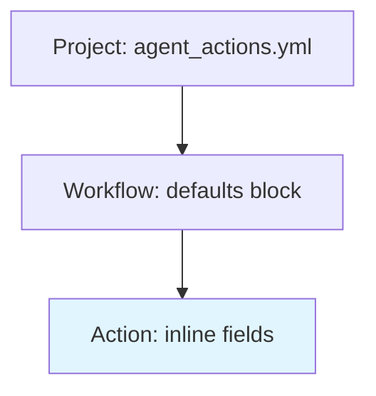

# Configuration

How do you configure an agentic workflow without repeating yourself across dozens of actions? Agent Actions uses a three-level configuration hierarchy that lets you set defaults once and override them where needed. Higher specificity wins—action settings override agentic workflow defaults, which override project defaults.

Think of it like CSS specificity: project settings are the base styles, agentic workflow defaults are class-level overrides, and action-specific settings are inline styles that take precedence.

The diagram below shows how configuration cascades from project-level down to individual actions:



Notice that the most specific level (action inline fields) has final say. This means you can establish sensible defaults project-wide but still customize individual actions when needed.

## Project Configuration

The `agent_actions.yml` file in your project root defines global settings:

```yaml
# agent_actions.yml
default_agent_config:
  api_key: OPENAI_API_KEY
  model_name: gpt-4o-mini
  model_vendor: openai

schema_path: schema
tool_path: ["tools"]
seed_data_path: seed_data

chunk_config:
  chunk_size: 4000
  overlap: 500

output_storage:
  backend: sqlite
  db_path: ./agent_io/outputs.db
```

| Field | Description |
|-------|-------------|
| `default_agent_config` | Default settings inherited by all actions |
| `schema_path` | Directory containing output schemas (default: `schema`) |
| `tool_path` | Directories to scan for custom tools |
| `seed_data_path` | Directory for static reference data (default: `seed_data`) |
| `chunk_config` | Text chunking for large inputs |
| `output_storage` | Storage backend config: `backend` (`sqlite`), `db_path` (database file location) |

## Agentic Workflow Configuration

Each agentic workflow YAML file defines defaults and actions. Let's explore how an agentic workflow brings together model settings, execution modes, and action definitions:

```yaml
# agent_config/my_workflow.yml
name: my_workflow
description: "Extract and validate facts"
# version: "1.0.0"  # Optional — for your own bookkeeping

defaults:
  model_vendor: openai
  model_name: gpt-4o-mini
  json_mode: true
  granularity: Record
  run_mode: batch

actions:
  - name: extract_facts
    prompt: $prompts.extract_facts
    schema: facts_schema
```

See [Defaults](./defaults.md) for the complete inheritance system.

## Action Configuration

Each action can override any default. Consider what happens when you need one action to use a different model or run in a different mode—you simply specify those fields on the action itself:

```yaml
actions:
  - name: extract_facts
    intent: "Extract key facts from content"
    dependencies: prior_action  # Input source

    # Model
    model_vendor: openai
    model_name: gpt-4o-mini

    # Prompt & Schema
    prompt: $prompts.extract_facts
    schema: facts_schema
    json_mode: true

    # Execution
    run_mode: batch
    granularity: Record

    # Conditional
    guard:
      condition: "source.content != ''"
      on_false: filter
```

### Core Action Fields

| Field | Type | Description |
|-------|------|-------------|
| `name` | string | Unique action identifier |
| `intent` | string | Human-readable description |
| `kind` | string | `llm` (default) or `tool` |
| `dependencies` | list | Upstream actions to wait for |
| `prompt` | string | Inline prompt or `$store.template` reference |
| `schema` | string | Output validation schema |
| `context_scope` | object | Control data visibility: `observe`, `drop`, `passthrough`, `seed_path` — see [Context Scope](../context/context-scope.md) |
| `data_source` | object/string | Optional input source configuration for start-node actions (defaults to `staging/`) |

### Model Fields

| Field | Type | Description |
|-------|------|-------------|
| `model_vendor` | string | Provider: openai, anthropic, google, groq, mistral, cohere, ollama |
| `model_name` | string | Model identifier (e.g., gpt-4o-mini) |
| `api_key` | string | Environment variable name for API key |
| `temperature` | float | LLM temperature (0.0-2.0) |
| `max_tokens` | integer | Maximum response tokens |
| `top_p` | float | Top-p (nucleus) sampling (0.0-1.0) |
| `stop` | string/list | Stop sequence(s) to end generation |

:::note Vendor-Specific Parameter Mapping
Generation parameters (`temperature`, `max_tokens`, `top_p`, `stop`) are mapped to vendor-specific API keys automatically:
- **OpenAI / Groq / Mistral**: Parameters passed through as-is. OpenAI and Groq also support `frequency_penalty` and `presence_penalty`.
- **Anthropic**: `stop` → `stop_sequences` (string values are wrapped in a list)
- **Gemini**: `max_tokens` → `max_output_tokens`, `stop` → `stop_sequences`
- **Cohere**: `top_p` → `p`, `stop` → `stop_sequences`
- **Ollama**: `max_tokens` → `num_predict`, parameters placed in `options` dict. `stop` strings are wrapped in a list.
:::

### Execution Fields

| Field | Type | Description |
|-------|------|-------------|
| `run_mode` | string | `online` or `batch` — see [Run Modes](../execution/run-modes.md) |
| `granularity` | string | `record` or `file` — see [Granularity](../execution/granularity.md) |
| `guard` | object | Conditional execution — see [Guards](../execution/guards.md) |
| `is_operational` | boolean | Enable/disable action (default: true) |
| `policy` | string | Execution policy |
| `idempotency_key` | string | Template for idempotency key |
| `retry` | object | Retry configuration for transport-layer failures |

:::note Granularity Constraints
- **File granularity** is only supported for tool actions (`kind: tool`)
- **Guards** are not supported with File granularity
:::

### Input Source

Start-node actions can override the default `staging/` input with a local folder and optional file-type filter:

```yaml
actions:
  - name: extract_facts
    data_source:
      type: local
      folder: ./data
      file_type: json
```

### Validation Fields

| Field | Type | Description |
|-------|------|-------------|
| `json_mode` | boolean | Enable structured JSON output |
| `reprompt` | object/false | Reprompt configuration for validation failures (see [Reprompting](../validation/reprompting.md)) |

### Tool Action Fields

| Field | Type | Description |
|-------|------|-------------|
| `impl` | string | Python function name (required for `kind: tool`) |

Tool actions support both `Record` and `File` granularity. File granularity allows the tool to process all records at once, enabling operations like deduplication, aggregation, and batch exports.

## Vendor Support

| Vendor | `model_vendor` | Batch API | Example Models |
|--------|----------------|-----------|----------------|
| OpenAI | `openai` | ✅ | gpt-4o, gpt-4o-mini |
| Anthropic | `anthropic` | ✅ | claude-sonnet-4-20250514 |
| Google | `google` | ✅ | gemini-2.0-flash |
| Groq | `groq` | ✅ | llama-3.3-70b-versatile |
| Mistral | `mistral` | ✅ | mistral-large-latest |
| Cohere | `cohere` | ❌ | command-r-plus |
| Ollama | `ollama` | ✅ | llama3, mistral |

## Environment Variables

You might wonder why API keys are specified as variable names rather than values. Agent Actions references environment variables by name, keeping secrets out of your configuration files:

```yaml
api_key: OPENAI_API_KEY  # Uses $OPENAI_API_KEY from environment
```

### API Keys

| Variable | Provider |
|----------|----------|
| `OPENAI_API_KEY` | OpenAI |
| `ANTHROPIC_API_KEY` | Anthropic |
| `GOOGLE_API_KEY` | Google Gemini |
| `GROQ_API_KEY` | Groq |
| `MISTRAL_API_KEY` | Mistral |
| `OLLAMA_HOST` | Ollama (default: `http://localhost:11434`) |

### Runtime Variables

| Variable | Default | Description |
|----------|---------|-------------|
| `AGENT_ACTIONS_LOG_LEVEL` | INFO | Log level (DEBUG, INFO, WARNING, ERROR) |
| `AGENT_ACTIONS_DEBUG` | 0 | Enable debug mode |

## Directory Structure

Here's where it gets interesting: Agent Actions uses a two-level structure—**project-level** assets shared across workflows, and **workflow-level** assets specific to each domain:

```
project/
├── agent_actions.yml           # Project config
│
├── # ════════════════════════════════════════════════════════
├── # PROJECT-LEVEL (shared across all workflows)
├── # ════════════════════════════════════════════════════════
├── schema/                     # Output schemas (project-level only)
├── tools/                      # Custom tools (shared)
├── prompt_store/               # Shared prompt templates (optional)
│
├── # ════════════════════════════════════════════════════════
├── # WORKFLOW-LEVEL (domain-specific)
├── # ════════════════════════════════════════════════════════
└── agent_workflow/
    └── my_workflow/
        ├── agent_config/
        │   └── my_workflow.yml # Agentic workflow definition
        ├── agent_io/
        │   ├── staging/        # Input data (starting point)
        │   ├── source/         # Metadata tracking
        │   └── target/         # Output data
        ├── seed_data/          # Static reference data (workflow-level)
        └── prompt_store/       # Domain-specific prompts (optional)
```

### Asset Location Summary

| Asset | Project Level | Workflow Level | Notes |
|-------|--------------|----------------|-------|
| **Schemas** | `schema/` | — | Always project-level; shared across workflows |
| **Tools** | `tools/` | — | Always project-level; shared across workflows |
| **Prompts** | `prompt_store/` | `workflow/prompt_store/` | Either or both; searched recursively |
| **Seed Data** | — | `workflow/seed_data/` | Always workflow-level; domain-specific |
| **Input/Output** | — | `workflow/agent_io/` | Always workflow-level |

This structure keeps your agentic workflows organized while enabling reuse. Shared schemas ensure consistent data contracts; workflow-level seed data enables domain customization without touching shared assets.

## See Also

- [Defaults](./defaults.md) — Configuration inheritance system
- [Templates](./templates.md) — Template-based configuration
- [Run Modes](../execution/run-modes.md) — Batch vs online execution
- [Granularity](../execution/granularity.md) — Record vs file processing
- [Workflow Dependencies](../execution/workflow-dependencies.md) — Cross-agentic-workflow orchestration
