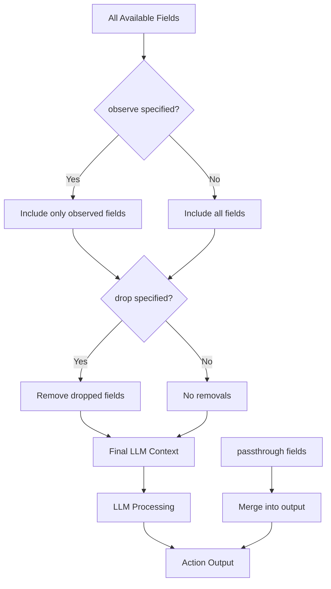

# Context Scope

What happens when an upstream action produces 20 fields, but the LLM only needs 3 of them? Context Scope controls the visibility and flow of data between actions. It provides fine-grained control over what data the LLM sees in its context, what data passes through to the output, and what data is explicitly excluded.

Think of context scope like a filter on a camera: it lets you control exactly what's in frame. This matters because LLMs have token limits—not all upstream data should be included, and irrelevant context can actually hurt response quality.

## Overview

The context scope system addresses three key challenges:

1. **Context Management** - LLMs have token limits; not all upstream data should be included
2. **Data Flow Control** - Some fields should pass through without LLM processing
3. **Noise Reduction** - Exclude irrelevant fields to improve LLM focus

## Directives

| Directive | Purpose | In LLM Context | In Output |
|-----------|---------|----------------|-----------|
| `observe` | Include specific fields in LLM context | Yes | No |
| `drop` | Exclude specific fields from context | No | No |
| `passthrough` | Forward fields directly to output | No | Yes |

## Syntax

```yaml
context_scope:
  observe:
    - upstream_action.field_name
    - another_action.nested.field
  drop:
    - source.unused_field
    - upstream_action.internal_field
  passthrough:
    - upstream_action.preserve_this
    - source.metadata
```

## Observe Directive

The `observe` directive explicitly includes fields in the LLM context. When specified, only listed fields are visible to the LLM.

Here's where it gets interesting: using `observe` is like putting blinders on the LLM. It can only see what you explicitly list, which helps focus its attention and reduces token usage.

### Use Cases

- Focus LLM attention on specific upstream outputs
- Reduce context size by selecting only relevant fields
- Ensure consistent data visibility across agentic workflow versions

### Example from qanalabs

```yaml
- name: Cluster_Validation_Agent
  dependencies: [group_by_similarity, cluster_list]  # Merge pattern
  context_scope:
    observe:
      - canonicalize_facts.candidate_facts_list
      - cluster_list.semantic_unique_id
      - group_by_similarity.num_similar_facts
      - group_by_similarity.similarity_group_id
```

The LLM sees only these four specific fields, even though upstream actions may produce many more.

### Observe with Source Data

Include source (input) data fields:

```yaml
- name: generate_summary
  context_scope:
    observe:
      - source.page_content      # Original input text
      - flatten_clusters.cluster_name
```

## Drop Directive

The `drop` directive explicitly excludes fields from the LLM context. All other fields are included unless `observe` is also specified.

### Use Cases

- Remove noisy or irrelevant fields
- Exclude internal/debugging fields
- Hide sensitive data from LLM processing

### Example from qanalabs

```yaml
- name: fact_extractor
  context_scope:
    drop:
      - source.syllabus    # Reference data not needed for extraction
      - source.url         # URL not relevant to fact extraction
```

### Combining Drop with Other Actions

```yaml
- name: generate_scenarios
  context_scope:
    observe:
      - generate_summary.summary
    drop:
      - filter_low_quality_summaries.quality_score
      - filter_low_quality_summaries.quality_tier
      - filter_low_quality_summaries.score_breakdown
      - filter_low_quality_summaries.filter_decision
```

## Passthrough Directive

You might wonder how to preserve data for downstream actions without cluttering the LLM's context. The `passthrough` directive forwards fields directly to the action output **without** including them in the LLM context. This preserves data for downstream actions.

Think of passthrough like a bypass valve: data flows around the LLM rather than through it.

### Use Cases

- Preserve metadata for downstream processing
- Forward fields that shouldn't influence current LLM decision
- Maintain data lineage through multi-step agentic workflows

### Example from qanalabs

```yaml
- name: Cluster_Validation_Agent
  context_scope:
    observe:
      - canonicalize_facts.candidate_facts_list
      - cluster_list.semantic_unique_id
    passthrough:
      - group_by_similarity.grouped_facts   # Forward without LLM seeing
```

### Complex Passthrough Chain

In multi-step agentic workflows, passthrough chains data through multiple actions. Consider what happens when you need to preserve question data across several processing steps:

```yaml
- name: score_question_quality
  context_scope:
    observe:
      - source.referenced_in
    passthrough:
      - generate_scenarios.question
      - generate_scenarios.options
      - generate_scenarios.answer
      - generate_scenarios.answer_explanation

- name: suggest_distractor_counts
  dependencies: filter_low_quality_questions  # Input source
  context_scope:
    passthrough:
      - generate_scenarios.question     # Continues from previous
      - generate_scenarios.options
      - generate_scenarios.answer
      - generate_scenarios.answer_explanation
```

## Seed Data

Static reference data can be loaded into context via `seed_data`:

```yaml
defaults:
  context_scope:
    seed_data:
      exam_syllabus: $file:mcp_qanalabs_syllabus.json

actions:
  - name: extract_facts
    prompt: |
      Using syllabus: {{ seed.exam_syllabus.exam_name }}
      Extract facts from: {{ source.page_content }}
```

### Seed Data Syntax

| Syntax | Description |
|--------|-------------|
| `$file:path.json` | Load JSON file from seed_data directory |
| `$file:path.yaml` | Load YAML file from seed_data directory |

See [Seed Data](./seed-data.md) for complete documentation.

## Field Prefix Patterns for Loop Consumption

When consuming outputs from version actions, you need a way to reference all version iterations without explicitly listing each one. Field prefix patterns solve this by matching all fields that start with a specific prefix.

### What Are Field Prefix Patterns?

A field prefix pattern is a reference ending with `_` (underscore) that matches all fields starting with that prefix:

```yaml
context_scope:
  observe:
    - extract_raw_qa_  # Field prefix pattern (note the trailing _)
```

This matches fields like:
- `extract_raw_qa_1_questions`
- `extract_raw_qa_1_confidence`
- `extract_raw_qa_2_questions`
- `extract_raw_qa_2_confidence`
- `extract_raw_qa_3_questions`
- `extract_raw_qa_3_confidence`

### Why Field Prefixing?

Loop consumption merges outputs from multiple iterations. To avoid field name collisions, each iteration's fields are prefixed with the agent name:

```yaml
# Loop action configuration
- name: extract_raw_qa
  versions:
    range: [1, 3]
  # Each iteration produces: {"questions": [...]}
```

Without prefixing, all iterations would have the same field name `questions`, and only the last one would survive. With prefixing:

```json
// Merged output
{
  "extract_raw_qa_1_questions": ["Q1a", "Q1b"],
  "extract_raw_qa_2_questions": ["Q2a", "Q2b"],
  "extract_raw_qa_3_questions": ["Q3a", "Q3b"]
}
```

### Usage with Loop Consumption

When configuring version consumption, use wildcard references which automatically expand to field prefix patterns:

```yaml
- name: extract_raw_qa
  versions:
    range: [1, 3]
  json_output_schema:
    type: object
    properties:
      questions:
        type: array

- name: flatten_questions
  dependencies: [extract_raw_qa]  # References loop base name
  version_consumption:
    source: extract_raw_qa
    pattern: merge
  context_scope:
    observe:
      - extract_raw_qa.*  # Wildcard reference (user-facing)
      # System expands to: extract_raw_qa_ (field prefix pattern)
      # Matches all: extract_raw_qa_1_*, extract_raw_qa_2_*, extract_raw_qa_3_*
```

### Automatic Expansion

The system automatically converts version references during workflow initialization:

| User Configuration | System Expansion | Matches |
|-------------------|------------------|---------|
| `extract_raw_qa.*` | `extract_raw_qa_` | All fields from all iterations |
| `extract_raw_qa.specific_field` | Unchanged | Only from base action (if exists) |

This happens at the orchestration level before any agent execution, ensuring dependencies and context_scope references are consistent.

### Accessing Prefixed Fields in Prompts

In your prompts, reference the prefixed fields directly:

```yaml
- name: flatten_questions
  prompt: |
    Combine questions from multiple strategies:

    Strategy 1: {{ extract_raw_qa_1_questions }}
    Strategy 2: {{ extract_raw_qa_2_questions }}
    Strategy 3: {{ extract_raw_qa_3_questions }}

    Merge and deduplicate these questions.
```

### Dynamic Field Access

For variable numbers of version iterations, use Jinja2 loops:

```yaml
prompt: |
  Process all extraction strategies:
  
  Strategy {{ i }}:
  Questions: {{ extract_raw_qa_{{i}}_questions | default([]) }}
  Confidence: {{ extract_raw_qa_{{i}}_confidence | default(0) }}
  

  Combine the results.
```

### Mixed Loop and Regular References

You can combine field prefix patterns with regular field references:

```yaml
context_scope:
  observe:
    - extract_raw_qa_      # Field prefix pattern for loop
    - classify_type.category  # Regular field reference
    - source.metadata      # Source data reference
```

### Validation

The system validates that field prefix patterns match actual dependencies:

```yaml
# ❌ Error: No matching version iterations
- name: consumer
  dependencies: [regular_action]  # Not a loop
  context_scope:
    observe:
      - extract_raw_qa_  # No version iterations found!

# ✅ Correct: Loop iterations exist
- name: consumer
  dependencies: [extract_raw_qa]  # Loop expands to _1, _2, _3
  context_scope:
    observe:
      - extract_raw_qa_  # Matches all version iterations
```

## Resolution Order

When multiple directives apply, Agent Actions resolves them in a specific order. The following diagram shows how the different directives interact:



Notice that passthrough fields take a separate path—they never enter the LLM context but join the output after processing.

1. **Observe filter** - If `observe` is specified, start with only those fields
2. **Drop filter** - Remove any fields in `drop` list
3. **Passthrough merge** - After LLM processing, merge passthrough fields into output

## Best Practices

Let's walk through patterns that make context scope effective.

### 1. Use Observe for Focus

When LLM needs only specific fields, use `observe`:

```yaml
# Good: Explicit about what LLM sees
context_scope:
  observe:
    - extract.facts
    - source.title

# Avoid: Including everything when only some fields matter
# (no context_scope specified)
```

### 2. Use Drop for Noise Reduction

When most fields are needed but some aren't:

```yaml
context_scope:
  drop:
    - upstream.debug_info
    - upstream.internal_metrics
```

### 3. Use Passthrough for Data Lineage

Preserve data that downstream actions need:

```yaml
context_scope:
  passthrough:
    - source.record_id      # For tracking
    - extract.timestamp     # For ordering
```

### 4. Combine Directives Strategically

For complex workflows, combine all three:

```yaml
- name: generate_feynman_explanation
  context_scope:
    observe:
      - generate_summary.summary              # LLM needs this
    passthrough:
      - generate_scenarios.question           # Forward to output
      - generate_scenarios.answer
      - source.url                            # Preserve source reference
    drop:
      - reconstruct_options.thinking_process_1  # Internal, not needed
      - reconstruct_options.thinking_process_2
      - reconstruct_options.thinking_process_3
```

## Debugging Context

You might wonder how to verify what context the LLM actually receives. Enable `prompt_debug` to see the rendered context:

```yaml
- name: my_action
  prompt_debug: true
  context_scope:
    observe:
      - upstream.data
```

This outputs the rendered prompt and context to help verify context_scope configuration.

## Error Handling

### Missing Field in Observe

```
ConfigurationError: Field 'nonexistent_action.field' in observe not found
```

Ensure the referenced action exists and produces the specified field.

### Invalid Passthrough Source

```
ConfigurationError: Cannot passthrough from action 'future_action' -
  action is not an upstream dependency
```

You can only passthrough from actions that are dependencies (direct or transitive).

:::tip
Context scope works best when you're intentional about data flow. Start by listing what each action truly needs, then use `observe` to include only those fields.
:::

## Examples from Production Agentic Workflows

### Minimal Context for Focused Task

```yaml
- name: validate_facts
  dependencies: extract_facts  # Input source
  context_scope:
    observe:
      - extract_facts.facts   # Only the facts, nothing else
```

### Rich Passthrough for Final Output

```yaml
- name: format_quiz_text
  dependencies: OptionsCombiner  # Input source
  context_scope:
    passthrough:
      - generate_scenarios.question
      - generate_scenarios.question_type
      - reconstruct_options.options
      - generate_scenarios.answer
      - add_answer_text.answer_text
      - generate_summary.summary
      - source.url
```

### Multi-Vendor with Consistent Context

```yaml
- name: generate_distractor_2
  model_vendor: anthropic
  model_name: claude-3-5-haiku-20241022
  context_scope:
    observe:
      - add_answer_text.answer_text
    passthrough:
      - generate_distractor_1.distractor_1
      - generate_distractor_1.explanation_why_it_is_incorrect_1
```

## See Also

- [Version Actions](../execution/loops) - Loop configuration and consumption patterns
- [Field References](./field-references) - Field reference syntax and validation
- [Seed Data](./seed-data) - Loading static reference data
- [Workflow Dependencies](../execution/workflow-dependencies) - Dependency patterns and resolution
