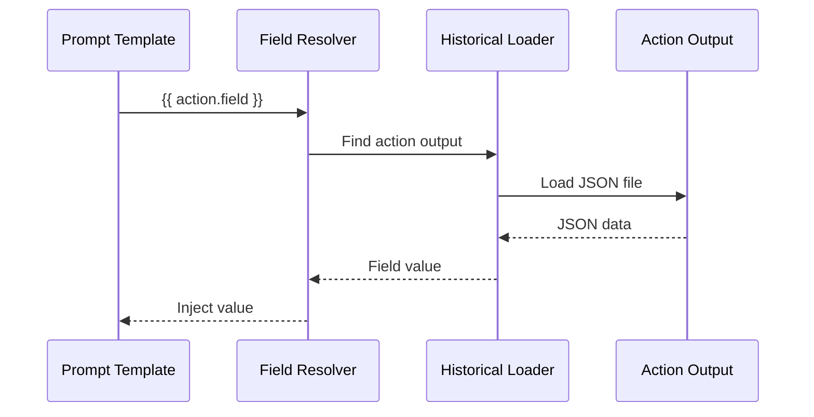

# Field References

How do you access data from an upstream action? Field references are the primary mechanism for this—they work like spreadsheet formulas. When you write `{{ extract_facts.facts }}`, you're pointing to a cell that will be filled in when that action completes.

If you've used dbt, field references will feel familiar. They function similarly to dbt's `ref()` function, creating explicit dependencies and enabling data flow through the agentic workflow DAG.

## Syntax

Agent Actions supports three reference formats:

### Jinja2 Format (Recommended)

```yaml
prompt: |
  Process these facts: {{ extract_facts.candidate_facts_list }}
  Using context: {{ source.page_content }}
```

### Selector Format (Guards and Context Scope)

```yaml
guard:
  condition: "extract_facts.count > 0"
context_scope:
  observe:
    - extract_facts.candidate_facts_list
```

### Template Format (Legacy)

```yaml
prompt: "Found {source.title} with {extract.count} items"
```

## Reference Structure

A field reference consists of:

```
action_name.field_path
```

| Component | Description | Example |
|-----------|-------------|---------|
| `action_name` | Name of the upstream action | `extract_facts` |
| `field_path` | Path to the field (dot-separated for nested) | `response.data.count` |

## Reserved Action Names

Action names cannot use reserved namespaces. The following names are disallowed:

- `action`
- `context_scope`
- `loop`
- `prompt`
- `schema`
- `seed`
- `source`
- `workflow`

### Nested Field Access

Access deeply nested fields with dot notation:

```yaml
# Upstream output:
# {
#   "response": {
#     "data": {
#       "items": [...]
#     }
#   }
# }

prompt: |
  Items: {{ upstream_action.response.data.items }}
```

## Special Sources

### source

The `source` reference accesses the input data for the current record:

```yaml
prompt: |
  Analyze this content: {{ source.page_content }}
  From URL: {{ source.url }}
```

### seed

The `seed` reference accesses static seed data loaded via `context_scope.seed_data`:

```yaml
defaults:
  context_scope:
    seed_data:
      exam_syllabus: $file:syllabus.json

actions:
  - name: extract_facts
    prompt: |
      Extract facts for {{ seed.exam_syllabus.exam_name }}
```

## Resolution Process

You might wonder what happens under the hood when Agent Actions encounters a field reference. Here's the sequence:



Notice that the resolver loads data from disk—this means upstream actions must complete before their outputs can be referenced.

1. **Parse reference** - Extract action name and field path
2. **Locate output** - Find the output file from the referenced action
3. **Load data** - Parse the JSON output
4. **Extract field** - Navigate to the specified field path
5. **Inject value** - Substitute into the template

## Examples from qanalabs

### Basic Field Reference

```yaml
- name: canonicalize_facts
  dependencies: fact_extractor  # Input source (auto-inferred from prompt references)
  prompt: $qanalabs_quiz_gen.Canonicalize_Facts
  # Context dependencies are auto-inferred from {{ field }} references in prompt
```

### Prompt with Multiple References

```yaml
- name: generate_summary
  dependencies: flatten_clusters  # Input source (auto-inferred from prompt references)
  prompt: |
    Grouped Facts: {{ flatten_clusters.grouped_facts }}
    Page Content: {{ source.page_content }}
    Cluster Name: {{ flatten_clusters.cluster_name }}
```

### Guard with Field Reference

```yaml
- name: canonicalize_facts
  dependencies: fact_extractor  # Input source
  guard:
    condition: "candidate_facts_list != []"
    on_false: "filter"
```

### Context Scope with References

```yaml
- name: Cluster_Validation_Agent
  dependencies: [group_by_similarity, cluster_list]  # Merge pattern
  context_scope:
    observe:
      - canonicalize_facts.candidate_facts_list
      - cluster_list.semantic_unique_id
      - group_by_similarity.num_similar_facts
    passthrough:
      - group_by_similarity.grouped_facts
```

### Jinja2 Loops with References

```yaml
prompt: |
  
  **Section**: {{ ref.section_name }}
  **Objective**: {{ ref.objective }}
  
```

## Implicit vs Explicit Dependencies

Consider what happens when you reference a field but forget to declare the dependency explicitly.

### Implicit (via Field Reference)

When you reference `{{ action.field }}` in a prompt, the dependency is implicit:

```yaml
- name: validate
  prompt: |
    Validate: {{ extract.data }}
  # Implicit dependency on 'extract' via field reference
```

Implicit dependencies are not allowed. You must declare dependencies explicitly for every
referenced action.

### Explicit (via dependencies)

Declare dependencies explicitly:

```yaml
- name: validate
  dependencies: extract  # Explicit dependency - required for execution ordering
  prompt: |
    Validate: {{ extract.data }}
```

**Requirement**: Explicit `dependencies` are required for correct execution ordering and
workflow validation. Agent Actions will auto-infer context dependencies from field references
in your prompts, but you must still declare execution dependencies explicitly.

## Error Handling

**How does Agent Actions handle missing dependencies?** When an action references a field that doesn't exist, Agent Actions catches this at configuration time—before any API calls are made. This means you discover typos and wiring errors immediately, not after processing thousands of records.

### Missing Field Reference

If a referenced field doesn't exist:

```
TemplateVariableError: Field 'extract_facts.missing_field' not found
  Available fields: candidate_facts_list, quote, technical_level
```

### Circular Reference

Circular dependencies are detected at pre-flight:

```
WorkflowError: Circular dependency detected: action_a -> action_b -> action_a
```

### Missing Upstream Action

If the referenced action doesn't exist:

```
ConfigurationError: Action 'nonexistent_action' referenced but not defined
```

## Pre-flight Validation

Field references are validated before execution. This is one of Agent Actions' key safety features:

```bash
agac run -a workflow --validate-only
```

Checks performed:
- All referenced actions exist
- All referenced fields are available in upstream schemas
- No circular dependencies
- Type compatibility (with `--static-typing`)

## Best Practices

Let's walk through patterns that make field references reliable and maintainable.

1. **Use explicit dependencies** - Implicit dependencies are invalid and will fail validation
2. **Prefer Jinja2 syntax** - `{{ action.field }}` for prompts
3. **Use selector syntax** - `action.field` for guards and context_scope
4. **Validate early** - Run `--validate-only` before full execution
5. **Document field expectations** - Use schemas to define expected output structure

:::warning
Field references only work for upstream dependencies. You cannot reference fields from actions that run in parallel or downstream—the data simply doesn't exist yet.
:::

## Version Field Prefix Patterns

When working with version actions that produce merged outputs, field names are prefixed with the agent name to avoid collisions. Field prefix patterns enable you to reference all version iteration fields efficiently.

### Prefixed Field Names

Loop consumption creates prefixed fields:

```yaml
# Loop configuration
- name: extract_strategies
  versions:
    range: [1, 3]
  # Each produces: {"facts": [...], "confidence": 0.9}

# Merged output (after version consumption):
# {
#   "extract_strategies_1_facts": [...],
#   "extract_strategies_1_confidence": 0.9,
#   "extract_strategies_2_facts": [...],
#   "extract_strategies_2_confidence": 0.8,
#   "extract_strategies_3_facts": [...],
#   "extract_strategies_3_confidence": 0.7
# }
```

### Referencing Prefixed Fields

Access prefixed fields directly in prompts:

```yaml
- name: analyze_strategies
  prompt: |
    Strategy 1 facts: {{ extract_strategies_1_facts }}
    Strategy 1 confidence: {{ extract_strategies_1_confidence }}

    Strategy 2 facts: {{ extract_strategies_2_facts }}
    Strategy 2 confidence: {{ extract_strategies_2_confidence }}

    Compare and select the best strategy.
```

### Field Prefix Pattern in Context Scope

Use wildcard syntax in context_scope for version consumption:

```yaml
- name: analyze_strategies
  dependencies: [extract_strategies]
  context_scope:
    observe:
      - extract_strategies.*  # Expands to field prefix pattern
```

The system automatically converts `extract_strategies.*` to the field prefix pattern `extract_strategies_`, which matches all prefixed fields from version iterations.

### Dynamic Access with Jinja2

For variable numbers of iterations:

```yaml
prompt: |
  Analyze all strategies:
  
  Strategy {{ i }}:
    Facts: {{ extract_strategies_{{i}}_facts | default([]) }}
    Confidence: {{ extract_strategies_{{i}}_confidence | default(0) }}
  
```

See [Version Actions](../execution/loops) for complete documentation on loop configuration and consumption patterns.

## See Also

- [Version Actions](../execution/loops) - Loop configuration and field prefix patterns
- [Context Scope](./context-scope) - Field visibility and flow control
- [Workflow Dependencies](../execution/workflow-dependencies) - Dependency patterns
