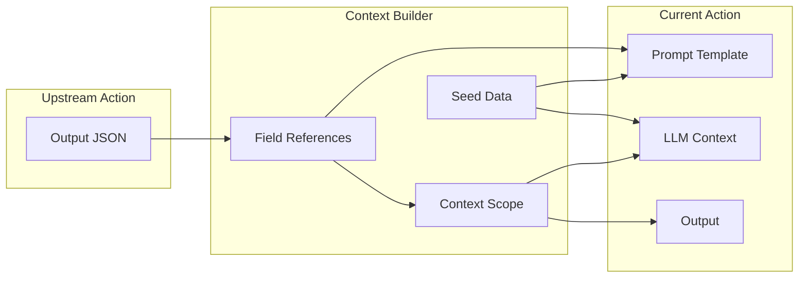

# Context System

How do actions in an agentic workflow share data? The context system controls how data flows between actions. It provides mechanisms to reference upstream outputs, control what data is visible to the LLM, and pass fields through to downstream actions.

Think of it like a relay race: each runner (action) receives a baton (context) from the previous runner, does their work, and passes it forward. The context system lets you control exactly what's in that baton.

## Core Concepts

| Concept | Purpose | Syntax |
|---------|---------|--------|
| **Field References** | Access upstream action outputs | `{{ action.field }}` |
| **Context Scope** | Control data visibility and flow | `context_scope: {observe, drop, passthrough}` |
| **Seed Data** | Load static reference data | `seed_data: {name: $file:path}` |

## Data Flow Model

The following diagram shows how data flows from upstream actions through the context builder into the current action. Notice that seed data joins the flow alongside upstream outputs:

This separation of concerns lets you precisely control what the LLM sees (via context scope) versus what flows through to output (via passthrough).

## Learn More

- **[Field References](./field-references.md)** - The `{{ action.field }}` syntax for referencing upstream data
- **[Context Scope](./context-scope.md)** - Control visibility with observe, drop, and passthrough
- **[Seed Data](./seed-data.md)** - Load static reference data into context
