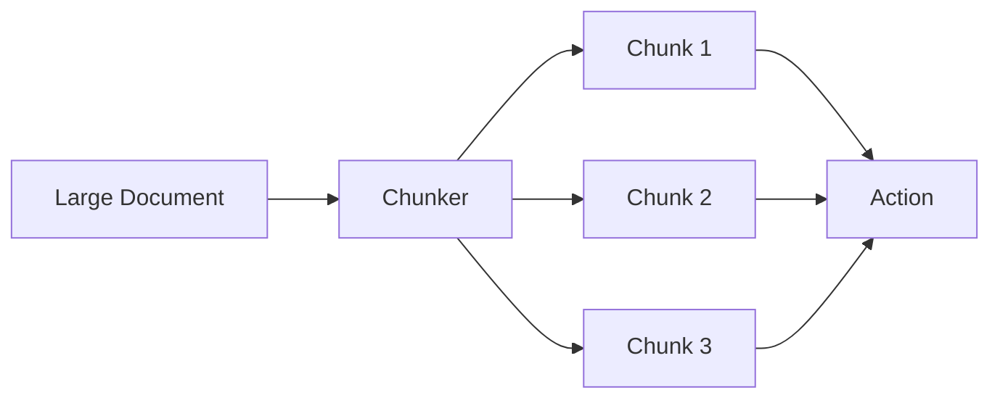

# Chunking

What happens when your document is too large for the LLM context window? Chunking splits large documents into smaller pieces that fit within LLM context limits. Agent Actions supports multiple chunking strategies optimized for different use cases.

## Overview

Think of chunking like reading a long book in sittings. Rather than trying to absorb everything at once, you read chapters or sections and take notes as you go. Chunking does the same for your agentic workflow: it breaks documents into manageable pieces while preserving enough overlap to maintain context.



When a document exceeds the configured chunk size, it is split into overlapping segments. Each chunk is processed as a separate record in your agentic workflow.

## Configuration

Configure chunking at the project level in `agent_actions.yml`:

```yaml
default_agent_config:
  chunk_config:
    chunk_size: 4000
    overlap: 500
    strategy: tiktoken
```

### Configuration Fields

| Field | Default | Description |
|-------|---------|-------------|
| `chunk_size` | 300 | Maximum size per chunk (tokens or characters) |
| `overlap` | 10 | Overlap between consecutive chunks |
| `strategy` | `tiktoken` | Chunking strategy to use |

### Per-Action Override

Override chunking for specific actions:

```yaml
actions:
  - name: process_large_docs
    chunk_config:
      chunk_size: 8000
      overlap: 1000
      strategy: chars
```

## Strategies

### tiktoken (Default)

Token-based chunking using OpenAI's tokenizer. Best for optimizing LLM context usage.

```yaml
chunk_config:
  chunk_size: 4000    # Tokens
  overlap: 500        # Token overlap
  strategy: tiktoken
```

**When to use:**
- OpenAI models
- Need precise token control
- Optimizing for context limits

**How it works:**
1. Tokenizes the document
2. Splits at token boundaries
3. Maintains semantic coherence where possible

### chars

Character-based splitting. Simple and predictable.

```yaml
chunk_config:
  chunk_size: 8000    # Characters
  overlap: 1000
  strategy: chars
```

**When to use:**
- Non-OpenAI models
- Simple text processing
- Predictable chunk sizes needed

**How it works:**
1. Counts characters
2. Splits at character boundaries
3. Attempts to break at whitespace

### spacy

Semantic chunking using spaCy NLP. Splits at sentence boundaries for better coherence.

```yaml
chunk_config:
  chunk_size: 4000    # Target tokens
  overlap: 500
  strategy: spacy
```

**When to use:**
- Preserving sentence integrity is critical
- Natural language content
- Quality over speed

**How it works:**
1. Parses document with spaCy
2. Identifies sentence boundaries
3. Groups sentences up to target size
4. Never splits mid-sentence

## Overlap

Consider what happens at the boundary between two chunks. Without overlap, an important concept might be split awkwardly, with the setup in one chunk and the conclusion in another. Overlap ensures context is not lost at chunk boundaries:

```
Chunk 1: [........................|overlap]
Chunk 2:                    [overlap|........................|overlap]
Chunk 3:                                              [overlap|........................]
```

The overlapping sections appear in both adjacent chunks, giving the LLM enough context to understand content that spans boundaries.

### Choosing Overlap Size

| Content Type | Recommended Overlap |
|--------------|---------------------|
| Technical docs | 10-20% of chunk size |
| Narrative text | 15-25% of chunk size |
| Code | 5-10% of chunk size |
| Structured data | Minimal or none |

```yaml
# Example: 4000 token chunks with 20% overlap
chunk_config:
  chunk_size: 4000
  overlap: 800
```

## Examples

### Large Document Processing

```yaml
# agent_actions.yml
default_agent_config:
  chunk_config:
    chunk_size: 4000
    overlap: 500
    strategy: tiktoken

# workflow
actions:
  - name: summarize_chapters
    prompt: |
      Summarize this section:
      {{ source.content }}
    schema: chapter_summary
```

### Code Analysis

```yaml
# Lower overlap for code
chunk_config:
  chunk_size: 6000
  overlap: 300
  strategy: chars
```

### Multi-Language Content

```yaml
# spaCy for sentence-aware splitting
chunk_config:
  chunk_size: 3000
  overlap: 400
  strategy: spacy
```

## Best Practices

### 1. Match Strategy to Model

```yaml
# OpenAI models: use tiktoken
chunk_config:
  strategy: tiktoken

# Other models: use chars
chunk_config:
  strategy: chars
```

### 2. Account for Prompt Size

Here is an important limitation: chunk size is not the same as context size. Leave room for your prompt template:

```yaml
# If prompt is ~500 tokens, use smaller chunks
chunk_config:
  chunk_size: 3500  # 4000 - 500 for prompt
```

### 3. Test Chunk Boundaries

Enable debug logging to see how documents are split:

```bash
agac run -a workflow --log-level DEBUG
```

### 4. Consider Downstream Aggregation

Chunking works best when each chunk can be processed independently. If you need to combine results from all chunks of a document, use a downstream aggregation action:

```yaml
actions:
  - name: process_chunks
    granularity: Record  # Process each chunk

  - name: aggregate_results
    granularity: File    # Combine all chunks
    dependencies: process_chunks  # Input source
```

## Disabling Chunking

To process documents whole (if they fit in context):

```yaml
chunk_config:
  chunk_size: 100000  # Large enough to never trigger
```

Or omit `chunk_config` entirely for small documents.
