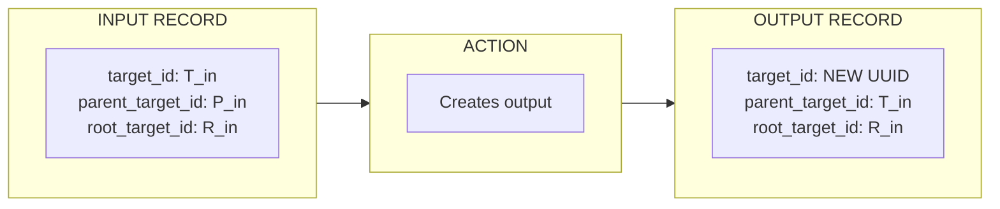
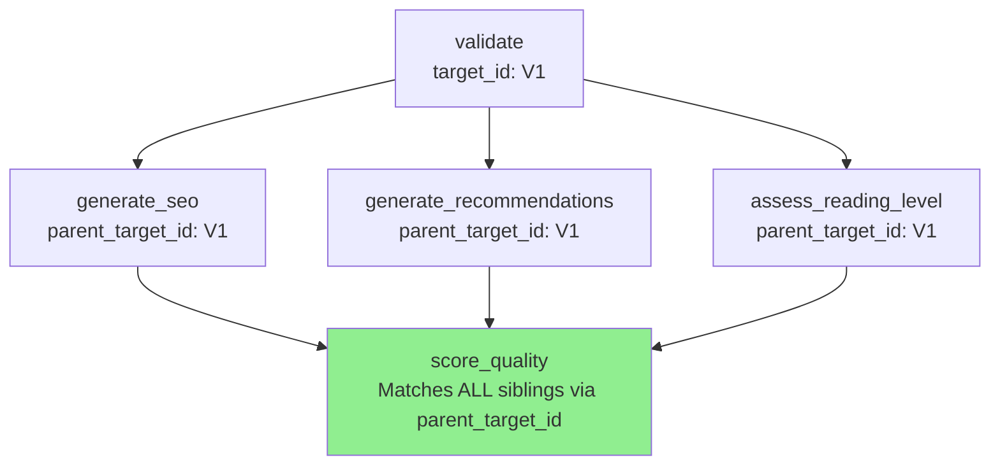
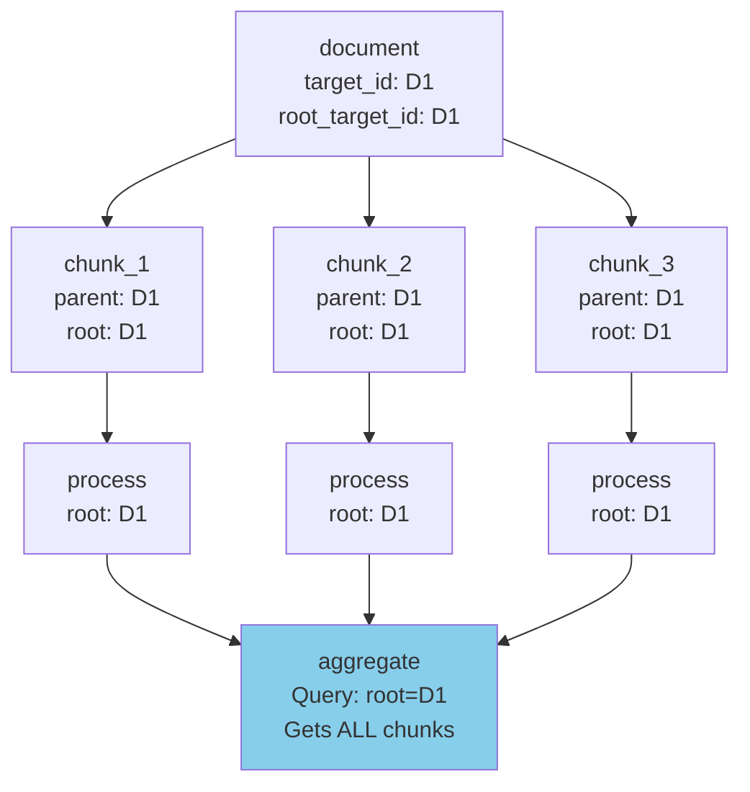
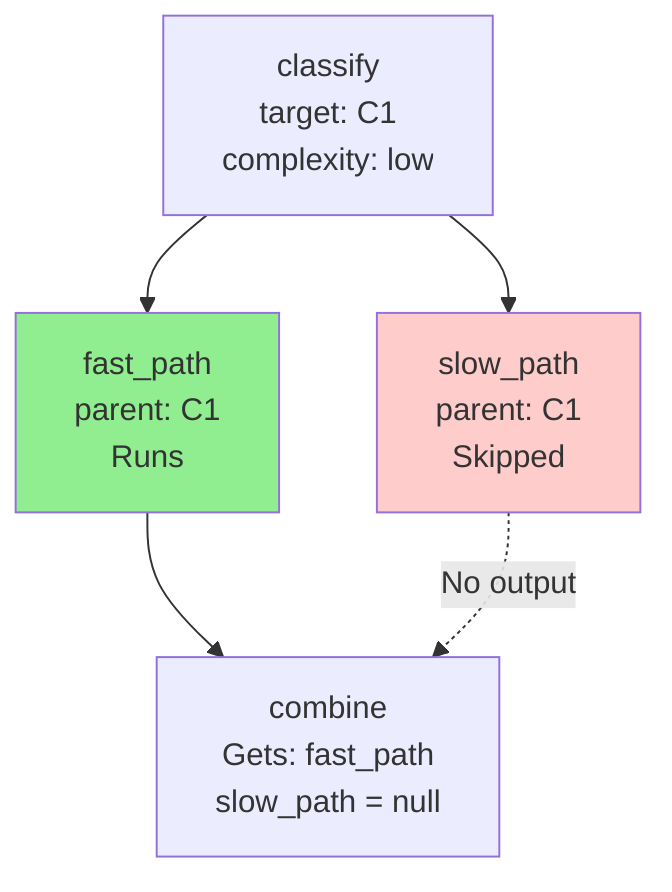
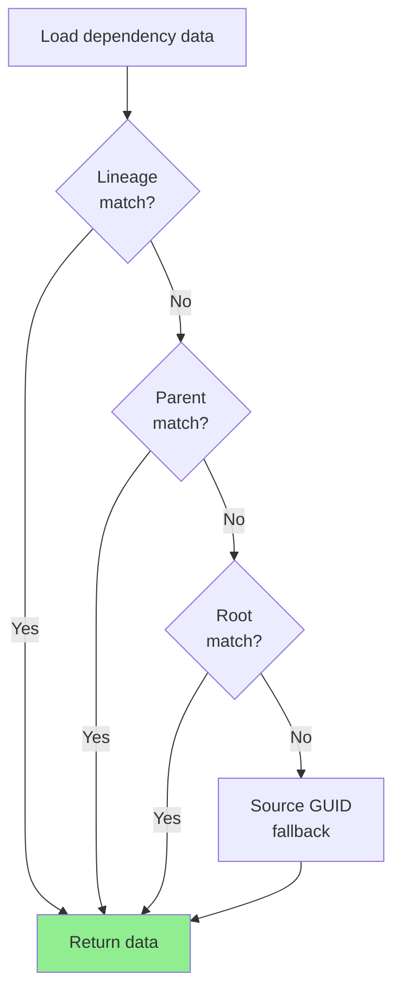

# Data Lineage

How does Agent Actions track data as it flows through parallel branches, merges, and splits? The **Ancestry Chain** provides complete lineage tracking that enables complex workflow patterns like Diamond, Map-Reduce, and Ensemble voting.

## Overview

Every record in Agent Actions carries lineage metadata:

```json
{
  "source_guid": "file-001-hash",
  "target_id": "550e8400-e29b-41d4-a716-446655440003",
  "parent_target_id": "550e8400-e29b-41d4-a716-446655440001",
  "root_target_id": "550e8400-e29b-41d4-a716-446655440000",
  "node_id": "node_5_abc123",
  "lineage": ["node_0_def456", "node_1_ghi789", "node_5_abc123"],
  "content": { ... }
}
```

## Ancestry Fields

| Field | Purpose | Use Case |
|-------|---------|----------|
| `source_guid` | Correlates records from same source file | Basic file-level grouping |
| `target_id` | Unique identifier for this specific record | Individual record tracking |
| `parent_target_id` | Links to immediate parent record | **Parallel branch merge** (Diamond pattern) |
| `root_target_id` | Links to original ancestor record | **Map-Reduce** aggregation |
| `lineage` | Array of node IDs this record passed through | Sequential chain tracking |

## How It Works

### Record Lifecycle

When a record flows through an action, the ancestry chain propagates automatically:



**Propagation Rules:**
1. `target_id` = new UUID (unique for each output)
2. `parent_target_id` = input's `target_id` (links to immediate parent)
3. `root_target_id` = input's `root_target_id` (preserves original ancestor)

### First Record (Root)

When a record first enters the pipeline:

```json
{
  "target_id": "ROOT-UUID",
  "parent_target_id": null,
  "root_target_id": "ROOT-UUID"
}
```

The first record is its own root—`root_target_id` equals `target_id`.

## Parallel Branch Merge (Diamond Pattern)

The most common use case: multiple actions process the same data in parallel, then a downstream action needs **all** their outputs.

```yaml
actions:
  - name: validate
    dependencies: []

  - name: generate_seo
    dependencies: validate  # Input source

  - name: generate_recommendations
    dependencies: validate  # Input source

  - name: assess_reading_level
    dependencies: validate  # Input source

  - name: score_quality
    dependencies: [generate_seo, generate_recommendations, assess_reading_level]  # Merge pattern
```



**How matching works:** All three parallel branches share the same `parent_target_id` (the `validate` action's `target_id`). When `score_quality` runs, it queries for records with that `parent_target_id` and finds all siblings.

### Accessing Parallel Outputs

In your merge action's prompt, use namespaced field references:

```yaml
- name: score_quality
  dependencies: [generate_seo, generate_recommendations, assess_reading_level]
  prompt: |
    SEO Keywords: {{ generate_seo.primary_keywords }}
    Similar Books: {{ generate_recommendations.similar_books }}
    Reading Level: {{ assess_reading_level.reading_level }}

    Score the overall quality of this enriched catalog entry.
```

## Map-Reduce Pattern

For splitting a document into chunks, processing each, then aggregating results:

```yaml
actions:
  - name: chunk_document
    granularity: splits

  - name: process_chunk
    dependencies: chunk_document  # Input source

  - name: aggregate_results
    dependencies: process_chunk  # Input source
    granularity: collect
```



**How matching works:** All chunks preserve the original document's `root_target_id`. The aggregate action queries by `root_target_id` to collect all descendants.

## Ensemble/Voting Pattern

Run the same input through multiple models, then select or combine the best answers:

```yaml
actions:
  - name: prepare

  - name: gpt4_answer
    dependencies: prepare  # Input source
    model_vendor: openai

  - name: claude_answer
    dependencies: prepare  # Input source
    model_vendor: anthropic

  - name: gemini_answer
    dependencies: prepare  # Input source
    model_vendor: google

  - name: best_answer
    dependencies: [gpt4_answer, claude_answer, gemini_answer]
```

All three model responses share the same `parent_target_id`, enabling `best_answer` to access all of them for comparison.

## Conditional Merge

When some branches may be skipped due to guards:

```yaml
actions:
  - name: classify

  - name: fast_path
    dependencies: classify  # Input source
    guard:
      condition: "classify.complexity == 'low'"

  - name: slow_path
    dependencies: classify  # Input source
    guard:
      condition: "classify.complexity == 'high'"

  - name: combine
    dependencies: [fast_path, slow_path]
```



**Handling missing branches:** The merge action receives `null` for skipped branches. Your template should handle this gracefully:

```yaml
- name: combine
  prompt: |
    Fast result: {{ fast_path.result }}
    Slow result: {{ slow_path.result }}
```

## Matching Priority

When loading historical data, Agent Actions uses this priority:

1. **Lineage match** — Dependency's node_id is in current record's lineage (sequential chain)
2. **Parent match** — Records share the same `parent_target_id` (parallel siblings)
3. **Root match** — Records share the same `root_target_id` (Map-Reduce descendants)
4. **Source GUID fallback** — Legacy behavior for backward compatibility



## Debugging Lineage

### Inspect Record Ancestry

```bash
jq '{source_guid, target_id, parent_target_id, root_target_id, lineage}' \
  agent_io/target/node_5_merge/data.json
```

### Verify Sibling Relationships

Check that parallel branches share the same parent:

```bash
# All three should have the same parent_target_id
jq '.parent_target_id' agent_io/target/node_3_branch_a/*.json
jq '.parent_target_id' agent_io/target/node_3_branch_b/*.json
jq '.parent_target_id' agent_io/target/node_3_branch_c/*.json
```

### Trace Root Ancestry

For Map-Reduce, verify all chunks trace back to the same root:

```bash
jq '.root_target_id' agent_io/target/node_2_process_chunk/*.json | sort -u
# Should output exactly one UUID
```

## Backward Compatibility

Workflows created before ancestry tracking continue to work:

- Missing ancestry fields trigger **source GUID fallback**
- No migration required for existing workflows
- New workflows automatically get ancestry tracking

## See Also

- [Common Patterns](../../getting-started/patterns.md) — Workflow patterns enabled by ancestry
- [Output Format](./output-format.md) — Complete output structure
- [Context Scope](../context/context-scope.md) — Controlling data visibility between actions
