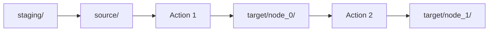

# Data I/O

Every agentic workflow needs data to flow in, through, and out. Agent Actions uses a standardized directory structure that makes this flow predictable and traceable.

Think of it like a factory floor: raw materials enter through one door (`staging/`), get registered for tracking (`source/`), move through workstations (actions), and finished products exit through another (`target/`). The directory structure enforces this separation, making it easy to inspect what went in and what came out.

## Directory Structure

```
agent_workflow/
└── my_workflow/
    ├── agent_config/
    │   └── my_workflow.yml    # Workflow definition
    ├── agent_io/
    │   ├── staging/           # Input data (starting point)
    │   ├── source/            # Metadata tracking staging files (JSON mode)
    │   ├── target/            # Output data (JSON mode)
    │   └── outputs.db          # SQLite database (database mode)
    └── seed_data/             # Static reference data
```

:::tip Storage Backend
Agent Actions supports two storage modes for source and target data:

- **SQLite mode** (default): All data in a single `outputs.db` database file, configured via `output_storage` in `agent_actions.yml`
- **JSON mode**: Individual JSON files in `source/` and `target/` directories

SQLite mode offers better query performance, built-in deduplication, and atomic writes. Staging data always remains as JSON files regardless of mode.
:::

### staging/

This is where your agentic workflow begins. Place input files here before running:

```
agent_io/staging/
├── document_1.json
├── document_2.json
└── batch_input.csv
```

You can also point the start node at a local folder via `data_source` config:

```yaml
actions:
  - name: extract_facts
    data_source:
      type: local
      folder: ./data
      file_type: [json, csv]
```

### source/

Metadata layer that tracks what's in staging:

- References to staging files for lineage tracking
- Enables tracing outputs back to original inputs
- Auto-generated when you run the agentic workflow

### target/

Outputs organized by action. In JSON mode:

```
agent_io/target/
├── node_0_extract_facts/
│   └── document_1.json
├── node_1_validate_facts/
│   └── document_1.json
└── node_2_summarize/
    └── document_1.json
```

In SQLite mode, the same data is stored in the `target_data` table with `action_name` and `relative_path` columns.

## Data Flow

Let's trace how a document moves through an agentic workflow:



Here is what happens at each stage:

1. Input data placed in `staging/`
2. Agent Actions creates tracking references in `source/`
3. Each action writes to `target/node_{n}_{name}/`
4. Downstream actions read from upstream `target/` folders
5. Filenames preserved through the agentic workflow

Notice that filenames stay consistent across all stages. The `source/` layer provides lineage tracking—you can trace any output back to its original staging file, which is essential for debugging and auditing.

## Storage Backend

Agent Actions uses a pluggable storage backend system for source and target data. The default SQLite backend stores all workflow data in a single database file.

### SQLite Database Schema

The database contains two main tables:

| Table | Purpose |
|-------|---------|
| `source_data` | Stores source records with deduplication by `source_guid` |
| `target_data` | Stores action outputs organized by `action_name` |

### Querying the Database

You can inspect workflow data directly using SQLite:

```bash
sqlite3 my_workflow/agent_io/outputs.db

-- List all actions with output
SELECT DISTINCT action_name FROM target_data;

-- Count records per action
SELECT action_name, SUM(record_count) FROM target_data GROUP BY action_name;

-- Preview data from an action
SELECT data FROM target_data WHERE action_name = 'extract_facts' LIMIT 1;
```

### Benefits

- **Performance**: Indexed queries for fast data access
- **Integrity**: ACID transactions prevent partial writes
- **Deduplication**: Automatic source_guid-based deduplication
- **Concurrency**: WAL mode enables concurrent reads

## Learn More

- **[Input Formats](./input-formats.md)** — JSON, CSV, and other supported formats
- **[Output Format](./output-format.md)** — Output structure and lineage tracking
- **[Data Lineage](./data-lineage.md)** — Ancestry chain for parallel merges and Map-Reduce
- **[Chunking](./chunking.md)** — Split large documents for LLM processing
