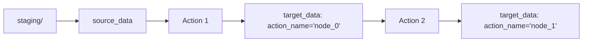

# Data I/O

> **Storage backend:** SQLite as of v0.2.6. All source and target records live in a single SQLite database per workflow at `agent_io/store/<workflow>.db`. Older snippets that reference `agent_io/source/` and `agent_io/target/` directories are stale — only `agent_io/staging/` remains as on-disk JSON.

Every agentic workflow needs data to flow in, through, and out. Agent Actions uses a standardized layout that makes this flow predictable and traceable.

Raw materials enter through one door (`staging/`), the framework registers them in `source_data`, they move through workstations (actions) that write to `target_data`, and you query the result out of the SQLite database. The layout enforces this separation, making it easy to inspect what went in and what came out.

## Directory Structure

```
agent_workflow/
└── my_workflow/
    ├── agent_config/
    │   └── my_workflow.yml         # Workflow definition
    ├── agent_io/
    │   ├── staging/                # Input data (on-disk JSON / CSV / etc.)
    │   └── store/
    │       └── my_workflow.db      # SQLite database — source, target, dispositions, traces
    └── seed_data/                  # Static reference data
```

:::tip Storage Backend
SQLite is the only supported storage backend. Source records, target records, dispositions, prompt traces, and checkpoint outputs all live in `agent_io/store/<workflow>.db`. Only `staging/` remains as on-disk JSON because that is what users place by hand.
:::

### staging/

This is where your agentic workflow begins. Place input files here before running:

```
agent_io/staging/
├── document_1.json
├── document_2.json
└── batch_input.csv
```

You can also point the start node at a local folder via `data_source` config:

```yaml
actions:
  - name: extract_facts
    data_source:
      type: local
      folder: ./data
      file_type: [json, csv]
```

### source_data (table)

Metadata layer that tracks what's in staging:

- One row per `(relative_path, source_guid)` from the staging files
- Auto-populated on `agac run`
- Provides the join key (`source_guid`) that ties target records back to their origin

### target_data (table)

Outputs are stored per action in the `target_data` table:

```sql
CREATE TABLE target_data (
    id            INTEGER PRIMARY KEY AUTOINCREMENT,
    action_name   TEXT NOT NULL,
    relative_path TEXT NOT NULL,
    data          TEXT NOT NULL,         -- JSON array of records
    record_count  INTEGER,
    created_at    TEXT DEFAULT CURRENT_TIMESTAMP,
    UNIQUE(action_name, relative_path)
)
```

Each row stores every record an action produced for a given input file (`relative_path`) as a single JSON array in `data`. Fan it out with `json_each(data)` and pull fields with `json_extract`.

## Data Flow

Let's trace how a document moves through an agentic workflow:


```mermaid
flowchart LR
    ST[staging/] --> SR[source_data]
    SR --> A1[Action 1]
    A1 --> T1[target_data: action_name='node_0']
    T1 --> A2[Action 2]
    A2 --> T2[target_data: action_name='node_1']
```

Here is what happens at each stage:

1. Input data placed in `staging/`
2. Agent Actions registers each input record in `source_data` with a stable `source_guid`
3. Each action writes its output as a `target_data` row keyed by `(action_name, relative_path)`
4. Downstream actions read from `target_data` rows of their upstream actions
5. `relative_path` is preserved across actions, so the same input file is traceable through every step

The `source_guid` field provides lineage tracking — you can trace any output record back to its original staging file, which is essential for debugging and auditing.

## Storage Backend

All workflow data lives in `agent_io/store/<workflow>.db`. The framework manages this file — it is created on first `agac run`, migrated in place when columns are added, and truncated (not deleted) by `--fresh`.

### SQLite Database Schema

The database carries five framework-owned tables:

| Table                | Purpose                                                                            |
|----------------------|------------------------------------------------------------------------------------|
| `source_data`        | Source records, deduplicated by `(relative_path, source_guid)`                     |
| `target_data`        | Per-action output records, one row per `(action_name, relative_path)`              |
| `record_disposition` | Per-record dispositions (success/failed/exhausted/skipped) emitted by each action  |
| `prompt_trace`       | Compiled prompt + LLM response per record per attempt (online and batch)           |
| `checkpoint_output`  | Mid-action checkpoint records (resumable batch retrieval and repair recovery)     |

Plus a `workflow_metadata` bookkeeping table for run-level key/value state.

### Querying the Database

You can inspect workflow data directly using SQLite:

```bash
sqlite3 agent_io/store/<workflow>.db

-- List all actions with output
SELECT DISTINCT action_name FROM target_data;

-- Count records per action
SELECT action_name, SUM(record_count) FROM target_data GROUP BY action_name;

-- Preview the first record produced by an action
SELECT json_extract(r.value, '$')
FROM target_data t, json_each(t.data) r
WHERE t.action_name = 'extract_facts'
LIMIT 1;
```

### Benefits

- **Performance**: Indexed queries for fast data access
- **Integrity**: ACID transactions prevent partial writes
- **Deduplication**: Automatic `source_guid`-based deduplication
- **Concurrency**: WAL mode enables concurrent reads

## Learn More

- **[Input Formats](./input-formats.md)** — JSON, CSV, and other supported formats
- **[Output Format](./output-format.md)** — Output structure and lineage tracking
- **[Data Lineage](./data-lineage.md)** — Ancestry chain for parallel merges and Map-Reduce
- **[Chunking](./chunking.md)** — Split large documents for LLM processing
- **[Prompt Traces](./prompt-traces.md)** — Inspect compiled prompts and LLM responses per record
