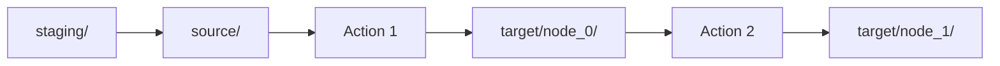

# Data I/O

Every agentic workflow needs data to flow in, through, and out. Agent Actions uses a standardized directory structure that makes this flow predictable and traceable.

Think of it like a factory floor: raw materials enter through one door (`staging/`), get registered for tracking (`source/`), move through workstations (actions), and finished products exit through another (`target/`). The directory structure enforces this separation, making it easy to inspect what went in and what came out.

## Directory Structure

```
agent_workflow/
└── my_workflow/
    ├── agent_config/
    │   └── my_workflow.yml    # Workflow definition
    ├── agent_io/
    │   ├── staging/           # Input data (starting point)
    │   ├── source/            # Metadata tracking staging files
    │   └── target/            # Output data
    └── seed_data/             # Static reference data
```

### staging/

This is where your agentic workflow begins. Place input files here before running:

```
agent_io/staging/
├── document_1.json
├── document_2.json
└── batch_input.csv
```

### source/

Metadata layer that tracks what's in staging:

- References to staging files for lineage tracking
- Enables tracing outputs back to original inputs
- Auto-generated when you run the agentic workflow

### target/

Outputs organized by action:

```
agent_io/target/
├── node_0_extract_facts/
│   └── document_1.json
├── node_1_validate_facts/
│   └── document_1.json
└── node_2_summarize/
    └── document_1.json
```

## Data Flow

Let's trace how a document moves through an agentic workflow:


```mermaid
flowchart LR
    ST[staging/] --> SR[source/]
    SR --> A1[Action 1]
    A1 --> T1[target/node_0/]
    T1 --> A2[Action 2]
    A2 --> T2[target/node_1/]
```

Here is what happens at each stage:

1. Input data placed in `staging/`
2. Agent Actions creates tracking references in `source/`
3. Each action writes to `target/node_{n}_{name}/`
4. Downstream actions read from upstream `target/` folders
5. Filenames preserved through the agentic workflow

Notice that filenames stay consistent across all stages. The `source/` layer provides lineage tracking—you can trace any output back to its original staging file, which is essential for debugging and auditing.

## Learn More

- **[Input Formats](./input-formats.md)** — JSON, CSV, and other supported formats
- **[Output Format](./output-format.md)** — Output structure and lineage tracking
- **[Data Lineage](./data-lineage.md)** — Ancestry chain for parallel merges and Map-Reduce
- **[Chunking](./chunking.md)** — Split large documents for LLM processing
