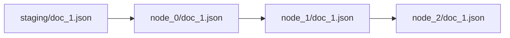

# Output Format

Where does your data end up after an agentic workflow runs? Action outputs are written to `agent_io/target/` as JSON files, organized by action. This structure makes it easy to inspect what each action produced and trace results back to their sources.

## Directory Structure

```
agent_io/target/
├── node_0_extract_facts/
│   ├── document_1.json
│   └── document_2.json
├── node_1_validate_facts/
│   ├── document_1.json
│   └── document_2.json
└── node_2_generate_summary/
    └── document_1.json
```

- Each action creates a subdirectory (`node_{index}_{action_name}`)
- Source filenames are preserved through the pipeline
- All outputs are JSON

## Output Structure

Each output file contains:

```json
{
  "source_guid": "document_1",
  "node_id": "node_0_extract_facts",
  "content": {
    "facts": [...],
    "count": 5
  },
  "metadata": {
    "timestamp": "2024-01-15T10:30:00Z",
    "model": "gpt-4o-mini"
  }
}
```

### Fields

| Field | Description |
|-------|-------------|
| `source_guid` | Links back to original source file |
| `node_id` | Action that produced this output |
| `content` | LLM/tool output (schema-validated) |
| `metadata` | Execution metadata (timestamp, model) |

### Content Field

The `content` field contains the action's output, validated against the schema:

```json
"content": {
  "facts": [
    {"fact": "MCP uses JSON-RPC 2.0", "confidence": 0.95},
    {"fact": "Servers expose tools and resources", "confidence": 0.92}
  ],
  "count": 2
}
```

For tool actions, `content` contains the UDF return value.

## Lineage Tracking

How do you trace a result back to its source? Agent Actions maintains lineage throughout the agentic workflow:



Notice how the filename stays consistent at every stage. This design choice has important implications:

- Same filename preserved at each stage
- `source_guid` links every output to its origin
- You can trace any result back to its source for debugging or auditing

### Lineage Array

For complex agentic workflows, outputs include a `lineage` array that records every action the data passed through:

```json
{
  "source_guid": "doc_1",
  "lineage": [
    "node_0_extract",
    "node_1_validate",
    "node_2_summarize"
  ],
  "content": {...}
}
```

## Passthrough Fields

Sometimes you need source data to appear directly in the output without being processed. Fields from `context_scope.passthrough` are preserved at the root level of the output:

```yaml
# Workflow config
context_scope:
  passthrough:
    - source.url
    - source.metadata
```

```json
// Output includes passthrough fields
{
  "source_guid": "doc_1",
  "content": {...},
  "url": "https://example.com",
  "metadata": {"author": "John"}
}
```

## Reading Outputs

### Single File

```bash
cat agent_io/target/node_0_extract_facts/document_1.json | jq .
```

### All Outputs from Action

```bash
cat agent_io/target/node_0_extract_facts/*.json | jq -s .
```

### Extract Content Only

```bash
jq '.content' agent_io/target/node_0_extract_facts/document_1.json
```

## Clean Outputs

Remove previous outputs before a fresh run:

```bash
agac run -a my_workflow --clean
```

This clears the `target/` directory before execution.

## See Also

- [Input Formats](./input-formats.md) — How to structure input data
- [Artifacts](../execution/artifacts.md) — Run tracking and detailed output structure
- [Context Scope](../context/context-scope.md) — Passthrough configuration
