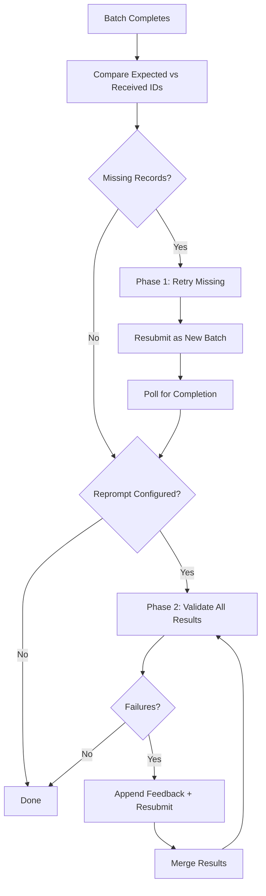

# Batch Recovery

When you submit 1,000 records to a batch API, what happens when only 985 come back? Or when 40 of those 985 have outputs that fail validation? Batch recovery handles both problems automatically through a two-phase process.

## The Two Phases

Batch recovery runs after the initial batch completes. It addresses two distinct failure modes in sequence:



**Phase 1 (Retry)** recovers records the provider dropped — network errors, timeouts, silent failures. The same request is resubmitted unchanged.

**Phase 2 (Reprompt)** fixes records where the LLM responded but produced invalid output — schema violations, failed custom validation. The prompt is modified with error feedback before resubmitting.

## Phase 1: Retry Missing Records

After retrieving batch results, the system compares expected record IDs against received IDs. Any gaps trigger the retry loop.

### How It Works

1. Collect all `custom_id` values from the context map (expected)
2. Collect all `custom_id` values from batch results (received)
3. Compute the difference — these are the missing records
4. For each retry attempt (up to `max_attempts`):
   - Build new records from the context map for missing IDs
   - Submit as a new batch
   - Poll until complete
   - Merge successful results back
   - Update the missing set
5. If records remain missing after all attempts, mark them with exhaustion metadata

### Configuration

Retry is configured at the action or defaults level:

```yaml
defaults:
  retry:
    enabled: true
    max_attempts: 3        # Retry up to 3 times
    on_exhausted: return_last  # or "raise"
```

### Per-Record Tracking

The system tracks failure counts per record, not globally. If record `A` succeeds on retry attempt 1 but record `B` needs all 3 attempts, each gets its own count:

```json
{
  "_recovery": {
    "retry": {
      "attempts": 2,
      "failures": 1,
      "succeeded": true,
      "reason": "missing",
      "timestamp": "2024-06-15T10:30:45Z"
    }
  }
}
```

### Exhaustion

When a record exhausts all retry attempts:

- **`on_exhausted: return_last`** — record is marked with exhaustion metadata, workflow continues without it
- **`on_exhausted: raise`** — raises an error, stops the workflow

## Phase 2: Validate and Reprompt

After Phase 1 ensures all recoverable records are present, Phase 2 checks whether the outputs are actually valid. This only runs if reprompt is configured with a validation function.

### How It Works

1. Load the validation UDF specified in `reprompt.validation`
2. For each attempt (up to `max_attempts`):
   - Validate all results that haven't already passed (API-failed records fail validation and are included)
   - Identify failures
   - If all pass, stop
   - For each failed result:
     - Look up the original record from the context map
     - Build validation feedback (what failed + the failed response)
     - Append feedback to the original `user_content`
     - Collect into a reprompt batch
   - Submit the reprompt batch and poll for completion
   - Merge new results, replacing old ones by `custom_id`
3. Apply exhaustion metadata to any records still failing

### Feedback Injection

The key mechanism: when a record fails validation, the error feedback is **appended to the original prompt**, not replaced. The LLM sees its previous attempt plus specific guidance on what went wrong:

```
[Original prompt content]

---
Your response failed validation: BISAC code must be a valid category

Your response: {"bisac_codes": ["INVALID_CODE"]}

Please correct and respond again.
```

### Metadata Preservation

When a record goes through both phases, retry metadata from Phase 1 is preserved into Phase 2. A record that was missing from the initial batch, recovered via retry, then failed validation and was reprompted will carry both:

```json
{
  "_recovery": {
    "retry": {
      "attempts": 2,
      "failures": 1,
      "succeeded": true,
      "reason": "missing",
      "timestamp": "2024-06-15T10:30:45Z"
    },
    "reprompt": {
      "attempts": 2,
      "passed": true,
      "validation": "check_valid_bisac"
    }
  }
}
```

### Skip Logic

Phase 2 skips records that already have reprompt metadata marked as passed (from a previous cycle).

API-failed records (`success=False`) are **not** skipped — they fail validation and are reprompted with guidance to retry. This prevents API failures from silently graduating as valid output.

## Recovery Metadata

Every record that goes through recovery gets a `_recovery` field in its output. This field is automatically excluded from content extraction — downstream actions never see it, but it's available for auditing and debugging.

### Structure

```json
{
  "_recovery": {
    "retry": {
      "attempts": 3,
      "failures": 2,
      "succeeded": true,
      "reason": "missing",
      "timestamp": "2024-06-15T10:30:45Z"
    },
    "reprompt": {
      "attempts": 2,
      "passed": true,
      "validation": "check_format"
    }
  }
}
```

### Fields

**Retry metadata** (present when transport-layer recovery occurred):

| Field | Type | Description |
|-------|------|-------------|
| `attempts` | integer | Total attempts made (including initial) |
| `failures` | integer | Number of failed attempts before success |
| `succeeded` | boolean | Whether retry ultimately succeeded |
| `reason` | string | Why retry was needed: `missing`, `network_error`, `rate_limit`, `timeout` |
| `timestamp` | string | ISO 8601 timestamp of the recovery |

**Reprompt metadata** (present when validation-layer recovery occurred):

| Field | Type | Description |
|-------|------|-------------|
| `attempts` | integer | Number of validation attempts |
| `passed` | boolean | Whether validation ultimately passed |
| `validation` | string | Name of the validation UDF used |

### Serialization

Recovery metadata survives serialization. When batch results are saved to disk and reloaded (e.g., for `agac batch retrieve`), both retry and reprompt metadata are preserved through the round-trip.

## Example: Full Recovery Flow

Submit 100 records. 95 come back. 10 of the 95 fail validation.

```
Submit 100 records
├── Phase 1: Retry
│   ├── 5 missing → resubmit
│   ├── Attempt 1: 4 recovered, 1 still missing
│   ├── Attempt 2: 1 recovered
│   └── Result: 100 records (all recovered)
│
└── Phase 2: Reprompt
    ├── Validate 100 results → 10 fail
    ├── Attempt 1: resubmit 10 with feedback → 8 pass
    ├── Attempt 2: resubmit 2 with feedback → 1 passes
    └── Result: 99 passed, 1 exhausted (on_exhausted: return_last)

Final output:
  94 records — clean (no recovery needed)
   5 records — _recovery.retry present
   1 record  — _recovery.retry + _recovery.reprompt (both phases)
```

## See Also

- [Retry & Error Handling](./retry.md) — Transport-layer retry for online mode
- [Reprompting](../validation/reprompting.md) — Validation-layer reprompting
- [Run Modes](./run-modes.md) — Online vs batch execution
- [Output Format](../data-io/output-format.md) — Output structure and `_recovery` field
