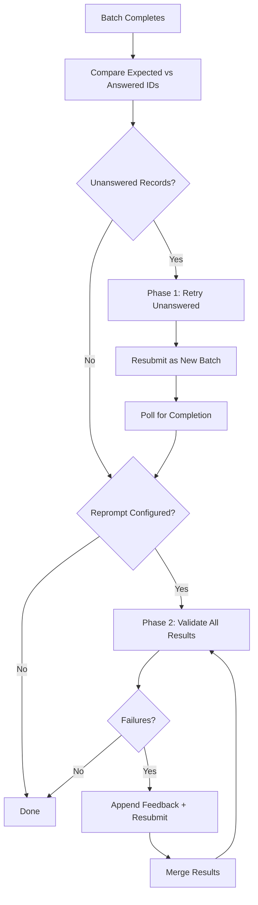

# Batch Recovery

When you submit 1,000 records to a batch API, what happens when only 985 come back? Or when 40 of those 985 have outputs that fail validation? Batch recovery handles both problems automatically through a two-phase process.

## The Two Phases

Batch recovery runs after the initial batch completes. It addresses two distinct failure modes in sequence:


```mermaid
flowchart TD
    A[Batch Completes] --> B[Compare Expected vs Answered IDs]
    B --> C{Unanswered Records?}
    C -->|Yes| D[Phase 1: Retry Unanswered]
    C -->|No| G
    D --> E[Resubmit as New Batch]
    E --> F[Poll for Completion]
    F --> G{Reprompt Configured?}
    G -->|Yes| H[Phase 2: Validate All Results]
    G -->|No| L[Done]
    H --> I{Failures?}
    I -->|Yes| J[Append Feedback + Resubmit]
    J --> K[Merge Results]
    K --> H
    I -->|No| L
```

**Phase 1 (Retry)** recovers records the provider did not answer — ones it dropped outright (network errors, timeouts, silent failures) and ones it returned with a per-record error and no content. The same request is resubmitted unchanged.

**Phase 2 (Reprompt)** fixes records where the LLM responded but produced invalid output — schema violations, failed custom validation. The prompt is modified with error feedback before resubmitting.

## Phase 1: Retry Missing Records

After retrieving batch results, the system compares the expected record IDs against the ids the provider actually answered. A record returned with an error, or with null content, was not answered. Any gap triggers the retry loop.

### How It Works

1. Collect all `custom_id` values from the context map (expected)
2. Collect the `custom_id` values of results the provider answered successfully. A result returned with an error carries the record's real `custom_id` but no content, so it does not count as answered
3. Compute the difference — these are the missing records
4. For each retry attempt (up to `max_attempts`):
   - Build new records from the context map for missing IDs
   - Submit as a new batch
   - Poll until complete
   - Merge the results back, replacing any earlier answer for the same record
   - Update the missing set
5. If records remain missing after all attempts, mark them with exhaustion metadata

### Configuration

Retry is configured at the action or defaults level:

```yaml
defaults:
  retry:
    enabled: true
    max_attempts: 3        # Retry up to 3 times
    on_exhausted: return_last  # or "raise"
```

### Per-Record Tracking

The system tracks failure counts per record, not globally. If record `A` succeeds on retry attempt 1 but record `B` needs all 3 attempts, each gets its own count:

```json
{
  "_recovery": {
    "retry": {
      "attempts": 2,
      "failures": 1,
      "succeeded": true,
      "reason": "missing",
      "timestamp": "2024-06-15T10:30:45Z"
    }
  }
}
```

### Exhaustion

When a record exhausts all retry attempts:

- **`on_exhausted: return_last`** — record is marked with exhaustion metadata, workflow continues without it
- **`on_exhausted: raise`** — the output file is written first, then the run stops. Batch
  writes once at the end, so halting mid-conversion would discard every record that had
  already converted cleanly; the halt is carried to the caller and raised after the write

Both policies apply to every record that spends its attempts, but the two exhausted shapes
do not land in the same disposition. The split is whether a result row came back at all. A record the provider never
returned has nothing to report, so it becomes an `EXHAUSTED` tombstone dispositioned
`exhausted_after_N_attempts`. A record that came back — with an error, or with null
content and no message at all — is dispositioned `FAILED`, carrying whatever the
provider said (or a generic failure when it said nothing) plus the same exhausted
retry metadata under `_recovery.retry`. The provider's
message is the more useful signal of the two, so it is preserved rather than replaced by an
empty tombstone. Counting retry exhaustion means counting both — filter on
`_recovery.retry.succeeded == false`, not on the disposition alone.

## Phase 2: Validate and Reprompt

After Phase 1 ensures all recoverable records are present, Phase 2 checks whether the outputs are actually valid. This only runs if reprompt is configured with a validation function.

### How It Works

1. Load the validation UDF specified in `reprompt.validation`
2. For each attempt (up to `max_attempts`):
   - Validate every result that has not already passed — an API-failed record fails validation rather than graduating
   - Identify failures
   - If all pass, stop
   - For each failed result that still carries content:
     - Look up the original record from the context map (a record missing from it is
       corrupt state and fails the run, rather than being skipped silently)
     - Build validation feedback (what failed + the failed response)
     - Append feedback to the original `user_content`
     - Collect into a reprompt batch
   - A failed result with no content is withheld — there is nothing to repair — and
     carried to finalization with its provider error
   - So is a record task preparation does not admit (a guard filter, or a preparation
     error): the submitter reports which records it actually sent, and the rest are
     carried the same way rather than counted as attempted. They reach finalization
     marked as still failing, so they disposition as `exhausted` rather than collecting
     as successes. For a record whose reprompt *preparation* raised, that terminal
     disposition replaces the `failed` row preparation wrote, which means the next run
     leaves it alone instead of reprocessing it — recover it with `agac retry`.
   - Submit the reprompt batch and poll for completion
   - Merge new results, replacing old ones by `custom_id`
3. Apply exhaustion metadata to any records still failing

### Feedback Injection

The key mechanism: when a record fails validation, the error feedback is **appended to the original prompt**, not replaced. The LLM sees its previous attempt plus specific guidance on what went wrong:

```
[Original prompt content]

---
Your response failed validation: BISAC code must be a valid category

Your response: {"bisac_codes": ["INVALID_CODE"]}

Please correct and respond again.
```

### Metadata Preservation

When a record goes through both phases, retry metadata from Phase 1 is preserved into Phase 2. A record that was missing from the initial batch, recovered via retry, then failed validation and was reprompted will carry both:

```json
{
  "_recovery": {
    "retry": {
      "attempts": 2,
      "failures": 1,
      "succeeded": true,
      "reason": "missing",
      "timestamp": "2024-06-15T10:30:45Z"
    },
    "reprompt": {
      "attempts": 2,
      "passed": true,
      "validation": "check_valid_bisac"
    }
  }
}
```

### Skip Logic

Phase 2 skips records that already have reprompt metadata marked as passed (from a previous cycle).

API-failed records are still **evaluated** — they fail validation rather than graduating silently. What they are not is **resubmitted**: a reprompt has nothing to repair on a record with no content, so it is withheld from the reprompt batch and carried to finalization with its provider error and its retry history. Records preparation does not admit are carried the same way. When `retry:` is configured, Phase 1 claims such records first, so by Phase 2 they have already spent their attempts. With no `retry:` block there is no Phase 1, and the record reaches finalization with its provider error but no retry history.

## Recovery Metadata

Every record that goes through recovery gets a `_recovery` field in its output. This field is automatically excluded from content extraction — downstream actions never see it, but it's available for auditing and debugging.

### Structure

```json
{
  "_recovery": {
    "retry": {
      "attempts": 3,
      "failures": 2,
      "succeeded": true,
      "reason": "missing",
      "timestamp": "2024-06-15T10:30:45Z"
    },
    "reprompt": {
      "attempts": 2,
      "passed": true,
      "validation": "check_format",
      "parse_error_count": 1
    }
  }
}
```

### Fields

**Retry metadata** (present when transport-layer recovery occurred):

| Field | Type | Description |
|-------|------|-------------|
| `attempts` | integer | Total attempts made (including initial) |
| `failures` | integer | Number of failed attempts before success |
| `succeeded` | boolean | Whether retry ultimately succeeded |
| `reason` | string | Why retry was needed: `missing`, `network_error`, `rate_limit`, `timeout` |
| `timestamp` | string | ISO 8601 timestamp of the recovery |

**Reprompt metadata** (present when validation-layer recovery occurred):

| Field | Type | Description |
|-------|------|-------------|
| `attempts` | integer | Number of validation attempts |
| `passed` | boolean | Whether validation ultimately passed |
| `validation` | string | Name of the validation UDF used |
| `parse_error_count` | integer | JSON parse failures (absent when 0) |
| `schema_fail_count` | integer | Schema validation failures (absent when 0) |
| `udf_fail_count` | integer | UDF validation failures (absent when 0) |

:::note Sparse serialization
Counter fields use a sparse contract: absent means zero. Consumers should use `record.get("parse_error_count", 0)`, not assume the key exists.

Counter fields are populated by both the online and batch reprompt paths. Earlier documentation incorrectly stated that batch paths always default to 0; in practice, batch recovery also populates these counters when the provider returns per-record error classification.
:::

### Serialization

Recovery metadata survives serialization. When batch results are saved to disk and reloaded (e.g., for `agac batch retrieve`), both retry and reprompt metadata are preserved through the round-trip.

## Example: Full Recovery Flow

Submit 100 records. 95 come back. 10 of the 95 fail validation.

```
Submit 100 records
├── Phase 1: Retry
│   ├── 5 missing → resubmit
│   ├── Attempt 1: 4 recovered, 1 still missing
│   ├── Attempt 2: 1 recovered
│   └── Result: 100 records (all recovered)
│
└── Phase 2: Reprompt
    ├── Validate 100 results → 10 fail
    ├── Attempt 1: resubmit 10 with feedback → 8 pass
    ├── Attempt 2: resubmit 2 with feedback → 1 passes
    └── Result: 99 passed, 1 exhausted (on_exhausted: return_last)

Final output:
  94 records — clean (no recovery needed)
   5 records — _recovery.retry present
   1 record  — _recovery.retry + _recovery.reprompt (both phases)
```

## See Also

- [Retry & Error Handling](./retry.md) — Transport-layer retry for online mode
- [Reprompting](../validation/reprompting.md) — Validation-layer reprompting
- [Run Modes](./run-modes.md) — Online vs batch execution
- [Output Format](../data-io/output-format.md) — Output structure and `_recovery` field
