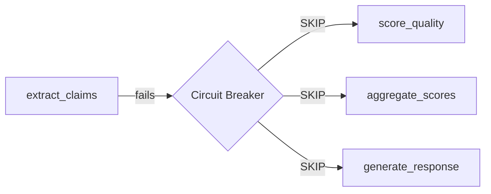
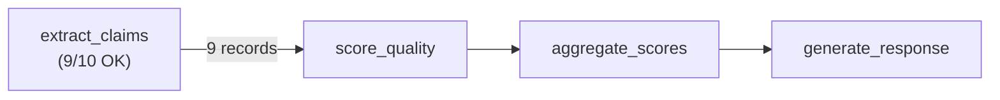

# Failure Handling

What happens when some records succeed and others fail? Consider a workflow extracting claims from 100 reviews — 97 process fine, but 3 hit a rate limit. Agent Actions doesn't treat this as a total failure. Instead, it tracks exactly what happened, tells you about it, and lets downstream actions continue on the successful records.

## Partial Failures

When an action processes N items and some fail while others succeed, the action is marked `completed_with_failures`. This is distinct from `completed` (everything worked) and `failed` (nothing worked).

```
Action 0 complete (4.2s)           # 97/100 items OK, 3 failed
Action 1 complete (2.1s)           # Runs on the 97 successful records
07:45:35 | Completed in 6.31s | 1 OK | 1 PARTIAL | 0 SKIP | 0 ERROR
```

### What Gets Tracked

For each failed item, Agent Actions persists:

| Field | Description |
|-------|-------------|
| `source_guid` | Unique identifier of the failed record |
| `reason` | Error message (e.g., "groq API error: 429 rate limit") |
| `input_snapshot` | JSON snapshot of the original input record (for future retry) |

This data lives in the storage backend's disposition table — not in temporary logs.

### How Downstream Actions Behave

`completed_with_failures` does **not** trigger the circuit breaker. Downstream actions receive the successful records and process them normally. The failed records are simply absent from the output.

:::info
This is different from `failed` status, which triggers the circuit breaker and skips all downstream actions that depend on it.
:::

## Pausing on Partial Failure

By default, the workflow continues when partial failures occur. If you want the workflow to pause and show you what failed before proceeding, use `on_partial_failure: pause`.

### Configuration

```yaml
defaults:
  on_partial_failure: pause    # Pause for all actions

actions:
  - name: extract_claims
    on_partial_failure: continue  # Override: this action continues
  - name: score_quality
    # Inherits "pause" from defaults
```

| Option | Type | Default | Description |
|--------|------|---------|-------------|
| `on_partial_failure` | `"continue"` \| `"pause"` | `"continue"` | Behavior when the action has partial item failures |

`on_partial_failure` follows the standard [defaults inheritance](../configuration/defaults.md) pattern — set it once in defaults, override per-action where needed.

### What Happens When Paused

When a level contains an action with partial failures and `on_partial_failure: pause`:

1. The level completes and prints a yellow completion line
2. A failure summary is printed with action names, failed item counts, and truncated error reasons
3. The workflow exits cleanly

```
Action 0 complete (4.2s)
Workflow paused — partial failure(s) detected:
  extract_claims: 3 item(s) failed
    - groq API error: Error code: 429 rate limit exceeded
    - groq API error: Error code: 429 rate limit exceeded
    - groq API error: Error code: 500 internal server error
Run 'agac run' again to continue with partial results.
```

### Resuming After a Pause

Run `agac run` again. Actions that already completed (including those with partial failures) are skipped — the workflow picks up where it left off. The successful records from the paused action are still available to downstream actions.

:::tip
Use `on_partial_failure: pause` during development to catch issues early. Use `continue` (the default) in automated pipelines where you want the workflow to finish without manual intervention.
:::

## Execution Tally

The workflow completion summary shows four categories:

```
07:45:35 | Completed in 31.17s | 7 OK | 1 PARTIAL | 2 SKIP | 1 ERROR
```

| Status | Meaning | Level Line Color |
|--------|---------|-----------------|
| **OK** | Action completed successfully | Green |
| **PARTIAL** | Action completed but some items failed | Yellow |
| **SKIP** | Action skipped because an upstream dependency failed | Yellow |
| **ERROR** | Action failed entirely (all items) | Red |

### Circuit Breaker Behavior

When an action fails entirely (`ERROR`), the circuit breaker kicks in:



All downstream dependents are marked `SKIP` — they don't execute, don't make API calls, and don't produce output. The tally reflects this accurately.

When an action partially fails (`PARTIAL`), no circuit breaker triggers. Downstream actions run on the successful records:



## See Also

- [Retry & Error Handling](./retry.md) — Automatic retry for transient errors
- [Guards](./guards.md) — Conditional action execution
- [Defaults](../configuration/defaults.md) — Setting `on_partial_failure` globally
- [Run Modes](./run-modes.md) — Batch vs online execution
