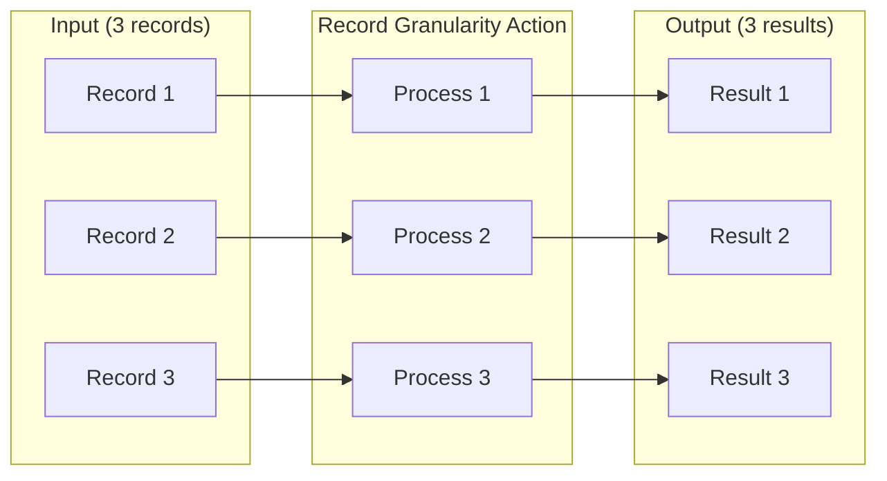
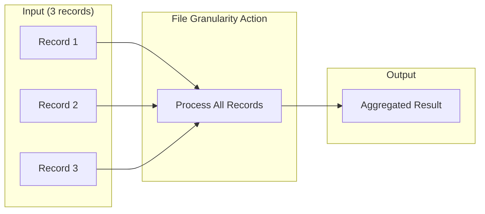
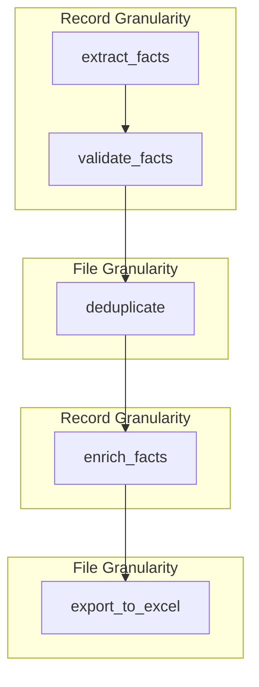

# Granularity

Should an action see one record at a time, or the entire dataset? Granularity controls the scope of data processing - and choosing correctly is essential for operations like deduplication and aggregation.

Think of it like a factory assembly line: record granularity is a single worker processing items one by one, while file granularity is a team that sees everything at once and can compare items.

## Overview

| Granularity | Processing Scope | Input | Output | Use Case |
|-------------|------------------|-------|--------|----------|
| **record** | Per-item | Single record | Single result | Transformations, validations |
| **file** | All items | Array of records | Array or aggregate | Deduplication, exports, aggregation |

## Configuration

Set granularity in defaults or per-action:

```yaml
defaults:
  granularity: Record  # Default for all actions
```

Or per-action:

```yaml
actions:
  - name: aggregate_results
    granularity: File  # Override for this action
```

## Record Granularity

Let's start with record granularity - it's the default and most common choice. The action receives one record and produces one result.

```yaml
- name: validate_email
  granularity: Record  # Default, can be omitted
  kind: tool
  impl: validate_email
```

### Characteristics

- **Isolated processing** - Each record processed independently
- **Parallel execution** - Records can be processed concurrently
- **Simple data flow** - One-to-one mapping of inputs to outputs
- **Stateless** - No context shared between records

### When to Use Record Granularity

- Individual item transformations
- Per-record validations
- LLM calls per item
- Field extraction and enrichment
- Quality scoring

### Example: Per-Record Processing

```yaml
- name: flatten_raw_questions
  dependencies: extract_raw_qa  # Input source
  kind: tool
  impl: flatten_questions
  granularity: Record
  intent: "Flatten questions array for individual processing"

- name: classify_question_type
  dependencies: flatten_raw_questions  # Input source
  model_vendor: openai
  model_name: gpt-4o-mini
  granularity: Record
  prompt: $qanalabs_quiz_gen.Classify_Question_Type
  schema: question_classification
```

### Data Flow

Consider what happens with three input records. Each gets processed independently, potentially in parallel:



Notice the one-to-one mapping. Each input produces exactly one output.

## File Granularity

Here's where it differs: file granularity processes all records together. The action receives the entire array and can produce aggregated or transformed results.

```yaml
- name: deduplicate_facts
  granularity: File
  kind: tool
  impl: deduplicate_by_similarity
```

### Characteristics

- **Batch processing** - All records available at once
- **Cross-record operations** - Can compare/combine records
- **Aggregation** - Produce summary or reduced output
- **Sequential** - Must wait for all upstream records

### Constraints

:::warning Important Constraints
**File granularity is only supported for tool actions** (`kind: tool`). LLM actions must use Record granularity.

**Guards are not supported** with File granularity. Since File mode processes the entire array at once, per-record guards cannot be applied. If you need conditional logic, implement it within your UDF function.
:::

```yaml
# Valid: File granularity with tool action
- name: deduplicate_facts
  granularity: File
  kind: tool
  impl: deduplicate_by_similarity

# Invalid: File granularity with LLM action
- name: summarize_all
  granularity: File  # ERROR: File granularity not supported for LLM
  model_vendor: openai
  model_name: gpt-4o

# Invalid: File granularity with guard
- name: filter_and_dedupe
  granularity: File
  kind: tool
  impl: deduplicate
  guard:  # ERROR: Guards not supported with File granularity
    clause: "status == 'active'"
```

### When to Use File Granularity

- Deduplication across records
- Aggregation and summarization
- File exports (Excel, CSV)
- Cross-record validation
- Sorting and grouping

### Example: File Export

```yaml
- name: convert_html_json_to_thinkific
  kind: tool
  impl: convert_html_json_to_thinkific
  granularity: File
  intent: "Convert HTML JSON format to Thinkific-compatible Excel export"
  dependencies: add_asterisk_to_correct_answer  # Input source
```

### Data Flow

Notice how file granularity funnels all records into a single processing step:



The output might be a single aggregated result, or it might be a filtered/transformed array - depending on what your action does.

### Output Wrapping and Metadata

The framework automatically wraps your FILE mode tool output with standard metadata fields. Your UDF returns raw data, and the framework adds:

- **`content`** - Your data is wrapped in a `content` field
- **`source_guid`** - Preserved from input if your tool copies it to output
- **`target_id`** - New unique identifier assigned to each output record
- **`node_id`** - Identifies which action produced the output
- **`lineage`** - Array tracking the processing chain (previous stages + current)
- **`metadata`** - Provider and model information

**Example transformation:**

Your UDF returns:
```python
[
    {"source_guid": "abc-123", "question": "What is MCP?", "answer": "A protocol"},
    {"source_guid": "abc-123", "question": "How does it work?", "answer": "Via messages"}
]
```

The framework wraps it as:
```json
[
    {
        "source_guid": "abc-123",
        "content": {"question": "What is MCP?", "answer": "A protocol"},
        "target_id": "new-uuid-1",
        "node_id": "flatten_questions_xyz_0",
        "lineage": ["extract_qa_previous", "flatten_questions_xyz_0"],
        "metadata": {"model": "flatten_questions", "provider": "tool"}
    },
    {
        "source_guid": "abc-123",
        "content": {"question": "How does it work?", "answer": "Via messages"},
        "target_id": "new-uuid-2",
        "node_id": "flatten_questions_xyz_1",
        "lineage": ["extract_qa_previous", "flatten_questions_xyz_1"],
        "metadata": {"model": "flatten_questions", "provider": "tool"}
    }
]
```

:::tip Preserving Lineage
To maintain lineage chaining, copy the `source_guid` from input records to your output. The framework uses this to look up the parent record and chain the lineage correctly.
:::

## UDF Considerations

When writing UDFs, the granularity affects the function signature and behavior.

### Record-Level UDF

```python
from agent_actions import udf_tool

@udf_tool
def validate_email(data, **kwargs):
    """Process single record."""
    email = data.get('email', '')
    # Validate single email
    return {"valid": is_valid_email(email)}
```

Configuration:
```yaml
- name: validate_email
  kind: tool
  impl: validate_email
  granularity: Record
```

### File-Level UDF

```python
from agent_actions import udf_tool
from agent_actions.configuration.new_format_schema import Granularity

@udf_tool(granularity=Granularity.FILE)
def deduplicate_facts(records, **kwargs):
    """Process entire array of records."""
    seen = set()
    unique = []
    for record in records:
        key = record.get('fact_text')
        if key not in seen:
            seen.add(key)
            unique.append(record)
    return unique
```

Configuration:
```yaml
- name: deduplicate_facts
  kind: tool
  impl: deduplicate_facts
  granularity: File
```

### FileUDFResult for Tracking

For file-level UDFs that need to track which inputs produced which outputs:

```python
from agent_actions import udf_tool, FileUDFResult
from agent_actions.configuration.new_format_schema import Granularity

@udf_tool(granularity=Granularity.FILE)
def group_by_category(records, **kwargs):
    """Group records and track provenance."""
    groups = {}
    for i, record in enumerate(records):
        cat = record.get('category')
        if cat not in groups:
            groups[cat] = FileUDFResult(output=[], input_indices=[])
        groups[cat].output.append(record)
        groups[cat].input_indices.append(i)
    return list(groups.values())
```

See [UDF Decorator](../tools/udf-decorator#granularity) for complete UDF granularity documentation.

## Mixing Granularities

Agentic workflows commonly mix granularities. Let's explore a typical pattern:

```yaml
defaults:
  granularity: Record

actions:
  # Record-level extraction
  - name: extract_facts
    granularity: Record  # Default

  # Record-level validation
  - name: validate_facts
    dependencies: extract_facts  # Input source
    granularity: Record

  # File-level deduplication
  - name: deduplicate
    dependencies: validate_facts  # Input source
    granularity: File

  # Record-level enrichment (back to per-item)
  - name: enrich_facts
    dependencies: deduplicate  # Input source
    granularity: Record

  # File-level export
  - name: export_to_excel
    dependencies: enrich_facts  # Input source
    granularity: File
```

### Flow Diagram



## Granularity Transitions

When transitioning between granularities:

### Record → File

All records from the record-level action are collected into an array for the file-level action.

```yaml
- name: process_items      # Record: produces N results
  granularity: Record

- name: aggregate          # File: receives array of N items
  dependencies: process_items  # Input source
  granularity: File
```

### File → Record

The output from a file-level action is distributed to record-level processing. If the file action outputs an array, each element becomes a record.

```yaml
- name: deduplicate        # File: produces array of M items
  granularity: File

- name: enrich_each        # Record: processes each of M items
  dependencies: deduplicate  # Input source
  granularity: Record
```

## Best Practices

### 1. Default to Record Granularity

```yaml
# Good: Explicit record granularity for per-item work
- name: validate_item
  granularity: Record

# File only when needed
- name: aggregate_results
  granularity: File
```

### 2. Use File for Aggregation Only

```yaml
# Good: File granularity for cross-record operations
- name: deduplicate
  granularity: File
  impl: remove_duplicates

# Avoid: File granularity for per-item operations
- name: validate_email  # Should be Record
  granularity: File
```

### 3. Consider Memory for Large Files

File granularity loads all records into memory. For large datasets, this can be problematic:

```yaml
# For large datasets, process in chunks at record level
# rather than loading everything at file level
- name: process_large_dataset
  granularity: Record  # Memory efficient
```

:::warning
File granularity with thousands of records can cause memory issues. Consider breaking large datasets into smaller files or using record granularity with streaming.
:::

### 4. Document Granularity Changes

```yaml
- name: export_final
  granularity: File
  intent: "Aggregate all processed records into single Excel file"
```

## Error Handling

### Unexpected Input Type

```
GranularityError: File granularity action 'aggregate' received single record instead of array
```

Ensure upstream actions produce the expected output format.

### Memory Overflow

```
MemoryError: File granularity action 'process_all' exceeded memory limit
```

Consider breaking into smaller batches or using record granularity with streaming.

## See Also

- [UDF Decorator](../tools/udf-decorator#granularity) - UDF granularity configuration
- [Run Modes](./run-modes) - Batch vs online execution
- [Context Handling](./context-handling) - Data flow between actions
