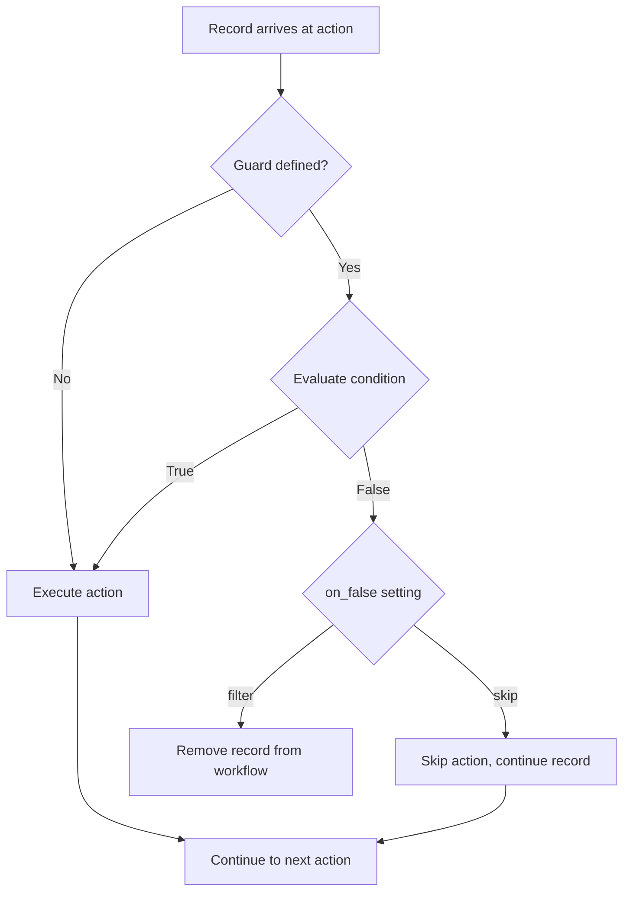

# Guards

What happens when an action depends on upstream data that might be empty or invalid? Without guards, you'd waste LLM calls on records that can't produce useful results.

Guards solve this by acting as quality checkpoints in your agentic workflow. Think of them like the "if statements" of data pipelines - they evaluate a condition and decide whether an action should run for each record.

## Overview

Guards work like SQL `WHERE` clauses - they filter which records proceed to an action based on conditions you define.

**Why use guards?**
- **Skip empty data** - Don't process records with no extracted facts
- **Quality filtering** - Only process high-quality content
- **Conditional branching** - Execute different actions based on data type
- **Cost optimization** - Avoid LLM calls for data that won't produce useful results

## Syntax

Let's walk through the basic guard structure:

```yaml
- name: my_action
  guard:
    condition: "expression"
    on_false: "skip" | "filter"
```

| Field | Description |
|-------|-------------|
| `condition` | Expression evaluated against upstream data |
| `on_false` | What happens when condition is false: `skip` or `filter` |

The `condition` is evaluated before the action runs. If it returns `false`, the `on_false` behavior kicks in.

## Condition Expressions

### Simple Field Checks

```yaml
guard:
  condition: "candidate_facts_list != []"
  on_false: "filter"
```

### Comparison Operators

| Operator | Description | Example |
|----------|-------------|---------|
| `==` | Equal | `status == "approved"` |
| `!=` | Not equal | `facts != []` |
| `>` | Greater than | `score > 85` |
| `>=` | Greater or equal | `count >= 1` |
| `<` | Less than | `priority < 3` |
| `<=` | Less or equal | `retries <= 3` |

### Logical Operators

```yaml
# AND condition
guard:
  condition: 'score > 85 and status == "valid"'

# OR condition
guard:
  condition: 'category == "technical" or category == "implementation"'

# NOT condition
guard:
  condition: 'not is_duplicate'
```

### Advanced Operators

| Operator | Description | Example |
|----------|-------------|---------|
| `IN` | Check membership in list | `status IN ["active", "pending"]` |
| `NOT IN` | Check non-membership | `category NOT IN ["spam", "invalid"]` |
| `CONTAINS` | Check if string/list contains | `tags CONTAINS "important"` |
| `LIKE` | Pattern matching | `name LIKE "prod_*"` |
| `BETWEEN` | Range check | `score BETWEEN 50 AND 100` |
| `IS NULL` | Check for null | `description IS NULL` |
| `IS NOT NULL` | Check not null | `content IS NOT NULL` |

### Built-in Functions

Guards support safe built-in functions:

| Function | Description | Example |
|----------|-------------|---------|
| `len()` | Get length | `len(items) > 0` |
| `str()` | Convert to string | `str(code) == "200"` |
| `int()` | Convert to integer | `int(score) >= 85` |
| `float()` | Convert to float | `float(ratio) > 0.5` |
| `abs()` | Absolute value | `abs(diff) < 10` |
| `min()` | Minimum value | `min(scores) > 50` |
| `max()` | Maximum value | `max(scores) <= 100` |

```yaml
# Using len() function
guard:
  condition: 'len(candidate_facts_list) >= 3'
  on_false: "filter"

# Combining functions
guard:
  condition: 'len(items) > 0 and max(scores) >= 85'
  on_false: "skip"
```

### Field References

```yaml
# Upstream action field
guard:
  condition: "extract_facts.count > 0"

# Current context field
guard:
  condition: "candidate_facts_list != []"
```

## on_false Behaviors

Here's where the two options differ significantly:

### skip

The action is skipped, but the record continues through the agentic workflow. Think of it as an optional step - downstream actions still run, they just won't see output from this action.

```yaml
- name: optional_enhancement
  guard:
    condition: "needs_enhancement == true"
    on_false: "skip"  # Record continues, this action just doesn't run
```

### filter

The record is completely removed from the agentic workflow. It won't be processed by this action or any downstream actions. Use this for early exits when a record can't produce useful results.

```yaml
- name: validate_facts
  guard:
    condition: "candidate_facts_list != []"
    on_false: "filter"  # Record stops here entirely
```

:::warning
Choose carefully between `skip` and `filter`. With `skip`, downstream actions still run but may receive incomplete data. With `filter`, the record is gone - no further processing happens.
:::

## Examples

Let's explore some real-world patterns:

### Filter Empty Results

```yaml
- name: canonicalize_facts
  dependencies: fact_extractor  # Input source
  guard:
    condition: 'candidate_facts_list != []'
    on_false: "filter"
```

Records with no extracted facts are removed from the agentic workflow entirely. Why pay for LLM calls on empty data?

### Skip Non-Matching Records

```yaml
- name: Cluster_Validation_Agent
  dependencies: [group_by_similarity, cluster_list]
  guard:
    condition: 'num_similar_facts != 1'
    on_false: "skip"
```

Single-fact clusters don't need validation, so the action is skipped but the record continues. The downstream actions still receive the record - they just won't see validation output.

### Quality Threshold Filter

```yaml
- name: suggest_distractor_counts
  dependencies: filter_low_quality_questions  # Input source
  guard:
    condition: 'question_status == "KEEP"'
    on_false: "filter"
```

Only high-quality questions proceed to distractor generation.

### Skip When Field Empty

```yaml
- name: review_code_snippets
  dependencies: generate_summary  # Input source
  guard:
    condition: 'code_snippets != []'
    on_false: "skip"
```

Skip code review if no code snippets were extracted.

## Guard Evaluation Context

Guards have access to:

| Source | Syntax | Example |
|--------|--------|---------|
| Upstream output | Direct field name | `candidate_facts_list` |
| Specific action | `action.field` | `extract_facts.count` |
| Context scope observed | Direct field name | `num_similar_facts` |

### Context from Observe

When using `context_scope.observe`, those fields are available in guards:

```yaml
- name: Cluster_Validation_Agent
  context_scope:
    observe:
      - group_by_similarity.num_similar_facts
  guard:
    condition: 'num_similar_facts != 1'  # Available from observe
    on_false: "skip"
```

## Decision Flow

Consider what happens when a record reaches an action with a guard:



Notice that both `skip` and `execute` paths lead to the next action, but `filter` removes the record entirely. The filtered record never reaches downstream actions.

## Best Practices

### 1. Use filter for Early Exits

```yaml
# Good: Filter early to avoid wasted processing
- name: first_action
  guard:
    condition: 'source.content != ""'
    on_false: "filter"  # Empty content stops here
```

### 2. Use skip for Optional Steps

```yaml
# Good: Skip optional enhancement
- name: enhance_summary
  guard:
    condition: 'needs_enhancement == true'
    on_false: "skip"  # Record continues without enhancement
```

### 3. Guard After Extraction

```yaml
# Common pattern: Guard after fact extraction
- name: extract_facts
  # No guard - always run extraction

- name: validate_facts
  dependencies: extract_facts  # Input source
  guard:
    condition: 'candidate_facts_list != []'
    on_false: "filter"  # No facts = no validation needed
```

### 4. Quality Gates

```yaml
# Filter based on quality scores
- name: generate_final_output
  guard:
    condition: 'quality_score >= 85'
    on_false: "filter"
```

### 5. Chain Guards for Multi-Stage Filtering

```yaml
- name: extract
  # Always runs

- name: validate
  guard:
    condition: 'facts != []'
    on_false: "filter"

- name: enhance
  guard:
    condition: 'quality >= 50'
    on_false: "filter"

- name: finalize
  guard:
    condition: 'quality >= 85'
    on_false: "filter"
```

## Common Patterns

### Empty Array Check

```yaml
guard:
  condition: 'items != []'
  on_false: "filter"
```

### Threshold Check

```yaml
guard:
  condition: 'score >= 85'
  on_false: "filter"
```

### Status Check

```yaml
guard:
  condition: 'status == "KEEP"'
  on_false: "filter"
```

### Boolean Check

```yaml
guard:
  condition: 'should_process == true'
  on_false: "skip"
```

### Count Check

```yaml
guard:
  condition: 'count > 1'
  on_false: "skip"
```

## Error Handling

### Missing Field

```
GuardEvaluationError: Field 'nonexistent_field' not found in context
```

Ensure the field exists in upstream output or context_scope.observe.

### Invalid Expression

```
GuardSyntaxError: Invalid condition expression: 'score >'
```

Check expression syntax for missing operands or invalid operators.

### Type Mismatch

```
GuardEvaluationError: Cannot compare string to integer
```

Ensure compared values are of compatible types.

## Limitations

Guards work well for simple conditions, but they have constraints:

- **No external calls** - Guards can't make API requests or database queries
- **Limited functions** - Only built-in functions like `len()`, `max()`, `min()` are available
- **Single expression** - Complex multi-step logic doesn't fit in a guard
- **Not supported with File granularity** - Guards evaluate per-record, so they can't be used with File granularity actions (see [Granularity](./granularity.md))

:::warning File Granularity Restriction
Guards are not supported with File granularity. Since File mode processes all records at once, per-record guards cannot be applied. If you need filtering with File granularity, implement the filtering logic within your UDF function.
:::

For complex filtering logic, consider using a tool action instead:

```yaml
# Simple: Use guard
- name: validate
  guard:
    condition: 'score >= 85'
    on_false: "filter"

# Complex: Use tool action
- name: filter_by_complex_logic
  kind: tool
  impl: complex_filter_function
  # Tool can implement sophisticated filtering
```
