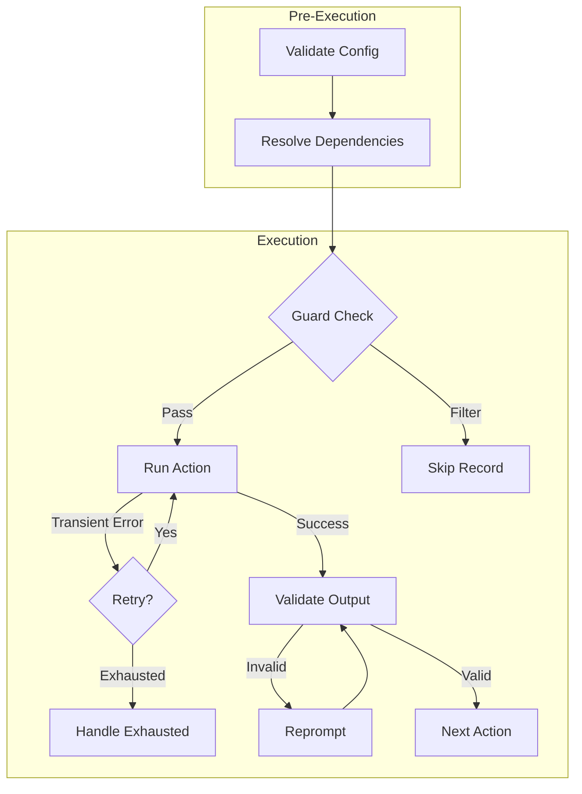

# Execution

How does Agent Actions actually run your agentic workflows? Let's explore the execution layer - the machinery that takes your configuration and turns it into orchestrated LLM calls, data transformations, and validated outputs.

## What You Can Control

Think of execution as having six main dials you can tune:

**Run Mode** — Choose between real-time responses or cost-optimized batch processing. [Learn more →](./run-modes.md)

**Granularity** — Process data per-record or per-file. [Learn more →](./granularity.md)

**Guards** — Skip or filter actions based on upstream data. [Learn more →](./guards.md)

**Retry** — Handle transient failures (rate limits, network errors) automatically. [Learn more →](./retry.md)

**Loops** — Generate multiple agent instances with different parameters for parallel processing. [Learn more →](./versions.md)

**Agentic Workflow Dependencies** — Chain agentic workflows together for multi-stage pipelines. [Learn more →](./workflow-dependencies.md)

## Execution Flow

Consider what happens when you run an agentic workflow. Before any LLM calls are made, Agent Actions validates your configuration and resolves dependencies. Then, for each action, it checks guards, runs the action, validates the output, and moves to the next stage:



Notice two automatic recovery loops: **retry** handles transient errors (rate limits, network issues) with exponential backoff, while **reprompt** handles invalid LLM outputs by asking the model to fix its response. This means both temporary failures and schema violations are handled during execution, not after.

## Quick Decisions

Not sure which settings to use? Here's a quick reference:

| If you need... | Use |
|----------------|-----|
| Lower costs, can wait 24h | `run_mode: batch` |
| Immediate responses | `run_mode: online` |
| Per-item transformations | `granularity: record` |
| Aggregation/exports | `granularity: file` |
| Conditional execution | `guard` with conditions |
| Handle transient failures | `retry: { max_attempts: 3, on_exhausted: return_last }` |
| Fail on any error | `retry: { max_attempts: 3, on_exhausted: raise }` |

## Parallel Execution

Here's where it gets interesting: actions at the same dependency level execute concurrently. If your agentic workflow has three independent actions, Agent Actions runs them in parallel rather than sequentially.

```bash
# Auto-detect parallel opportunities
agac run -a my_workflow

# Limit concurrent actions (useful for rate limits)
agac run -a my_workflow --concurrency-limit 10
```

This parallelism happens automatically - you don't need to configure anything. Agent Actions analyzes your dependency graph and finds the optimal execution order.

## Pre-flight Validation

You might wonder: what if there's a typo in a field reference? Or a missing schema file? Agent Actions catches these errors before making any API calls:

```bash
agac run -a my_workflow --validate-only
```

This validates:
- Field references resolve correctly
- Schema files exist
- No circular dependencies
- Vendor configuration is valid

Pre-flight validation means you discover wiring errors immediately, not after processing thousands of records.

## See Also

- [Run Modes](./run-modes.md) — Batch vs online execution
- [Granularity](./granularity.md) — Record vs file processing
- [Guards](./guards.md) — Conditional action execution
- [Retry](./retry.md) — Automatic transient error handling
- [Version Actions](./versions.md) — Parallel processing with multiple iterations
- [Agentic Workflow Dependencies](./workflow-dependencies.md) — Cross-workflow orchestration
- [Context Handling](./context-handling.md) — Data flow between actions
