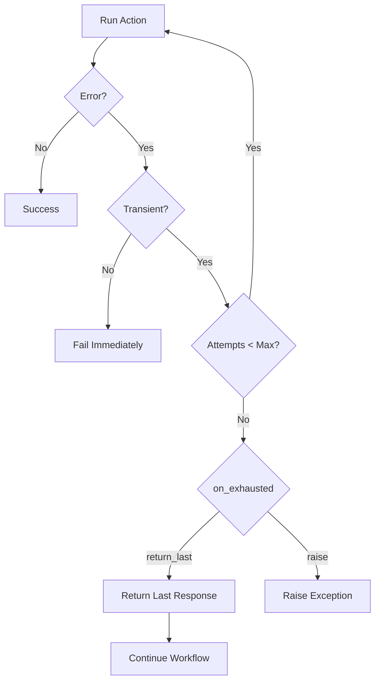
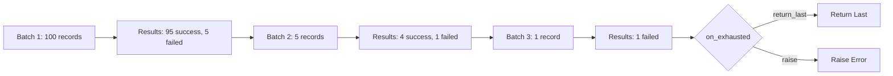

# Retry & Error Handling

What happens when an LLM provider returns a rate limit error? Or when a network timeout occurs mid-workflow? Agent Actions handles transient failures automatically through a unified retry engine that works consistently across all providers.

## Overview

Retry handles **transient errors** - temporary failures that might succeed if you try again:

| Error Type | Examples | Retryable? |
|------------|----------|------------|
| Rate Limits | HTTP 429, quota exceeded | Yes |
| Network Issues | Connection timeout, DNS failure | Yes |
| Server Errors | HTTP 502, 503, 504 | Yes |
| Invalid Request | Bad API key, malformed input | No |
| Schema Violation | LLM returned invalid JSON | No (uses reprompt) |

:::info
Retry handles transient network/API errors. For invalid LLM outputs, Agent Actions uses [reprompting](../validation/reprompting.md) instead - a different mechanism that asks the LLM to fix its response.
:::

## Configuration

Configure retry in your workflow defaults or per-action:

```yaml
defaults:
  # Disable retry
  retry:
    enabled: false

  # Enable with explicit configuration
  retry:
    enabled: true
    max_attempts: 3
    on_exhausted: return_last
```

Or per-action:

```yaml
actions:
  - name: extract_metadata
    retry:
      max_attempts: 5
      on_exhausted: raise
```

### Configuration Options

| Option | Type | Default | Description |
|--------|------|---------|-------------|
| `enabled` | `bool` | `true` | Whether retry is enabled |
| `max_attempts` | `int` | `3` | Maximum retry attempts (1-10) |
| `on_exhausted` | `string` | `return_last` | Behavior when retries exhausted |

### Exhaustion Behavior

When a record exhausts all retry attempts, `on_exhausted` determines what happens:

| Value | Behavior |
|-------|----------|
| `return_last` | Return the last response (even if failed), workflow continues (default) |
| `raise` | Raise an exception, workflow fails |

## How It Works

Let's walk through what happens when an action encounters a transient error:



### Unified Across Providers

The retry engine works identically across all supported providers:

| Provider | Rate Limit Error | Network Error | Server Error |
|----------|------------------|---------------|--------------|
| OpenAI | `RateLimitError` | `APIConnectionError` | `InternalServerError` |
| Anthropic | `RateLimitError` | `APIConnectionError` | `InternalServerError` |
| Gemini | `ResourceExhausted` | `ServiceUnavailable` | `InternalServerError` |
| Cohere | HTTP 429 | Connection errors | HTTP 502/503/504 |
| Mistral | HTTP 429 | Connection errors | HTTP 502/503/504 |
| Groq | `RateLimitError` | `APIConnectionError` | `InternalServerError` |
| Ollama | HTTP 429 | `ConnectError` | HTTP 502/503/504 |

All provider-specific errors are wrapped into unified `RateLimitError` and `NetworkError` types, ensuring consistent retry behavior regardless of which provider you use.

## Example: Production Workflow with Retry

Here's a production-ready configuration:

```yaml
name: document_enrichment
description: "Enrich documents with metadata"

defaults:
  json_mode: true
  granularity: record
  run_mode: batch
  model_vendor: openai
  model_name: gpt-4o-mini

  # Retry configuration
  retry:
    enabled: true
    max_attempts: 3
    on_exhausted: raise  # Fail workflow if retries exhausted

actions:
  - name: extract_metadata
    prompt: $prompts.extract_metadata
    schema: document_metadata

  - name: classify_document
    dependencies: extract_metadata
    prompt: $prompts.classify_document
    schema: classification_result
```

If `extract_metadata` fails for a record after 3 attempts, the workflow raises an exception.

## Batch Mode Considerations

In batch mode, retry works at the record level within batches:

1. Batch submitted to provider
2. Provider returns results (some records may fail)
3. Agent Actions identifies failed records
4. Failed records retried in new mini-batch
5. Process repeats until max attempts or all succeed



## Best Practices

### 1. Use `raise` for CI/CD

```yaml
retry:
  max_attempts: 3
  on_exhausted: raise
```

In automated pipelines, failures should fail the job so you can investigate.

### 2. Use `return_last` for Partial Results

```yaml
retry:
  max_attempts: 3
  on_exhausted: return_last
```

When partial results are acceptable and you want the workflow to continue.

### 3. Set Appropriate Max Attempts

```yaml
retry:
  max_attempts: 5  # Higher for flaky networks
```

Increase attempts for workflows running in environments with unreliable connectivity.

## Error Messages

### Rate Limit Exhausted

```
RetryExhausted: Action 'extract_metadata' failed after 3 attempts
Last error: OpenAI rate limit: Rate limit exceeded
```

Consider upgrading your API tier or reducing concurrency.

### Network Failures

```
RetryExhausted: Action 'classify_document' failed after 3 attempts
Last error: Anthropic connection error: Connection refused
```

Check network connectivity and provider status pages.

## See Also

- [Reprompting](../validation/reprompting.md) - Handling invalid LLM outputs
- [Run Modes](./run-modes.md) - Batch vs online execution
- [Troubleshooting](../troubleshooting.md) - Common error solutions
