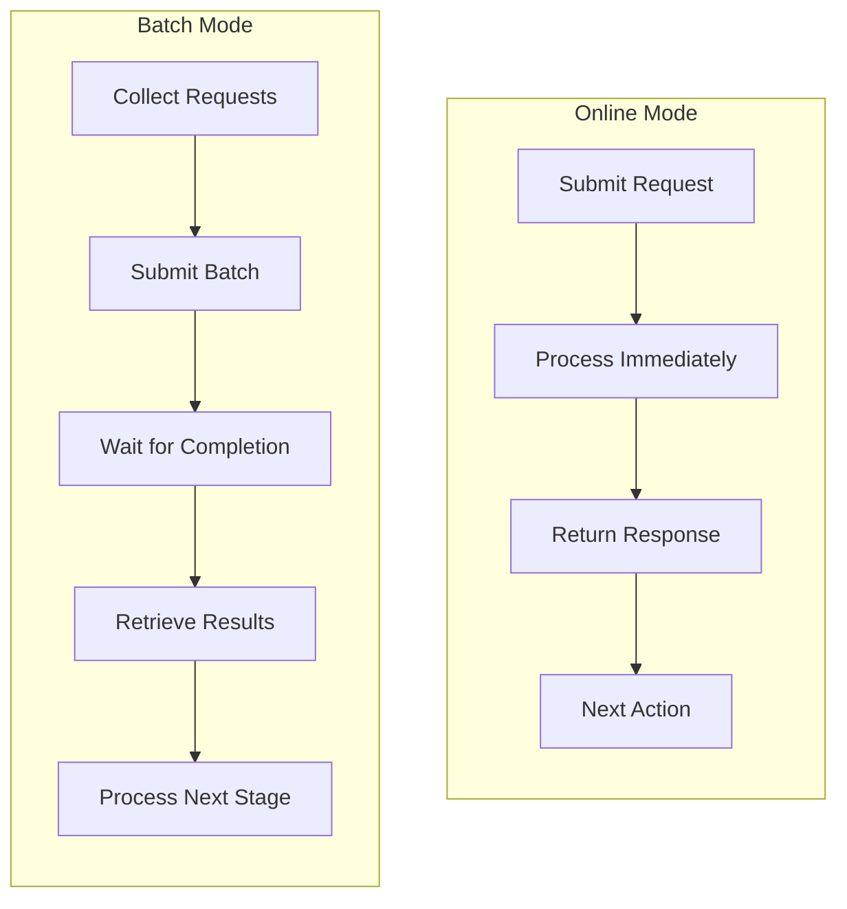

# Run Modes

Should you process requests immediately or queue them for batch processing? Agent Actions supports two execution modes - **batch** and **online** - and choosing the right one can save you up to 50% on LLM costs.

## Overview

| Mode | Processing | Latency | Cost | Use Case |
|------|------------|---------|------|----------|
| **online** | Synchronous | Real-time | Standard | Interactive, development |
| **batch** | Asynchronous | Hours | Up to 50% savings | Production, large datasets |

## Configuration

Set the run mode in your workflow defaults or per-action:

```yaml
defaults:
  run_mode: batch  # or "online"
```

Or override per-action:

```yaml
actions:
  - name: my_action
    run_mode: online  # Override default
```

## Online Mode

Let's start with online mode - it's the simpler of the two. Requests process synchronously in real-time. Each LLM call is made immediately and the response returns before proceeding.

```yaml
defaults:
  run_mode: online
```

### Characteristics

- **Immediate execution** - Requests processed as they arrive
- **Real-time responses** - Results available instantly
- **Standard pricing** - Regular API rates apply
- **Interactive feedback** - See results as workflow progresses

### When to Use Online Mode

- Development and testing
- Interactive applications
- Small datasets (< 100 records)
- Time-sensitive processing
- Debugging workflows

### Example

```yaml
defaults:
  run_mode: online
  model_vendor: openai
  model_name: gpt-4

actions:
  - name: analyze_text
    prompt: "Analyze: {{ source.content }}"
    schema: analysis_result
```

## Batch Mode

Here's where it gets interesting: batch mode leverages provider batch APIs for asynchronous processing. Think of it like sending mail via postal service instead of courier - slower, but much cheaper.

```yaml
defaults:
  run_mode: batch
```

### Characteristics

- **Asynchronous processing** - Requests queued for batch execution
- **Cost savings** - Up to 50% reduction with OpenAI/Anthropic batch APIs
- **Higher throughput** - Process thousands of records efficiently
- **Delayed results** - Results available after batch completes (typically hours)

### When to Use Batch Mode

- Production workloads
- Large datasets (100+ records)
- Cost-sensitive processing
- Non-time-critical tasks
- Overnight/scheduled jobs

### Example: Production Agentic Workflow

```yaml
defaults:
  json_mode: true
  granularity: Record
  run_mode: batch
  model_vendor: openai
  model_name: gpt-4o-mini
  context_scope:
    seed_data:
      exam_syllabus: $file:mcp_qanalabs_syllabus.json

actions:
  - name: extract_facts
    prompt: $qanalabs_quiz_gen.Fact_extraction
    schema: candidate_facts_list
```

### Batch Provider Support

| Provider | Batch API | Cost Savings |
|----------|-----------|--------------|
| OpenAI | Yes | ~50% |
| Anthropic | Yes | ~50% |
| Google Gemini | Yes | Varies |
| Groq | Yes | Varies |
| Mistral | Yes | Varies |
| Ollama | No (local) | N/A |

## Execution Flow

Consider what happens in each mode. Online processes requests one at a time with immediate responses. Batch collects requests, submits them together, and waits for results:



Notice the wait step in batch mode - this is where the cost savings come from. Providers offer discounts for non-urgent requests.

## Batch Registry

When using batch mode, Agent Actions maintains a batch registry to track job status:

```
agent_io/target/node_XX_action_name/batch/
├── .batch_registry.json      # Batch job metadata
└── .context_map_*.json       # Field mappings per batch
```

### Batch Registry Structure

```json
{
  "batch_abc123": {
    "batch_id": "batch_abc123",
    "provider": "openai",
    "status": "completed",
    "created_at": "2025-01-02T10:00:00Z",
    "completed_at": "2025-01-02T12:30:00Z",
    "record_count": 500
  }
}
```

### Batch Commands

Manage batch jobs with CLI commands:

```bash
# Check batch status
agent-actions batch status --batch-id batch_abc123

# Retrieve completed results
agent-actions batch retrieve --batch-id batch_abc123 -o ./results

# Retry failed records
agent-actions batch retry --batch-id batch_abc123

# View retry chain status
agent-actions batch chain-status --batch-id batch_abc123
```

See [batch Commands](../../cli-reference/batch) for complete CLI reference.

## Switching Modes

You can switch modes at different levels in your agentic workflow:

### Workflow-Level Default

```yaml
defaults:
  run_mode: batch  # All actions use batch by default
```

### Action-Level Override

```yaml
defaults:
  run_mode: batch

actions:
  - name: bulk_extraction
    # Uses default batch mode

  - name: interactive_validation
    run_mode: online  # Override for this action only
```

### Environment-Based

Use different modes for different environments:

```yaml
# development.yml
defaults:
  run_mode: online

# production.yml
defaults:
  run_mode: batch
```

## Best Practices

### 1. Use Batch for Production

```yaml
# Good: Cost-optimized production workflow
defaults:
  run_mode: batch

# Avoid: Online mode for large production jobs
defaults:
  run_mode: online  # Expensive at scale
```

### 2. Use Online for Development

```yaml
# Good: Fast iteration during development
defaults:
  run_mode: online

# Avoid: Batch mode when debugging
defaults:
  run_mode: batch  # Slow feedback loop
```

### 3. Consider Hybrid Approaches

```yaml
defaults:
  run_mode: batch

actions:
  # Bulk processing in batch
  - name: extract_all_facts
    # Uses batch default

  # Real-time validation in online
  - name: validate_critical_output
    run_mode: online
```

### 4. Plan for Batch Latency

Batch jobs may take hours to complete. This is an inherent limitation of the cost/speed tradeoff. Design agentic workflows that:
- Don't require immediate results
- Can be scheduled (overnight, weekends)
- Have appropriate retry handling

:::info
Batch latency varies by provider and load. OpenAI typically completes batches within 24 hours, often much faster.
:::

## Error Handling

### Batch Job Timeout

```
BatchTimeoutError: Batch job 'batch_abc123' did not complete within 24 hours
```

Check provider status and consider breaking into smaller batches.

### Provider Batch API Unavailable

```
ConfigurationError: Batch mode not supported for provider 'local_model'
```

Switch to online mode or use a provider that supports batch APIs.

### Partial Batch Failure

```
BatchPartialFailure: 5 of 500 records failed in batch 'batch_abc123'
```

Use `agent-actions batch retry` to reprocess failed records.

## Context Handling Differences

Batch and online modes handle context differently during preflight validation. See [Context Handling](./context-handling) for details on how `source` data availability differs between modes.

## See Also

- [batch Commands](../../cli-reference/batch) - CLI reference for batch operations
- [Context Handling](./context-handling) - Batch vs online context differences
- [Granularity](./granularity) - Record vs file processing
