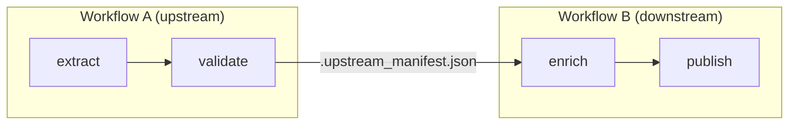

# Workflow Dependencies

Workflow dependencies enable orchestration across multiple workflows, creating multi-stage pipelines.

## Dependency Patterns

| Pattern | Behavior |
|---------|----------|
| **Single** | Output becomes input |
| **Parallel Branches** | Outputs **merged** into combined records |
| **Fan-in** | All available, **matched by lineage** |
| **Aggregation** | All outputs **merged** and grouped by `reduce_key` |

### Single Dependency

```yaml
- name: validate_data
  dependencies: extract_data
```

### Parallel Branches

Created using `versions` - multiple executions of the same action that get merged downstream:

```yaml
# Step 1: Create parallel branches with versions
- name: research
  dependencies: [analyze_issue]
  intent: "Research the issue from different angles"
  versions:
    range: [1, 3]      # Creates research_1, research_2, research_3
    mode: parallel
  schema: support_resolution/research_findings
  prompt: $support_resolution.Research_Issue
  context_scope:
    observe:
      - analyze_issue.*
      - source.*

# Step 2: Consume parallel branches - outputs are MERGED
- name: synthesize
  dependencies: [research]  # Automatically resolves to [research_1, research_2, research_3]
  intent: "Synthesize research findings"
  context_scope:
    observe:
      - research.*  # All branches merged and available
```

### Fan-in (Multiple Different Actions)

Different actions converging - all available matched by lineage:

```yaml
# Three different analysis actions run in parallel
- name: analyze_sentiment
  dependencies: [extract_data]
  # ...

- name: analyze_entities
  dependencies: [extract_data]
  # ...

- name: analyze_topics
  dependencies: [extract_data]
  # ...

# Fan-in: all three available, matched by lineage
- name: generate_report
  dependencies: [analyze_sentiment, analyze_entities, analyze_topics]
  context_scope:
    observe:
      - analyze_sentiment.*
      - analyze_entities.*
      - analyze_topics.*
```

The first dependency determines execution count — order your `dependencies` list so the action that controls record count appears first.

### Aggregation

Merge ALL outputs from different actions and group by a key. Use `reduce_key`:

```yaml
# Three validators each produce validation results
- name: validator_grammar
  dependencies: [generate_content]
  # ...

- name: validator_accuracy
  dependencies: [generate_content]
  # ...

- name: validator_style
  dependencies: [generate_content]
  # ...

# Aggregation: merge ALL outputs, group by content_id
- name: aggregate_validations
  dependencies: [validator_grammar, validator_accuracy, validator_style]
  reduce_key: content_id  # Groups all validations for same content
  context_scope:
    observe:
      - validator_grammar.*
      - validator_accuracy.*
      - validator_style.*
```

**Fan-in vs Aggregation:**
- **Fan-in** (no `reduce_key`): First dep drives execution, others matched by lineage
- **Aggregation** (`reduce_key` set): All outputs merged, grouped by key

:::info Auto-Inferred Dependencies
Actions referenced in `context_scope` but not in `dependencies` are automatically available via lineage matching.
:::

## Cross-Workflow Dependencies

When a single workflow isn't enough, you can chain workflows together. A downstream workflow declares a dependency on an upstream workflow's output — Agent Actions handles the artifact linking automatically.

### How It Works



When you run with `--upstream` or `--downstream`, Agent Actions:
1. Scans all workflows in `agent_workflow/` to build a dependency graph
2. Resolves execution order using topological sort
3. Runs workflows in dependency order
4. Writes `.upstream_manifest.json` in the downstream workflow's `agent_io/` directory, pointing to the upstream workflow's latest output
5. The downstream workflow reads from the upstream output as its input

### Declaring Cross-Workflow Dependencies

Reference another workflow in your action's `dependencies` list using the `workflow` key:

```yaml
# Workflow B: depends on Workflow A's output
actions:
  - name: enrich_data
    dependencies:
      - workflow: data_preparation        # All terminal outputs from Workflow A
    prompt: |
      Enrich this validated data...
```

To depend on a specific action's output:

```yaml
actions:
  - name: enrich_data
    dependencies:
      - workflow: data_preparation
        action: validated_output          # Only this action's output
    prompt: |
      Enrich: {{ validated_output.content }}
```

### Project Layout

Cross-workflow dependencies require workflows to live under the same `agent_workflow/` root:

```
agent_workflow/
├── data_preparation/          # Workflow A (upstream)
│   ├── agent_config/
│   │   └── data_preparation.yml
│   └── agent_io/
│       ├── staging/           # A's input
│       └── target/            # A's output
│
└── content_generation/        # Workflow B (downstream)
    ├── agent_config/
    │   └── content_generation.yml
    └── agent_io/
        ├── .upstream_manifest.json  # Auto-generated link to A's output
        ├── staging/
        └── target/
```

### The Upstream Manifest

When Agent Actions links workflows, it writes `.upstream_manifest.json` into the downstream workflow's `agent_io/` directory:

```json
{
  "upstream_workflow": "data_preparation",
  "upstream_path": "/project/agent_workflow/data_preparation/agent_io/target/validated_output",
  "files": ["batch_001.json", "batch_002.json"]
}
```

The downstream workflow reads this manifest to locate its input data instead of looking in `staging/`.

## CLI Execution

```bash
# Run upstream workflows first, then this workflow
agac run -a content_generation --upstream

# Run this workflow, then all downstream workflows
agac run -a data_preparation --downstream

# Full chain: upstream → this → downstream
agac run -a middle_workflow --upstream --downstream
```

| Command | What Executes |
|---------|---------------|
| `agac run -a B` | B only |
| `agac run -a B --upstream` | A → B |
| `agac run -a B --downstream` | B → C |
| `agac run -a B --upstream --downstream` | A → B → C |

:::info Topological Ordering
When multiple workflows have interdependencies, Agent Actions performs a topological sort to determine the correct execution order. Circular dependencies are detected and reported as errors.
:::

## Field References

Reference upstream workflow outputs in prompts just like any other action:

```yaml
- name: enhance_content
  dependencies:
    - workflow: quiz_generation
      action: format_quiz_text
  prompt: |
    Enhance: {{ format_quiz_text.question }}
```

## See Also

- [run Command](../cli/run) - `--upstream` and `--downstream` flags
- [Artifacts](./artifacts) - `.upstream_manifest.json` format
- [Field References](../context/field-references) - Referencing upstream outputs
- [Guards](./guards) - Conditional execution
