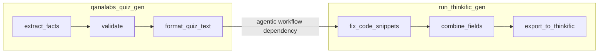
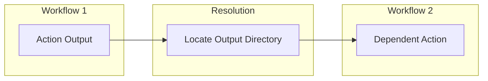

# Agentic Workflow Dependencies

What happens when one agentic workflow needs data from another? Workflow dependencies enable orchestration across multiple agentic workflows, creating multi-stage pipelines where outputs from one become inputs to the next.

Think of it like a relay race - each agentic workflow runs its leg, then passes the baton to the next.

## Overview

Dependencies can reference actions within the same agentic workflow or across different ones:

| Type | Syntax | Description |
|------|--------|-------------|
| Single input | `dependencies: action_name` | Single action in current workflow (input source) |
| Multiple inputs (merge) | `dependencies: [action_a, action_b]` | Merge multiple actions (input sources) |
| Cross-workflow (all) | `dependencies: [{workflow: name}]` | All outputs from another agentic workflow |
| Cross-workflow (specific) | `dependencies: [{workflow: name, action: act}]` | Specific action from another agentic workflow |

:::info Auto-Inferred Context Dependencies
Actions referenced in `context_scope` but NOT in `dependencies` are automatically treated as context dependencies. Only specify **input sources** in `dependencies`.
:::

## Same-Workflow Dependencies

Let's start with the basics. Dependencies within the same agentic workflow form the core of your action chain:

```yaml
actions:
  - name: extract_data
    # No dependencies (first action)

  - name: validate_data
    dependencies: extract_data        # Single input source

  - name: enrich_data
    dependencies: validate_data       # Chain continues
```

### Multiple Dependencies (Merge Pattern)

An action can merge multiple upstream actions as input sources:

```yaml
actions:
  - name: analyze_sentiment
    dependencies: preprocess          # Single input

  - name: extract_entities
    dependencies: preprocess          # Single input

  - name: generate_summary
    dependencies: [analyze_sentiment, extract_entities]  # Merge pattern
```

### Context Dependencies (Auto-Inferred)

Actions can also access data from other actions as context (without being input sources):

```yaml
actions:
  - name: extract_facts
    # First action

  - name: classify_type
    dependencies: extract_facts       # Single input

  - name: generate_question
    dependencies: classify_type       # Input source
    context_scope:
      observe:
        - classify_type.quiz_type     # Input (in dependencies)
        - extract_facts.summary       # Context (auto-inferred!)
```

In the example above, `extract_facts` is automatically treated as a context dependency because it's referenced in `context_scope` but not in `dependencies`.

## Cross-Workflow Dependencies

Here's where it gets powerful: you can reference actions from other agentic workflows using the expanded syntax:

```yaml
actions:
  - name: process_upstream_output
    dependencies:
      - workflow: upstream_workflow_name
        action: final_action_name
```

### Example: Chained Agentic Workflows

Consider a scenario where `run_thinkific_gen` depends on `qanalabs_quiz_gen`:

```yaml
# run_thinkific_gen.yml
actions:
  - name: fix_code_snippets
    kind: tool
    impl: fix_code_snippets
    granularity: record
    dependencies:
      - workflow: qanalabs_quiz_gen
        action: format_quiz_text  # Specific action from upstream workflow
```

### Agentic Workflow Chain

The dependency creates a clear handoff point between agentic workflows:


```mermaid
flowchart LR
    subgraph wf1["qanalabs_quiz_gen"]
        direction TB
        E[extract_facts] --> V[validate]
        V --> F[format_quiz_text]
    end

    subgraph wf2["run_thinkific_gen"]
        direction TB
        X[fix_code_snippets] --> C[combine_fields]
        C --> T[export_to_thinkific]
    end

    F -->|"agentic workflow dependency"| X
```

Notice how `format_quiz_text` output becomes input to `fix_code_snippets`. Agent Actions handles the data transfer automatically.

## Dependency Syntax Variations

### All Outputs from Workflow

When you need all outputs (not just a specific action):

```yaml
dependencies:
  - workflow: data_preparation
  # Receives outputs from all terminal actions
```

### Specific Action from Workflow

When you need output from a specific action:

```yaml
dependencies:
  - workflow: data_preparation
    action: validated_output
  # Receives only validated_output action's results
```

### Mixed Dependencies

Combine same-workflow and cross-workflow:

```yaml
actions:
  - name: local_preprocess
    # No dependencies

  - name: combine_results
    dependencies:
      - local_preprocess  # Same workflow
      - workflow: external_workflow
        action: external_data  # Cross-workflow
```

## CLI Execution

Execute agentic workflow chains using CLI flags:

### Run with Upstream Dependencies

```bash
# Execute upstream agentic workflows first, then this one
agac run -a run_thinkific_gen --upstream
```

### Run with Downstream Dependents

```bash
# Run this agentic workflow, then execute all downstream ones
agac run -a qanalabs_quiz_gen --downstream
```

### Full Chain Execution

```bash
# Execute entire chain: upstream -> current -> downstream
agac run -a middle_workflow --upstream --downstream
```

:::tip
Use `--upstream` during development to ensure you have fresh data from previous stages. Use `--downstream` in production to trigger the full pipeline.
:::

## Data Flow Between Agentic Workflows

### Output Directory Structure

Each agentic workflow maintains its own `agent_io` directory:

```
project/
├── agent_workflow/
│   ├── qanalabs_quiz_gen/
│   │   └── agent_io/
│   │       ├── staging/        # Input data (starting point)
│   │       ├── source/         # Metadata tracking
│   │       └── target/         # Output data
│   │           └── node_18_format_quiz_text/
│   │
│   └── run_thinkific_gen/
│       └── agent_io/
│           ├── staging/        # Receives upstream data
│           ├── source/         # Metadata tracking
│           └── target/
```

### Data Resolution

You might wonder: how does Agent Actions actually connect these agentic workflows? When a cross-workflow dependency is declared:

1. Agent Actions locates the upstream agentic workflow
2. Finds the specified action's output directory
3. Loads output data as input for the dependent action


```mermaid
flowchart LR
    subgraph wf1["Workflow 1"]
        A1[Action Output]
    end

    subgraph resolve["Resolution"]
        R[Locate Output Directory]
    end

    subgraph wf2["Workflow 2"]
        A2[Dependent Action]
    end

    A1 --> R --> A2
```

## Cycle Detection

Agent Actions validates that agentic workflow dependencies form a DAG (directed acyclic graph) - meaning no cycles. This prevents infinite loops:

```yaml
# ERROR: Circular dependency detected
# workflow_a -> workflow_b -> workflow_a

# workflow_a.yml
actions:
  - name: step1
    dependencies:
      - workflow: workflow_b

# workflow_b.yml
actions:
  - name: step1
    dependencies:
      - workflow: workflow_a  # Creates cycle!
```

### Error Message

```
ConfigurationError: Circular dependency detected in workflow graph
  Path: workflow_a -> workflow_b -> workflow_a

  Fix: Remove one of the dependencies to break the cycle.
```

## Context Across Agentic Workflows

### Field References

You can reference upstream agentic workflow outputs directly in prompts:

```yaml
# In run_thinkific_gen
- name: enhance_content
  dependencies:
    - workflow: qanalabs_quiz_gen
      action: format_quiz_text
  prompt: |
    Enhance this content:
    {{ format_quiz_text.question }}
    {{ format_quiz_text.options }}
```

### Context Scope with Cross-Workflow

```yaml
- name: combine_results
  dependencies:
    - workflow: upstream_workflow
      action: data_output
  context_scope:
    observe:
      - data_output.key_field
    passthrough:
      - data_output.metadata
```

## Best Practices

### 1. Use Specific Action Dependencies

```yaml
# Good: Explicit action reference
dependencies:
  - workflow: data_prep
    action: validated_output

# Avoid: Implicit all-outputs (when you only need one)
dependencies:
  - workflow: data_prep
```

### 2. Document Cross-Workflow Dependencies

```yaml
- name: process_external
  intent: "Process validated data from data_prep workflow"
  dependencies:
    - workflow: data_prep
      action: validated_output
```

### 3. Design Clear Agentic Workflow Boundaries

Each agentic workflow should have a clear responsibility:

```yaml
# Agentic Workflow 1: Data preparation
# - Input validation
# - Cleaning
# - Normalization

# Agentic Workflow 2: Processing
# - Analysis
# - Enrichment
# - Depends on Workflow 1

# Agentic Workflow 3: Export
# - Formatting
# - File generation
# - Depends on Workflow 2
```

This separation makes it easier to debug issues and rerun specific stages.

### 4. Use Upstream/Downstream Flags

```bash
# Development: Run just the agentic workflow you're working on
agac run -a my_workflow

# Production: Run full chain
agac run -a my_workflow --upstream --downstream
```

### 5. Handle Missing Upstream Data

```yaml
- name: process_upstream
  dependencies:
    - workflow: upstream
      action: data_output
  guard:
    clause: 'data_output != []'
    behavior: filter
```

## Error Handling

### Missing Upstream Agentic Workflow

```
ConfigurationError: Referenced workflow 'nonexistent' not found
  Action: process_data
  Dependency: {workflow: nonexistent, action: output}

  Available workflows: workflow_a, workflow_b
```

Agent Actions provides helpful suggestions showing which agentic workflows are available.

### Missing Upstream Action

```
ConfigurationError: Action 'missing_action' not found in workflow 'upstream'
  Action: process_data
  Dependency: {workflow: upstream, action: missing_action}

  Available actions in 'upstream': action_a, action_b, action_c
```

### Upstream Not Executed

```
ExecutionError: Upstream workflow 'data_prep' has not been executed
  Action: process_data requires output from data_prep.validated_output

  Fix: Run with --upstream flag or execute data_prep first
```

This is the most common error. The fix is simple: use `--upstream` to run the dependency chain, or run the upstream agentic workflow first.

## See Also

- [run Command](../../cli-reference/run) - `--upstream` and `--downstream` flags
- [Field References](../context/field-references) - Referencing upstream outputs
- [Guards](./guards) - Conditional execution based on upstream data
