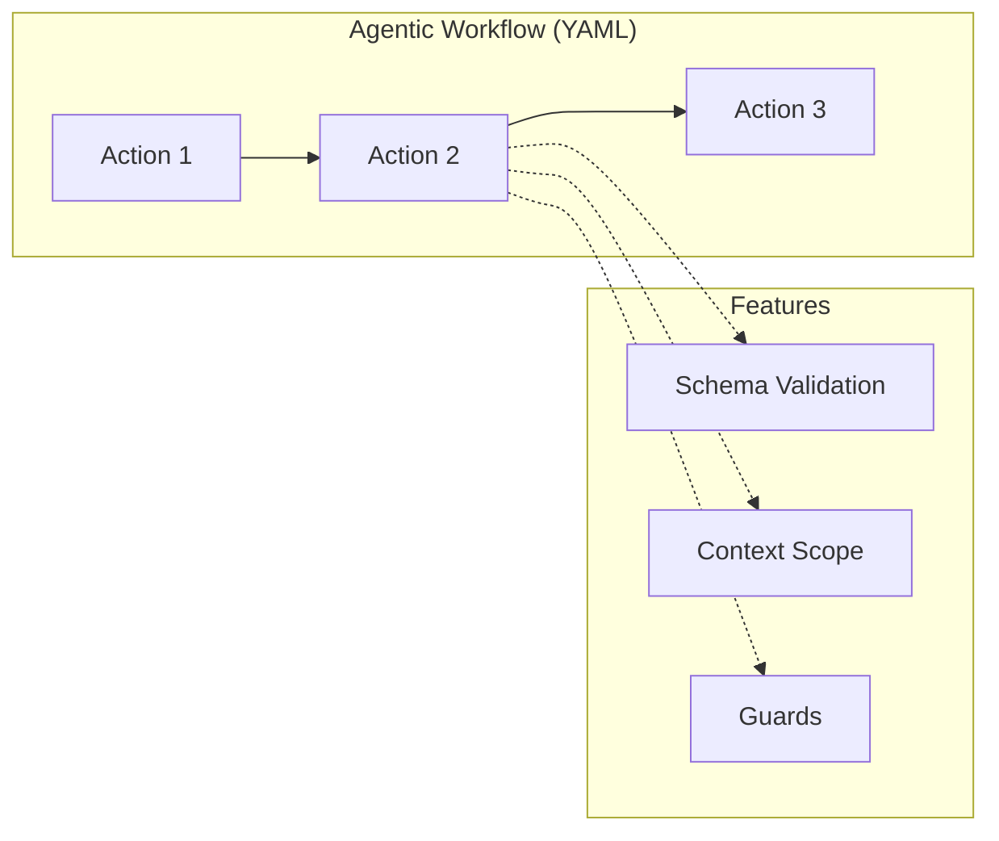

# Reference

This is your comprehensive guide to Agent Actions features. Whether you're building your first agentic workflow or debugging a complex multi-action pipeline, you'll find detailed documentation here.

## Quick Links

**Building Agentic Workflows**

- [Configuration](./configuration/) — Project, agentic workflow, and action settings
- [Context](./context/) — Data flow between actions
- [Prompts](./prompts/) — Prompt templates with Jinja2
- [Schemas](./schemas/) — JSON Schema validation

**Running Agentic Workflows**

- [Execution](./execution/) — Run modes, guards, granularity
- [Validation](./validation/) — Pre-flight checks and reprompting
- [Tools](./tools/) — Custom tools with `@udf_tool`

**Understanding the System**

- [Architecture](./architecture/) — DAG execution model
- [Data I/O](./data-io/) — File formats and directories

## Core Concepts

Think of an agentic workflow like an assembly line. Each action is a station that takes input, does its work, and passes output to the next station. The diagram below shows how actions connect and how features like validation and guards attach to each action:



Notice how each action can have its own schema validation, context scope, and guards. This modularity lets you build complex pipelines while keeping each piece testable.

**Agentic Workflow** — A DAG of actions defined in YAML. Actions declare dependencies, and the engine handles execution order automatically.

**Action** — A single step: either an LLM call or a Python tool. Each action has inputs, a prompt/function, and validated outputs.

**Field Reference** — Access upstream outputs in prompts using syntax like `{{ extract_facts.facts }}`. Think of these like spreadsheet formulas—they point to cells that will be filled in when the referenced action completes.

**Context Scope** — Control what data flows between actions using `observe`, `drop`, and `passthrough`.

**Guard** — Conditional execution: skip or filter actions based on data conditions. Guards are quality checkpoints—if input doesn't meet standards, the action is skipped entirely.

**Schema** — JSON Schema validation for outputs. Invalid responses trigger automatic reprompting. Note that schema validation catches structural errors but can't verify semantic correctness—a response might match your schema but still contain incorrect information.

## Example: Fact Extraction Agentic Workflow

Let's walk through a simple agentic workflow that extracts facts from documents and validates them:

```yaml
name: fact_extraction
defaults:
  model_vendor: openai
  model_name: gpt-4o-mini
  json_mode: true

actions:
  - name: extract_facts
    prompt: $prompts.extract_facts
    schema: facts_schema

  - name: validate_facts
    dependencies: [extract_facts]
    prompt: |
      Validate these facts: {{ extract_facts.facts }}
    schema: validation_result
    guard:
      condition: "extract_facts.facts != []"
      on_false: skip
```

Consider what happens when `extract_facts` returns an empty list. The guard on `validate_facts` checks the condition and skips the action entirely—no API call is made. This prevents unnecessary work and saves tokens.

## Supported Providers

Agent Actions supports OpenAI, Anthropic, Google, Groq, Mistral, Cohere, and Ollama. You can mix providers in the same agentic workflow—use different models for different actions based on cost or capability. See [Configuration](./configuration/) for setup details.
