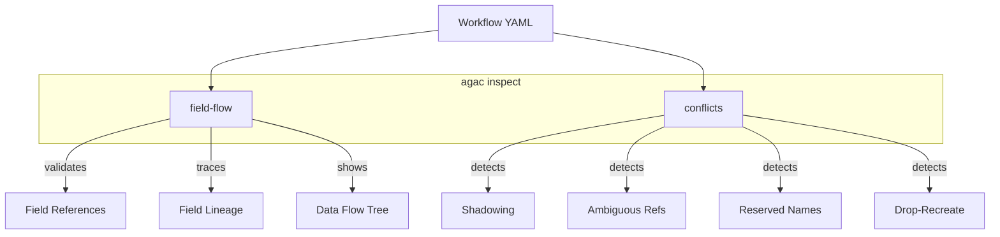
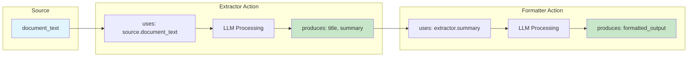
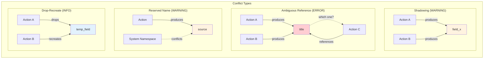
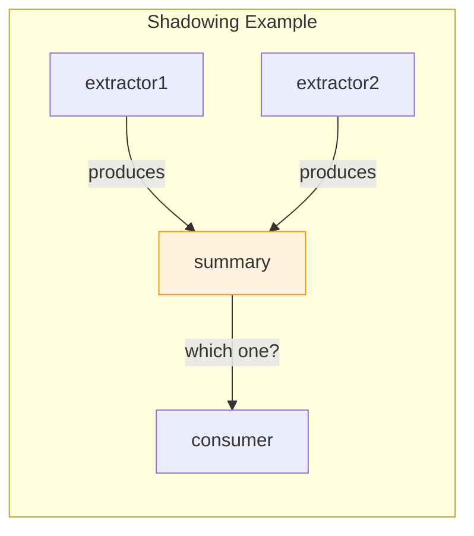
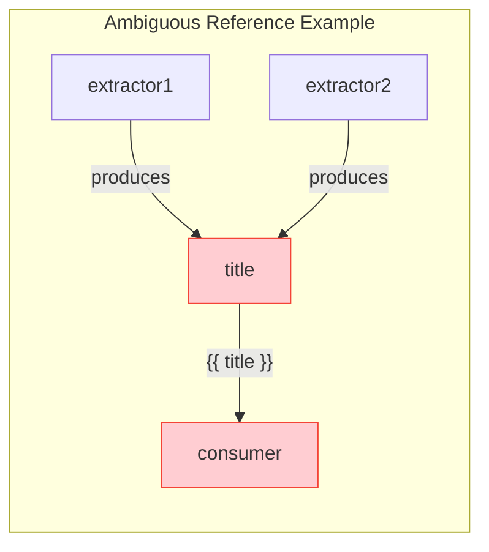
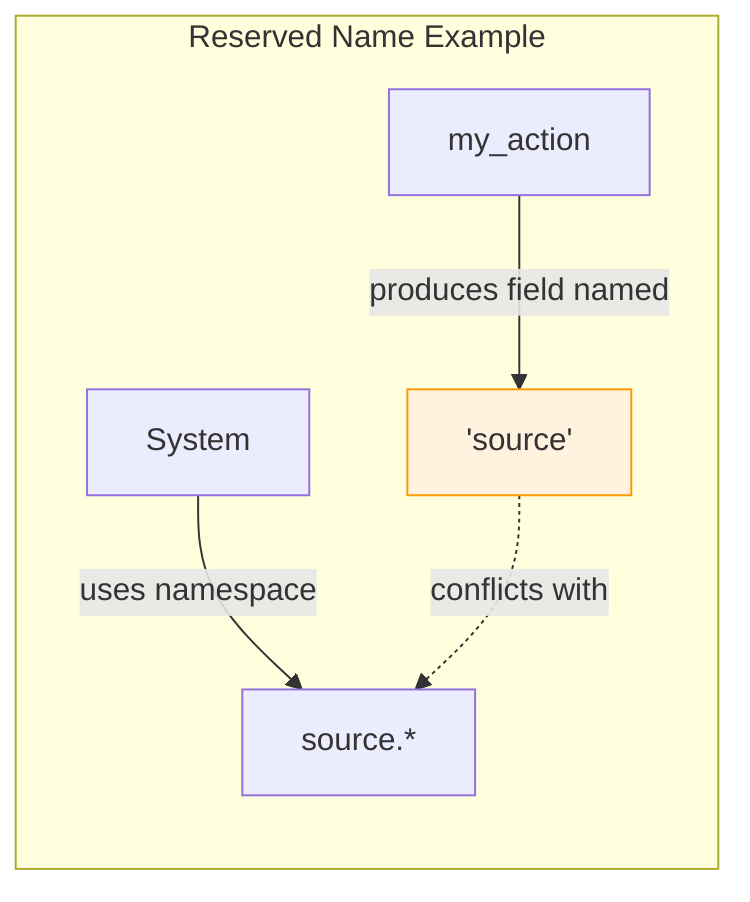
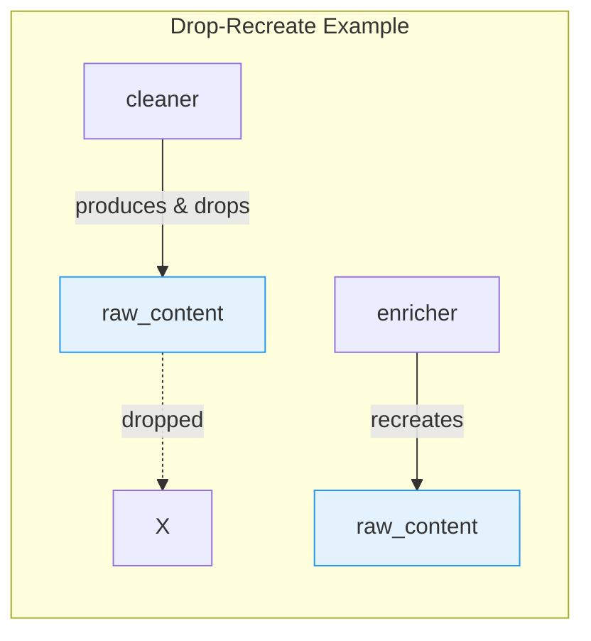
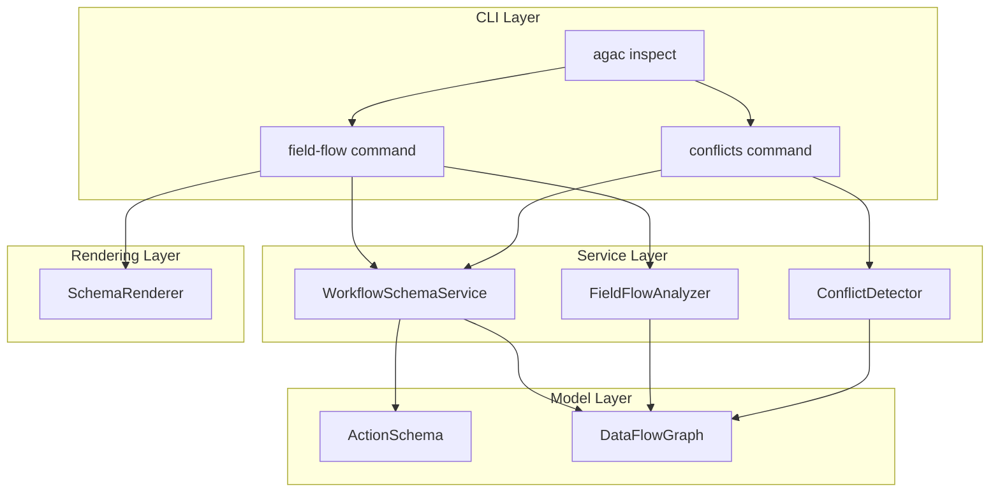

# Inspect Commands

How do you catch field reference typos before they cause runtime errors? What happens when two actions produce fields with the same name? The `agac inspect` commands answer these questions by analyzing your agentic workflow's data flow and detecting potential conflicts—all before you make a single LLM call.

Think of inspect commands like a spell-checker for your workflow wiring. Just as a spell-checker catches typos before you send an email, `agac inspect` catches data flow errors before you waste API credits on a misconfigured agentic workflow.

## Overview

```bash
agac inspect [SUBCOMMAND] [OPTIONS]
```

| Subcommand | Purpose |
|------------|---------|
| `field-flow` | Trace data flow between actions, validate field references |
| `conflicts` | Detect field name collisions and ambiguous references |



---

## Field Flow Analysis

Consider what happens when you reference `{{ extractor.sumary }}` in your prompt—notice the typo? Without validation, you'd discover this error only after processing records through the LLM, wasting time and API credits. The `field-flow` command catches these errors immediately.

### How Field Flow Works

Field flow analysis traces every data connection in your agentic workflow. Each action declares what fields it consumes (via templates) and what fields it produces (via schemas). The analyzer validates that every reference points to a field that actually exists.



Notice how data flows from source to extractor to formatter. Each arrow represents a field reference that the analyzer validates.

### Basic Usage

```bash
# Analyze entire agentic workflow
agac inspect field-flow -a my_workflow

# Focus on a specific action
agac inspect field-flow -a my_workflow.extract_facts

# Show detailed field lineages
agac inspect field-flow -a my_workflow --verbose

# Output as JSON for CI/CD integration
agac inspect field-flow -a my_workflow --json
```

### Options

| Option | Description |
|--------|-------------|
| `-a, --agent` | Workflow name, optionally with action (e.g., `my_workflow.action`) |
| `-u, --user-code` | Path to user code directory containing tools |
| `--json` | Output as JSON for programmatic use |
| `-v, --verbose` | Show detailed field lineage information |
| `--errors-only` | Show only validation errors |
| `--field` | Trace a specific field (e.g., `extractor.summary`) |

### Example: Whole Workflow Analysis

What does a healthy agentic workflow look like? Here's the output when all field references are valid:

```bash
$ agac inspect field-flow -a document_processor

Field Flow Analysis: document_processor

All field references are valid

╭─────────────────────────────────────────────────────────────╮
│ Workflow Data Flow                                          │
├─────────────────────────────────────────────────────────────┤
│ Flow Visualization                                          │
│ ├── extractor (llm)                                         │
│ │   ├── uses:                                               │
│ │   │   └── source.document_text                            │
│ │   └── produces:                                           │
│ │       ├── title                                           │
│ │       └── summary                                         │
│ └── formatter (llm)                                         │
│     ├── uses:                                               │
│     │   └── extractor.summary                               │
│     └── produces:                                           │
│         └── formatted_output                                │
╰─────────────────────────────────────────────────────────────╯
```

The tree visualization shows the data contract: extractor consumes `source.document_text` and produces `title` and `summary`. Formatter consumes `extractor.summary` and produces `formatted_output`.

### Example: Single Action Detail

Need to understand exactly what an action uses and produces? Focus on a single action:

```bash
$ agac inspect field-flow -a document_processor.extractor

╭───────────────────────────────────────────────────────────────╮
│ Action: extractor                                             │
├───────────────────────────────────────────────────────────────┤
│ extractor (llm)                                               │
│ ├── depends_on:                                               │
│ │   └── source                                                │
│ ├── uses (from templates):                                    │
│ │   └── source                                                │
│ │       └── document_text (task_instructions)                 │
│ └── produces:                                                 │
│     ├── title                                                 │
│     └── summary                                               │
╰───────────────────────────────────────────────────────────────╯
```

### Example: Tracing Field Lineage

Where does a field come from? Who consumes it? The `--field` option traces a field's complete lineage:

```bash
$ agac inspect field-flow -a my_workflow --field extractor.summary

╭──────────────────────────────────────────────────────────────╮
│ Field Lineage: extractor.summary                             │
├──────────────────────────────────────────────────────────────┤
│ Field Lineage: extractor.summary                             │
│ ├── Producer: extractor                                      │
│ │   └── Type: schema                                         │
│ └── Consumers:                                               │
│     └── formatter                                            │
│         └── Location: task_instructions                      │
╰──────────────────────────────────────────────────────────────╯
```

This tells you that `summary` is produced by the extractor action (defined in its schema) and consumed by the formatter action in its task instructions.

### Example: Catching Errors

Here's where the real value shows. When you have a typo or missing field reference:

```bash
$ agac inspect field-flow -a broken_workflow

Field Flow Analysis: broken_workflow

2 error(s), 0 warning(s) found

Error 1:
  Action: formatter
  Reference: {{ extractor.sumary }}
  Location: task_instructions
  Problem: Field 'sumary' not found in agent 'extractor'
  Available: summary, title
  Hint: Did you mean 'summary'?
```

The analyzer not only catches the error but suggests the likely intended field. This saves you from discovering the typo after processing hundreds of records.

---

## Conflict Detection

What happens when two actions both produce a field called `title`? If you later reference `{{ title }}` without qualifying which action you mean, the system can't know which value to use. The `conflicts` command detects these ambiguities before they cause runtime surprises.

### Conflict Types

The analyzer detects four types of conflicts, each with different severity:



| Conflict Type | Severity | Meaning |
|---------------|----------|---------|
| **Shadowing** | Warning | Multiple actions produce the same field name |
| **Ambiguous Reference** | Error | An unqualified reference matches multiple sources |
| **Reserved Name** | Warning | A field uses a system namespace name |
| **Drop-Recreate** | Info | A field was dropped and later recreated |

### Basic Usage

```bash
# Analyze entire agentic workflow
agac inspect conflicts -a my_workflow

# Output as JSON
agac inspect conflicts -a my_workflow --json

# Filter to specific action
agac inspect conflicts -a my_workflow --filter-action extractor

# Include INFO-level conflicts
agac inspect conflicts -a my_workflow --include-info
```

### Options

| Option | Description |
|--------|-------------|
| `-a, --agent` | Agent/workflow configuration name |
| `-u, --user-code` | Path to user code directory containing tools |
| `--json` | Output as JSON for programmatic use |
| `--filter-action` | Filter conflicts to those affecting a specific action |
| `--include-info` | Include INFO-level conflicts (drop-recreate patterns) |

### Shadowing (WARNING)

Consider an agentic workflow with two extractors that both produce a `summary` field:



This isn't necessarily wrong—you might intend to use qualified references. But it's worth knowing about:

```bash
$ agac inspect conflicts -a multi_extractor_workflow

1 warning(s)

Shadowing Conflicts
┏━━━━━━━━━━┳━━━━━━━━━━┳━━━━━━━━━━━━━━━━━━━━━━━━━━━━━━━━━━━━━━━━━━━┳━━━━━━━━━━━━━━━━━━━━━━━━━━━━━━━━━━━┓
┃ Field    ┃ Severity ┃ Details                                   ┃ Resolution                        ┃
┡━━━━━━━━━━╇━━━━━━━━━━╇━━━━━━━━━━━━━━━━━━━━━━━━━━━━━━━━━━━━━━━━━━━╇━━━━━━━━━━━━━━━━━━━━━━━━━━━━━━━━━━━┩
│ summary  │ WARN     │ Field 'summary' is produced by multiple   │ Use qualified reference:          │
│          │          │ actions: extractor1, extractor2           │ {{ action.extractor1.summary }}   │
│          │          │ Producers: extractor1, extractor2         │ or {{ action.extractor2.summary }}│
└──────────┴──────────┴───────────────────────────────────────────┴───────────────────────────────────┘

Summary:
  Actions analyzed: 3
  Unique fields: 5
  Shadowed fields: 1
```

The resolution is simple: use qualified references like `{{ extractor1.summary }}` instead of unqualified `{{ summary }}`.

### Ambiguous Reference (ERROR)

Shadowing becomes an error when you actually reference the ambiguous field without qualifying it:



```bash
$ agac inspect conflicts -a ambiguous_workflow

1 error(s)

Ambiguous References
┏━━━━━━━━━━┳━━━━━━━━━━┳━━━━━━━━━━━━━━━━━━━━━━━━━━━━━━━━━━━━━━━━━━━┳━━━━━━━━━━━━━━━━━━━━━━━━━━━━━━━━━━━┓
┃ Field    ┃ Severity ┃ Details                                   ┃ Resolution                        ┃
┡━━━━━━━━━━╇━━━━━━━━━━╇━━━━━━━━━━━━━━━━━━━━━━━━━━━━━━━━━━━━━━━━━━━╇━━━━━━━━━━━━━━━━━━━━━━━━━━━━━━━━━━━┩
│ title    │ ERROR    │ Ambiguous reference '{{ source.title }}'  │ Use qualified reference:          │
│          │          │ in action 'consumer' could match multiple │ {{ action.extractor1.title }}     │
│          │          │ sources                                   │ or {{ action.extractor2.title }}  │
│          │          │ Affected: consumer:task_instructions      │                                   │
└──────────┴──────────┴───────────────────────────────────────────┴───────────────────────────────────┘
```

This is an error because the system cannot determine which `title` you mean. Fix it by qualifying the reference.

### Reserved Name (WARNING)

Agent Actions uses certain names for system purposes: `source`, `seed`, `versions`, `workflow`, `action`. If you produce a field with one of these names, it may conflict with system namespaces:



```bash
$ agac inspect conflicts -a reserved_name_workflow

1 warning(s)

Reserved Name Usage
┏━━━━━━━━━━┳━━━━━━━━━━┳━━━━━━━━━━━━━━━━━━━━━━━━━━━━━━━━━━━━━━━━━━━┳━━━━━━━━━━━━━━━━━━━━━━━━━━━━━━━━━━━┓
┃ Field    ┃ Severity ┃ Details                                   ┃ Resolution                        ┃
┡━━━━━━━━━━╇━━━━━━━━━━╇━━━━━━━━━━━━━━━━━━━━━━━━━━━━━━━━━━━━━━━━━━━╇━━━━━━━━━━━━━━━━━━━━━━━━━━━━━━━━━━━┩
│ source   │ WARN     │ Field 'source' uses a reserved name that  │ Consider renaming the field to    │
│          │          │ may conflict with system namespaces       │ avoid confusion                   │
└──────────┴──────────┴───────────────────────────────────────────┴───────────────────────────────────┘
```

### Drop-Recreate (INFO)

Sometimes you intentionally drop a field in one action and recreate it in another. This pattern is common in data transformation agentic workflows:



By default, these are hidden since they're usually intentional. Use `--include-info` to see them:

```bash
$ agac inspect conflicts -a transform_workflow --include-info

1 info

Drop-Recreate Patterns
┏━━━━━━━━━━━━━━┳━━━━━━━━━━┳━━━━━━━━━━━━━━━━━━━━━━━━━━━━━━━━━━━━━━━━┳━━━━━━━━━━━━━━━━━━━━━━━━━━━━━━━━━━━┓
┃ Field        ┃ Severity ┃ Details                                ┃ Resolution                        ┃
┡━━━━━━━━━━━━━━╇━━━━━━━━━━╇━━━━━━━━━━━━━━━━━━━━━━━━━━━━━━━━━━━━━━━━╇━━━━━━━━━━━━━━━━━━━━━━━━━━━━━━━━━━━┩
│ raw_content  │ INFO     │ Field 'raw_content' was dropped by     │ This may be intentional. Verify   │
│              │          │ 'cleaner' and recreated by 'enricher'  │ the workflow logic.               │
└──────────────┴──────────┴────────────────────────────────────────┴───────────────────────────────────┘
```

---

## JSON Output

Both commands support JSON output for programmatic use—ideal for CI/CD pipelines:

```bash
$ agac inspect conflicts -a my_workflow --json
```

```json
{
  "workflow_name": "my_workflow",
  "has_conflicts": true,
  "error_count": 0,
  "warning_count": 1,
  "conflicts": [
    {
      "type": "shadowing",
      "severity": "warning",
      "field_name": "summary",
      "message": "Field 'summary' is produced by multiple actions: extractor1, extractor2",
      "resolution": "Use qualified reference: {{ action.extractor1.summary }} or {{ action.extractor2.summary }}",
      "producers": [
        {"action": "extractor1", "field_source": "schema"},
        {"action": "extractor2", "field_source": "schema"}
      ],
      "affected_references": []
    }
  ],
  "summary": {
    "actions_analyzed": 3,
    "unique_fields": 5,
    "shadowed_fields": 1
  }
}
```

```bash
$ agac inspect field-flow -a my_workflow --json
```

```json
{
  "workflow_name": "my_workflow",
  "is_valid": true,
  "execution_order": ["extractor", "formatter"],
  "actions": {
    "extractor": {
      "name": "extractor",
      "kind": "llm",
      "upstream_refs": [
        {
          "source_agent": "source",
          "field_name": "document_text",
          "location": "task_instructions"
        }
      ],
      "input_fields": [],
      "output_fields": [
        {"name": "title", "source": "schema"},
        {"name": "summary", "source": "schema"}
      ]
    }
  },
  "validation": {
    "is_valid": true,
    "errors": [],
    "warnings": []
  }
}
```

---

## Architecture

For those interested in how the inspect commands work internally:



The `WorkflowSchemaService` builds a unified schema model from your workflow YAML. The `FieldFlowAnalyzer` and `ConflictDetector` operate on the `DataFlowGraph` to identify issues. Results are rendered through the `SchemaRenderer` for both CLI and JSON output.

---

## Best Practices

### Run Before Deployment

Make `agac inspect field-flow` part of your deployment checklist. Catching a typo like `{{ extractor.sumary }}` before deployment is far better than discovering it after processing thousands of records.

### Check for Conflicts During Design

When designing agentic workflows with multiple actions that produce similar data, run `agac inspect conflicts` early. It's easier to rename fields during design than after you've built downstream consumers.

### Use Qualified References

When multiple actions produce the same field name, always use qualified references:

```yaml
# Avoid ambiguity
prompt: |
  Compare the summaries:
  Original: {{ extractor1.summary }}
  Enhanced: {{ extractor2.summary }}
```

### Avoid Reserved Names

Don't name output fields `source`, `seed`, `versions`, `workflow`, or `action`. These conflict with system namespaces and cause confusion.

### Integrate into CI/CD

Add inspect commands to your CI pipeline:

```bash
# Fail the build if there are field reference errors
agac inspect field-flow -a my_workflow --json | jq -e '.is_valid'

# Fail the build if there are conflict errors
agac inspect conflicts -a my_workflow --json | jq -e '.error_count == 0'
```

### Review Drop-Recreate Periodically

Use `--include-info` occasionally to review intentional drop-recreate patterns. As agentic workflows evolve, what was once intentional may become a bug.

---

## See Also

- [Validation](./validation/) - Pre-flight validation for agentic workflows
- [Context Scoping](./context/) - How `observe`, `passthrough`, and `drop` control data flow
- [Troubleshooting](../guides/troubleshooting) - Common issues and solutions
