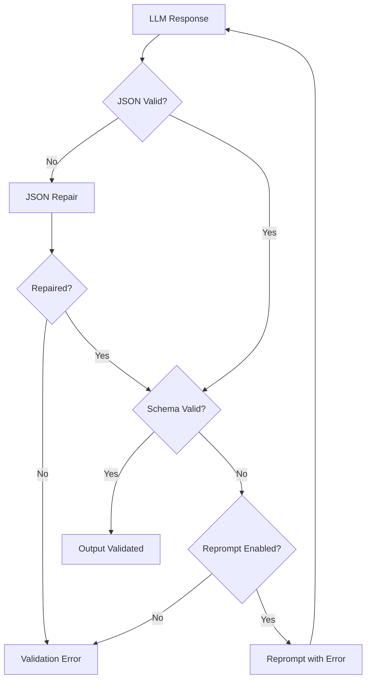

# Schema System

What happens when an LLM returns malformed JSON or misses a required field? The Schema System provides output validation for LLM actions. Schemas define the expected structure of action outputs, enabling automatic validation, reprompting on failure, and type-safe data flow between actions.

Think of schemas like contracts: they define exactly what each action promises to deliver. When the LLM output does not match the contract, Agent Actions catches the error before it propagates downstream.

## Overview

Let's explore what schemas provide in your agentic workflow:

- **Output Validation** - Ensure LLM responses match expected structure
- **Reprompting** - Automatic retry when validation fails
- **Documentation** - Define contracts between actions
- **Type Safety** - Catch structural issues before downstream processing

Keep in mind that schema validation catches structural errors but cannot verify semantic correctness. A response might match your schema perfectly but still contain incorrect information.

## Schema Formats

Agent Actions supports multiple schema definition approaches:

| Format | Location | Use Case |
|--------|----------|----------|
| External YAML/JSON | `schema/` directory | Reusable, complex schemas |
| Inline Object | Workflow YAML | Simple, one-off schemas |
| Shorthand | Workflow YAML | Very simple type definitions |
| Dynamic Dispatch | `dispatch_task()` | Runtime schema selection |

## External Schemas (YAML and JSON Files)

Store reusable schemas in the `schema/` directory at the **project root**. Schema files can use `.yml`, `.yaml`, or `.json` extensions. Unlike prompts (which can be workflow-level), schemas are always project-level—shared across all workflows.

### Directory Structure

```
project/
├── agent_actions.yml
├── schema/                          # Project-level only (shared)
│   ├── candidate_facts_list.yml     # YAML format
│   ├── question_quality_score.yml
│   ├── product_data.json            # JSON format works too
│   └── cluster_validation.yml
└── agent_workflow/
    ├── quiz_generation/             # Workflow uses project schemas
    └── document_analysis/           # Same schemas available here
```

Why project-level only? Schemas define data contracts that often span multiple workflows. A `candidate_facts_list` schema might be used by both extraction and validation workflows. Centralizing schemas prevents drift and ensures consistent validation across your project.

If you need workflow-specific output structures, use inline schemas (see below) or create uniquely-named schema files in the shared `schema/` directory.

### JSON Schema Format

Full JSON Schema syntax for complex validation:

```yaml
# schema/candidate_facts_list.yml
name: candidate_facts_list
type: array
items:
  type: object
  properties:
    fact:
      type: string
      description: "Short, testable statement with technical detail"
      maxLength: 250
    quote:
      type: string
      description: "Short verbatim evidence from source"
    technical_level:
      type: string
      description: "Type of technical content"
      enum:
        - configuration
        - implementation
        - constraint
        - procedure
        - integration
  required:
    - fact
    - quote
    - technical_level
```

### Fields Format

Simplified syntax for straightforward schemas:

```yaml
# schema/question_quality_score.yml
name: question_quality_score
fields:
  - id: syllabus_alignment_score
    type: number
    description: "How well the question tests objectives (0-100)"

  - id: objective_tested
    type: string
    description: "Which objective(s) this question tests"

  - id: aligned_skill_area
    type: string
    description: "Primary exam skill area tested"

  - id: reasoning
    type: string
    description: "Explanation of alignment"
```

### Reference in Workflow

```yaml
actions:
  - name: extract_facts
    prompt: $prompts.extract_facts
    schema: candidate_facts_list  # References schema/candidate_facts_list.yml (or .yaml/.json)

  - name: score_quality
    prompt: $prompts.score_quality
    schema: question_quality_score
```

:::tip Schema Compilation
During the render step, schema references are **inlined** into the workflow. This means `schema: candidate_facts_list` gets replaced with the actual schema content from the matching file (`candidate_facts_list.yml`, `.yaml`, or `.json`). Use `agac render -a workflow_name` to see the compiled output with all schemas inlined.
:::

## Inline Schemas

Define schemas directly in workflow YAML for simple cases:

### Object Shorthand

```yaml
- name: generate_summary
  prompt: $prompts.summary_generator
  schema:
    summary: string
    code_snippets: array
```

Equivalent to:

```yaml
schema:
  type: object
  properties:
    summary:
      type: string
    code_snippets:
      type: array
```

### Complex Inline Schema

```yaml
- name: generate_distractor
  schema:
    distractor_1: string
    explanation_why_it_is_incorrect_1: string
    thinking_process_1: string
```

## Dynamic Schema Selection

What if different records need different output structures? For example, a quiz generator might need different schemas for multiple-choice vs open-ended questions. The `dispatch_task()` function enables runtime schema selection based on context.

### Basic Usage

```yaml
- name: generate_question
  prompt: $quiz_gen.question_prompt
  schema: dispatch_task('select_question_schema')
```

When this action runs, Agent Actions:
1. Calls the `select_question_schema` tool with current context
2. Uses the returned schema name or definition
3. Validates the LLM output against that schema

### Returning a Schema Name

The simplest approach returns a schema name that references a file in `schema/`:

```python
from agent_actions import udf_tool

@udf_tool
def select_question_schema(input_data: dict) -> str:
    question_type = input_data["source"]["question_type"].upper()

    if question_type == "MULTIPLE_CHOICE":
        return "mc_question_schema"  # References schema/mc_question_schema.yml (or .yaml/.json)
    elif question_type == "TRUE_FALSE":
        return "tf_question_schema"
    else:
        return "open_question_schema"
```

### Returning a Schema Definition

For more dynamic cases, return a complete schema definition:

```python
@udf_tool
def select_output_schema(input_data: dict) -> dict:
    complexity = input_data["source"]["complexity"]

    if complexity == "detailed":
        return {
            "name": "detailed_response",
            "fields": [
                {"id": "summary", "type": "string", "required": True},
                {"id": "details", "type": "array", "required": True},
                {"id": "confidence", "type": "number", "required": True},
                {"id": "sources", "type": "array", "required": False}
            ]
        }
    else:
        return {
            "name": "simple_response",
            "fields": [
                {"id": "summary", "type": "string", "required": True},
                {"id": "confidence", "type": "number", "required": True}
            ]
        }
```

### Use Cases

| Scenario | Approach |
|----------|----------|
| **Multi-domain content** | Select `technical_schema`, `business_schema`, or `legal_schema` based on content type |
| **Adaptive complexity** | Use detailed schema for long content, simple schema for short content |
| **Question types** | Different schemas for multiple-choice, true/false, open-ended questions |
| **Vendor variations** | Adjust schema based on target vendor capabilities |

### Context Available

The dispatch tool receives all available context:

```python
@udf_tool
def select_schema(input_data: dict) -> str:
    # Source fields from current record
    content_type = input_data["source"]["content_type"]

    # Seed data
    exam_type = input_data["seed"]["exam_syllabus"]["type"]

    # Upstream action outputs
    classification = input_data["classify_content"]["category"]

    # Make decision based on any combination
    if classification == "code":
        return "code_analysis_schema"
    return "default_schema"
```

For more details on `dispatch_task()`, see [Dynamic Dispatch](../prompts/dispatch).

## Schema Types

### Primitive Types

| Type | Description | Example |
|------|-------------|---------|
| `string` | Text value | `"hello"` |
| `number` | Numeric value | `42`, `3.14` |
| `integer` | Whole number | `42` |
| `boolean` | True/false | `true` |
| `array` | List of items | `[1, 2, 3]` |
| `object` | Key-value pairs | `{"key": "value"}` |

### Array Schema

```yaml
name: items_list
type: array
items:
  type: object
  properties:
    name:
      type: string
    value:
      type: number
```

### Nested Objects

```yaml
name: nested_structure
type: object
properties:
  metadata:
    type: object
    properties:
      created_at:
        type: string
      version:
        type: integer
  data:
    type: array
    items:
      type: string
```

### Enums

```yaml
properties:
  status:
    type: string
    enum:
      - pending
      - approved
      - rejected
  priority:
    type: string
    enum:
      - low
      - medium
      - high
```

## Validation Constraints

### String Constraints

```yaml
properties:
  title:
    type: string
    minLength: 1
    maxLength: 100
  email:
    type: string
    pattern: "^[a-zA-Z0-9+_.-]+@[a-zA-Z0-9.-]+$"
```

### Number Constraints

```yaml
properties:
  score:
    type: number
    minimum: 0
    maximum: 100
  count:
    type: integer
    exclusiveMinimum: 0
```

### Required Fields

```yaml
type: object
properties:
  name:
    type: string
  description:
    type: string
required:
  - name  # description is optional
```

## Examples

### Fact Extraction Schema

```yaml
# schema/candidate_facts_list.yml
name: candidate_facts_list
type: array
items:
  type: object
  properties:
    fact:
      type: string
      description: "Short, testable statement"
      maxLength: 250
    quote:
      type: string
      description: "Verbatim evidence from source"
    technical_level:
      type: string
      enum:
        - configuration
        - implementation
        - constraint
        - procedure
        - integration
    supports_objective:
      type: string
      description: "Learning objective supported"
  required:
    - fact
    - quote
    - technical_level
    - supports_objective
```

### Cluster Validation Schema

```yaml
# schema/cluster_validation.yml
name: cluster_validation
fields:
  - id: should_keep_cluster
    type: boolean
  - id: reasoning
    type: string
  - id: new_clusters
    type: array
    items:
      type: object
      properties:
        cluster_name:
          type: string
        semantic_unique_ids:
          type: array
          items:
            type: string
```

### Inline Schema in Workflow

```yaml
- name: review_code_snippets
  schema:
    code_snippets: array
    removed_snippets: array
    removal_reasoning: string
```

## Schema Validation Flow

Consider what happens when an action receives a response. Agent Actions validates the output through multiple stages:



Notice that invalid JSON triggers a repair attempt before giving up. This handles common LLM issues like trailing commas or unquoted keys.

## JSON Mode

Enable structured output with `json_mode`:

```yaml
defaults:
  json_mode: true

actions:
  - name: extract_facts
    schema: candidate_facts_list
    # json_mode: true inherited from defaults
```

When enabled:
- LLM is instructed to return JSON
- Provider-specific JSON modes are used when available
- Invalid JSON triggers repair and reprompting

## Best Practices

### 1. Use External Schemas for Reuse

```yaml
# Good: Reusable schema file
schema: candidate_facts_list

# Avoid: Duplicating complex schemas inline
```

### 2. Document with Descriptions

```yaml
properties:
  score:
    type: number
    description: "Quality score from 0-100. >= 85 means keep."
```

### 3. Use Enums for Constrained Values

```yaml
# Good: Explicit allowed values
technical_level:
  type: string
  enum: [configuration, implementation, constraint]

# Avoid: Free-form strings for categorical data
```

### 4. Define Required Fields

```yaml
required:
  - fact
  - quote
  # Optional: supports_objective
```

### 5. Use Appropriate Types

```yaml
# Good: Specific types
score:
  type: integer
  minimum: 0
  maximum: 100

# Avoid: Overly permissive
score:
  type: string  # Loses numeric validation
```

## Error Handling

### Validation Failure

What happens when schema validation fails? Agent Actions provides several fallback mechanisms:

1. If reprompting enabled: Retry with error context
2. If reprompting disabled: Action fails
3. Downstream actions using this output are skipped

This means a single validation failure does not necessarily crash your entire agentic workflow. Downstream actions that depend on the failed output will be skipped, but independent branches continue.

### Common Errors

```
SchemaValidationError: Required field 'fact' missing
SchemaValidationError: Value 'invalid' not in enum ['a', 'b', 'c']
SchemaValidationError: String length 300 exceeds maxLength 250
```

### Debugging

Enable validation details:

```yaml
- name: my_action
  schema: my_schema
  prompt_debug: true  # Shows validation errors in detail
```

## Schema Discovery

List available schemas:

```bash
ls schema/*.yml schema/*.yaml schema/*.json
```

Validate a schema file:

```bash
agac schema --validate schema/my_schema.yml
agac schema --validate schema/my_schema.json
```
