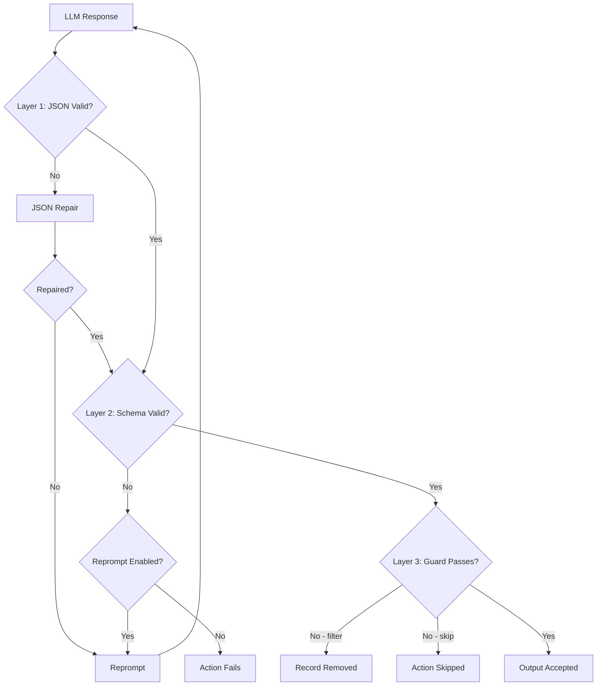

# Output Validation Pipeline

How do you ensure an LLM's output is actually usable? The model might return malformed JSON, miss required fields, or produce technically valid responses that don't meet your quality bar.

Agent Actions addresses this with a multi-layer validation system. Think of it like airport security: each layer catches different problems, and outputs must pass all checks to proceed.

## Validation Layers

LLM outputs pass through three validation layers. Let's walk through what each layer catches:



Notice how problems caught early (JSON repair) avoid expensive retries. Guards run last because they evaluate semantic conditions that require valid, schema-conforming data.

| Layer | Purpose | Mechanism |
|-------|---------|-----------|
| **1. JSON** | Structural integrity | JSON repair + reprompt |
| **2. Schema** | Type/field validation | Schema constraints + reprompt |
| **3. Guard** | Semantic validation | Condition expressions |

## Layer 1: JSON Validation

Ensures the LLM returns valid JSON.

### Automatic JSON Repair

Before reprompting, Agent Actions attempts to fix common JSON issues:

- Missing closing brackets/braces
- Trailing commas
- Unquoted strings
- Invalid escape sequences

```yaml
reprompt:
  json_repair: true  # Default: enabled
```

### Reprompt on JSON Failure

If repair fails, the LLM is reprompted with the error:

```yaml
- name: extract_data
  schema: my_schema
  reprompt:
    max_attempts: 3
    json_repair: true
    use_llm_critique: false
    on_exhausted: return_last
```

## Layer 2: Schema Validation

Validates output structure, types, and constraints.

### Structural Validation

**Required Fields** - Reject if missing:

```yaml
# schema/my_schema.yml
type: object
properties:
  title:
    type: string
  content:
    type: string
required:
  - title
  - content  # Both must be present
```

**Type Checking** - Reject wrong types:

```yaml
properties:
  score:
    type: integer  # Rejects "85" (string) or 85.5 (float)
  tags:
    type: array    # Rejects "tag1, tag2" (string)
```

### Value Constraints

**Enums** - Reject values not in list:

```yaml
properties:
  status:
    type: string
    enum:
      - approved
      - rejected
      - pending
    # Rejects: "maybe", "APPROVED", "Approved"
```

**Numeric Ranges** - Reject out-of-range values:

```yaml
properties:
  score:
    type: number
    minimum: 0
    maximum: 100
    # Rejects: -5, 101, 150

  confidence:
    type: number
    exclusiveMinimum: 0
    exclusiveMaximum: 1
    # Rejects: 0, 1 (must be between, not equal)
```

**String Constraints** - Reject by length/pattern:

```yaml
properties:
  summary:
    type: string
    minLength: 10
    maxLength: 500
    # Rejects: "Short" (< 10 chars)

  email:
    type: string
    pattern: "^[a-zA-Z0-9+_.-]+@[a-zA-Z0-9.-]+$"
    # Rejects: "not-an-email"
```

**Array Constraints** - Reject by count:

```yaml
properties:
  items:
    type: array
    minItems: 1
    maxItems: 10
    # Rejects: [] (empty) or arrays with 11+ items
```

### Reprompt on Schema Failure

When schema validation fails, reprompting retries with error context:

```yaml
- name: generate_analysis
  schema: analysis_schema
  reprompt:
    max_attempts: 4
    json_repair: true
    use_llm_critique: true
    critique_after_attempt: 2
    on_exhausted: return_last
```

The retry prompt includes:
- Original response that failed
- Specific validation errors
- Field/constraint that failed

## Layer 3: Guard Validation

Here's where it gets interesting: schema validation catches structural problems, but what about semantic ones? A score of 25 is a valid integer, but maybe you only want to process high-quality content with scores above 85.

Guards validate semantic and business logic after schema passes:

### Filter Unwanted Values

```yaml
- name: score_quality
  schema: quality_score
  # Schema ensures score is number 0-100

- name: generate_final
  dependencies: score_quality  # Input source
  guard:
    condition: 'score >= 85'  # Semantic: only high quality
    on_false: filter
```

### Reject Specific Content

```yaml
# Filter out responses with unwanted status
- name: next_action
  guard:
    condition: 'status != "invalid"'
    on_false: filter

# Filter based on category
- name: process_technical
  guard:
    condition: 'category IN ["technical", "implementation"]'
    on_false: filter
```

### Skip vs Filter

Consider what happens when a guard fails. You have two choices, and they have very different implications:

| Action | Use Case |
|--------|----------|
| `filter` | Remove record entirely from agentic workflow |
| `skip` | Skip this action, but continue processing record |

```yaml
# Filter: Record stops here
guard:
  condition: 'quality >= 50'
  on_false: filter

# Skip: Record continues without this action
guard:
  condition: 'needs_enhancement == true'
  on_false: skip
```

## Combining All Layers

Now let's see how these layers work together in real agentic workflows.

### Pattern: Quality Gate Pipeline

```yaml
actions:
  # Step 1: Extract with schema validation + reprompt
  - name: extract_facts
    prompt: $prompts.extract_facts
    schema: candidate_facts_list  # Layer 2: type/structure
    reprompt:
      max_attempts: 4
      json_repair: true
      use_llm_critique: true
      critique_after_attempt: 2
      on_exhausted: return_last

  # Step 2: Filter empty results (Layer 3)
  - name: validate_facts
    dependencies: extract_facts  # Input source
    guard:
      condition: 'candidate_facts_list != []'
      on_false: filter

  # Step 3: Score quality with schema
  - name: score_quality
    dependencies: validate_facts  # Input source
    schema: quality_score  # Ensures score is 0-100
    reprompt:
      max_attempts: 3
      json_repair: true
      use_llm_critique: false
      on_exhausted: return_last

  # Step 4: Filter low quality (Layer 3)
  - name: generate_output
    dependencies: score_quality  # Input source
    guard:
      condition: 'score >= 85'
      on_false: filter
```

### Pattern: Two-Stage LLM Validation

Use an LLM action to validate another LLM's output:

```yaml
actions:
  # Generate content
  - name: generate_content
    prompt: $prompts.generate
    schema: content_schema
    reprompt:
      max_attempts: 4
      json_repair: true
      use_llm_critique: true
      critique_after_attempt: 2
      on_exhausted: return_last

  # LLM validates the content
  - name: validate_content
    dependencies: generate_content  # Input source
    prompt: |
      Review this content and determine if it meets quality standards:
      {{ generate_content.content }}

      Return: {"is_valid": true/false, "reason": "..."}
    schema:
      is_valid: boolean
      reason: string

  # Guard on validation result
  - name: publish_content
    dependencies: validate_content  # Input source
    guard:
      condition: 'is_valid == true'
      on_false: filter
```

### Pattern: Enum + Guard for Categories

```yaml
# Schema enforces valid categories
# schema/classification.yml
properties:
  category:
    type: string
    enum:
      - technical
      - conceptual
      - procedural
      - invalid

---
# Workflow guards against unwanted category
- name: classify_content
  schema: classification
  reprompt:
    max_attempts: 3
    json_repair: true
    use_llm_critique: false
    on_exhausted: return_last

- name: process_valid
  dependencies: classify_content  # Input source
  guard:
    condition: 'category != "invalid"'  # Filter "invalid" category
    on_false: filter
```

### Pattern: Numeric Threshold with Reprompt

Force the LLM to return acceptable scores:

```yaml
# Schema with constraints
# schema/score_schema.yml
properties:
  confidence_score:
    type: number
    minimum: 0
    maximum: 100
    description: "Confidence from 0-100. Must be >= 70 for high confidence."

---
# Action with reprompt
- name: assess_confidence
  prompt: |
    Assess confidence in this analysis.
    Return a score from 0-100.
    Scores below 70 indicate low confidence.
  schema: score_schema
  reprompt:
    max_attempts: 5
    json_repair: true
    use_llm_critique: true
    use_self_reflection: true
    critique_after_attempt: 1
    on_exhausted: return_last

# Guard for business threshold
- name: proceed_if_confident
  dependencies: assess_confidence  # Input source
  guard:
    condition: 'confidence_score >= 70'
    on_false: filter
```

## Custom Validation with Tool Actions

What if your validation logic is too complex for schema constraints or guard expressions? For example, checking against a blocklist or calling an external API.

For complex validation logic, use a tool action:

```yaml
actions:
  - name: generate_content
    schema: content_schema
    reprompt:
      max_attempts: 3
      json_repair: true
      use_llm_critique: false
      on_exhausted: return_last

  - name: custom_validate
    kind: tool
    impl: validate_content
    dependencies: generate_content  # Input source

  - name: next_step
    dependencies: custom_validate  # Input source
    guard:
      condition: 'validation_passed == true'
      on_false: filter
```

```python
# tools/validate_content.py
@udf_tool()
def validate_content(content: dict) -> dict:
    """Custom validation logic."""
    issues = []

    # Check for prohibited words
    prohibited = ["todo", "placeholder", "tbd"]
    text = content.get("text", "").lower()
    for word in prohibited:
        if word in text:
            issues.append(f"Contains prohibited word: {word}")

    # Check minimum quality
    if len(content.get("summary", "")) < 50:
        issues.append("Summary too short")

    return {
        "validation_passed": len(issues) == 0,
        "issues": issues
    }
```

## Validation Decision Matrix

| Want to Reject | Use | Example |
|----------------|-----|---------|
| Invalid JSON | `reprompt: { json_repair: true }` | Malformed response |
| Wrong type | Schema `type` | String instead of number |
| Missing field | Schema `required` | No "title" field |
| Wrong value | Schema `enum` | "maybe" not in ["yes", "no"] |
| Out of range | Schema `min/max` | Score of 150 (max 100) |
| Too short/long | Schema `minLength/maxLength` | Summary < 10 chars |
| Empty array | Guard `!= []` | No facts extracted |
| Low score | Guard `>= threshold` | Quality < 85 |
| Wrong category | Guard `!= value` | Category == "invalid" |
| Complex logic | Tool action | Custom business rules |

## Reprompt vs Guard

You might wonder: when should I use reprompting, and when should I use a guard? The key distinction is whether the LLM can fix the problem.

| Aspect | Reprompt | Guard |
|--------|----------|-------|
| **When** | Before accepting output | After output accepted |
| **Purpose** | Fix LLM mistakes | Filter valid but unwanted |
| **Action** | Retry LLM call | Skip/remove record |
| **Cost** | Additional LLM calls | No additional cost |
| **Use for** | Structural issues | Semantic filtering |

**Use reprompt when:**
- Output is malformed (JSON errors)
- Schema validation fails
- LLM can fix the issue with guidance

**Use guard when:**
- Output is valid but doesn't meet criteria
- Filtering based on values (scores, categories)
- Business logic decisions

The limitation here: reprompting costs API tokens. Guards are free. If you're filtering on a value the LLM produced correctly, use a guard—don't reprompt hoping for a different answer.

## Best Practices

### 1. Layer Your Validation

```yaml
# Layer 1 & 2: Schema + Reprompt
- name: extract
  schema: extraction_schema
  reprompt:
    max_attempts: 4
    json_repair: true
    use_llm_critique: true
    critique_after_attempt: 2
    on_exhausted: return_last

# Layer 3: Guard for quality
- name: process
  guard:
    condition: 'quality >= threshold'
    on_false: filter
```

### 2. Use Enums for Constrained Values

```yaml
# Good: LLM must choose from list
status:
  type: string
  enum: ["approved", "rejected", "pending"]

# Avoid: Free-form string with guard
# (LLM might return "Approved", "APPROVED", etc.)
```

### 3. Provide Schema Descriptions

```yaml
properties:
  score:
    type: integer
    minimum: 0
    maximum: 100
    description: "Quality score. 85+ is high quality, below 50 is rejected."
```

### 4. Set Reasonable Reprompt Limits

```yaml
# Simple schema: fewer attempts, no LLM critique
reprompt:
  max_attempts: 3
  json_repair: true
  use_llm_critique: false
  on_exhausted: return_last

# Complex schema: more attempts, full critique
reprompt:
  max_attempts: 5
  json_repair: true
  use_llm_critique: true
  use_self_reflection: true
  critique_after_attempt: 1
  on_exhausted: raise
```

### 5. Guard Early to Save Cost

This is important: guards prevent downstream work. Place guards as early as possible in your agentic workflow to avoid wasting API calls on records that will be filtered anyway.

```yaml
# Filter early before expensive actions
- name: extract  # Cheap
- name: validate  # Cheap
  guard:
    condition: 'facts != []'
    on_false: filter
- name: expensive_llm_call  # Only runs on valid data
  dependencies: validate  # Input source
```

## Debugging Validation Failures

### Check Schema Validation Errors

```bash
agac run -a workflow --log-level DEBUG
```

Look for:
```
SchemaValidationError: Required field 'title' missing
SchemaValidationError: Value 'invalid' not in enum
```

### Check Guard Evaluation

```bash
agac run -a workflow --log-level DEBUG
```

Look for:
```
Guard condition 'score >= 85' evaluated to False
Record filtered by guard on action 'generate_output'
```

### Validate Schema Syntax

```bash
agac schema --validate schema/my_schema.yml
```

### Analyze Schema Structure

```bash
agac schema -a workflow
```
