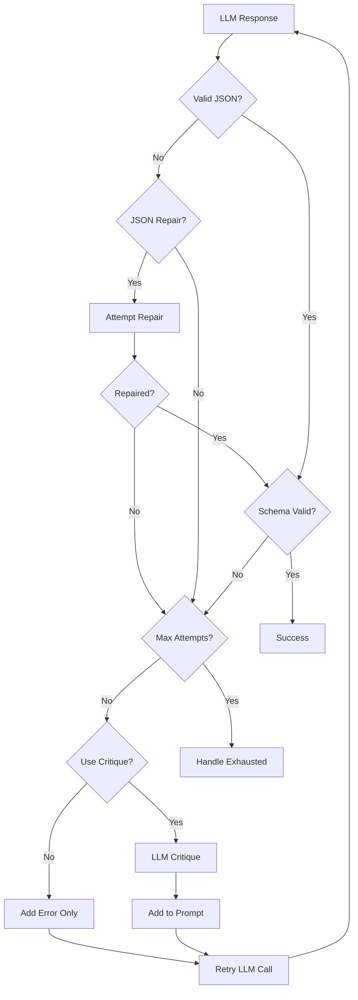

# Reprompting

What happens when an LLM returns malformed JSON or misses a required field? Without intervention, your agentic workflow fails. But often, the model just needs a second chance with clearer guidance.

Reprompting is Agent Actions' automatic retry system for validation errors. When an action's output fails validation, reprompting retries with the error context included in the prompt—giving the model specific feedback on what went wrong and how to fix it.

## Overview

The reprompting system provides:

- **Automatic retries** - Retry failed validations up to a configurable limit
- **JSON repair** - Attempt to fix malformed JSON before reprompting (no extra API call)
- **LLM critique** - Use an LLM to analyze failures and provide guidance
- **Self-reflection** - Include the model's own assessment in retry prompts
- **Configurable exhaustion** - Control what happens when all attempts fail

:::info Retry vs Reprompt
**Retry** handles transient errors (rate limits, network issues) - same request, wait, retry.
**Reprompt** handles validation errors (bad JSON, schema violations) - modify prompt with feedback, retry.

See [Retry & Error Handling](../execution/retry.md) for transient error handling.
:::

## Configuration

Reprompt requires explicit configuration—all options must be specified:

```yaml
defaults:
  reprompt:
    max_attempts: 2
    json_repair: true
    use_llm_critique: false
    critique_after_attempt: 2
    on_exhausted: return_last
```

To disable reprompting:

```yaml
defaults:
  reprompt: false
```

### Configuration Options

| Option | Type | Default | Description |
|--------|------|---------|-------------|
| `max_attempts` | integer | 2 | Maximum retry attempts |
| `json_repair` | boolean | true | Attempt JSON repair before retry |
| `use_llm_critique` | boolean | false | Use LLM to analyze failures |
| `use_self_reflection` | boolean | false | Include model self-assessment |
| `critique_after_attempt` | integer | 2 | Start critique after this attempt |
| `on_exhausted` | string | `return_last` | Behavior when attempts exhausted |

### Custom Validation Functions

Use `validation` to specify a Python function that checks the LLM response beyond schema validation. The function must be decorated with `@reprompt_validation`:

```yaml
actions:
  - name: classify_genre
    reprompt:
      validation: "check_valid_bisac"    # UDF function name
      max_attempts: 3
      on_exhausted: "return_last"
```

```python
from agent_actions import reprompt_validation

@reprompt_validation("BISAC code must be a valid category from the standard list")
def check_valid_bisac(response) -> bool:
    """Return True if valid, False triggers reprompt with the decorator's message."""
    codes = response.get("bisac_codes", [])
    return all(code.startswith(("FIC", "NON", "JUV", "YAF")) for code in codes)
```

When the validation function returns `False`, Agent Actions reprompts with the error message from the `@reprompt_validation` decorator, giving the LLM specific guidance on what to fix.

### Exhaustion Behavior

When a record exhausts all reprompt attempts, `on_exhausted` determines what happens:

| Value | Behavior |
|-------|----------|
| `return_last` | Return the last response (even if invalid), workflow continues (default) |
| `raise` | Raise an exception, workflow fails |

## How It Works

Let's walk through the reprompting flow. Notice how the system tries progressively more sophisticated recovery strategies before giving up:



The key insight: JSON repair is cheap (no API call), so it's tried first. LLM critique is expensive, so it's reserved for stubborn failures.

### Step-by-Step Process

1. **Initial response** - LLM generates output
2. **JSON check** - Verify response is valid JSON
3. **JSON repair** - If invalid, attempt automatic repair
4. **Schema validation** - Check against action schema
5. **Error analysis** - On failure, analyze validation errors
6. **LLM critique** (if enabled) - Get LLM analysis of failure
7. **Retry prompt** - Construct enhanced prompt with error context
8. **Retry** - Call LLM again with enhanced prompt
9. **Repeat** - Until valid or max attempts reached

## JSON Repair

Why try to fix JSON before reprompting? Because many JSON errors are trivial syntax issues—a missing bracket, a trailing comma—that don't require burning another API call to fix.

Before triggering a full reprompt, Agent Actions attempts to repair common JSON issues:

| Issue | Example | Repair Method |
|-------|---------|---------------|
| Markdown wrapping | ` ```json {...}``` ` | `strip_markdown` |
| Trailing commas | `[1, 2, 3,]` | `fix_trailing_commas` |
| Single quotes | `{'key': 'value'}` | `fix_quotes` |
| Unclosed brackets | `{"items": [1, 2, 3` | `close_brackets` |
| Embedded JSON | `Here's the data: {...}` | `extract_json_block` |

```yaml
reprompt:
  json_repair: true  # Enabled by default
```

When JSON repair succeeds, you'll see it in the logs:

```
INFO: JSON repaired using fix_trailing_commas: {'items': [1, 2, 3]}
```

## LLM Critique

When enabled, the system uses an LLM to analyze validation failures:

```yaml
reprompt:
  use_llm_critique: true
  critique_after_attempt: 2  # Start critique on 3rd attempt
```

The critique LLM:
- Analyzes the original response and error
- Identifies why validation failed
- Suggests corrections
- Provides guidance in the retry prompt

This is expensive (extra API call per retry), so it's typically enabled only after initial attempts fail.

## Self-Reflection

Includes the model's own assessment of what went wrong:

```yaml
reprompt:
  use_self_reflection: true
```

The retry prompt includes:
- Original response that failed
- Validation errors encountered
- Model's reflection on the failure
- Specific guidance for correction

## Examples

### Basic Reprompting (JSON Repair Only)

For simple schemas where most errors are JSON formatting issues:

```yaml
defaults:
  reprompt:
    max_attempts: 2
    json_repair: true
    use_llm_critique: false
    critique_after_attempt: 999  # Never use critique
    on_exhausted: return_last
```

### Balanced Reprompting

For production workflows—start with cheap retries, escalate to LLM critique:

```yaml
defaults:
  reprompt:
    max_attempts: 4
    json_repair: true
    use_llm_critique: true
    critique_after_attempt: 2  # Critique on 3rd and 4th attempts
    on_exhausted: return_last
```

### Maximum Effort

For critical workflows where correctness matters more than cost:

```yaml
defaults:
  reprompt:
    max_attempts: 5
    json_repair: true
    use_llm_critique: true
    use_self_reflection: true
    critique_after_attempt: 1  # Critique from 2nd attempt
    on_exhausted: raise  # Fail workflow if attempts exhausted
```

### Disable Reprompting

```yaml
defaults:
  reprompt: false

actions:
  - name: best_effort_action
    prompt: $prompts.optional_task
    schema: simple_schema
    # No retries - fails immediately on validation error
```

### Per-Action Override

```yaml
defaults:
  reprompt:
    max_attempts: 2
    json_repair: true
    use_llm_critique: false
    on_exhausted: return_last

actions:
  - name: simple_classify
    # Inherits default reprompting

  - name: critical_extraction
    # Override for this action only
    reprompt:
      max_attempts: 5
      json_repair: true
      use_llm_critique: true
      critique_after_attempt: 1
      on_exhausted: raise

  - name: optional_enrichment
    reprompt: false  # Disable for this action
```

## Combined with Retry

Retry and reprompt work together but handle different error types:

```yaml
defaults:
  # Retry: transient errors (rate limits, network)
  retry:
    max_attempts: 3
    on_exhausted: raise

  # Reprompt: validation errors (bad JSON, schema violations)
  reprompt:
    max_attempts: 4
    json_repair: true
    use_llm_critique: true
    critique_after_attempt: 2
    on_exhausted: return_last
```

The execution flow:
1. Action runs → transient error → **retry** kicks in
2. Action runs → success but invalid JSON → **reprompt** kicks in
3. Both can trigger for the same record (retry first, then reprompt)

## Best Practices

### 1. Always Enable JSON Repair

```yaml
reprompt:
  json_repair: true  # No reason to disable this
```

JSON repair is essentially free (no API call) and catches many common issues.

### 2. Use LLM Critique Sparingly

```yaml
reprompt:
  use_llm_critique: true
  critique_after_attempt: 2  # Don't start immediately
```

LLM critique adds an API call per retry. Start it after cheaper methods fail.

### 3. Match Max Attempts to Schema Complexity

| Schema Type | Recommended Max Attempts |
|-------------|-------------------------|
| Simple (1-3 fields) | 2-3 |
| Medium (4-8 fields) | 3-4 |
| Complex (9+ fields) | 4-5 |

### 4. Use `raise` for Critical Workflows

```yaml
reprompt:
  on_exhausted: raise
```

For critical workflows where validation failures should stop processing, use `raise` to fail fast.

### 5. Monitor Reprompt Rates

High reprompt rates are a signal:
- Prompts may need improvement (clearer instructions)
- Schema may be too strict (unrealistic constraints)
- Model capability mismatch (task too complex for the model)

## Error Handling

### Max Attempts Exceeded

```
RepromptError: Max attempts (3) exceeded for action 'extract_facts'
  Last error: Required field 'quote' missing
```

Options:
- Increase `max_attempts`
- Simplify schema
- Improve prompt clarity
- Use more capable model

### Critique Model Failure

If the critique LLM fails, reprompting continues without critique analysis.

### Persistent Validation Failure

Some responses may never validate—this is a limitation of reprompting. If the model fundamentally can't produce what you're asking for, no amount of retries will help. Consider:

- Making schema fields optional
- Adding default values
- Using `on_false: "skip"` guard on downstream actions
- Simplifying the task or using a more capable model

## Performance Considerations

Every retry has a cost. Let's be explicit about the tradeoffs:

| Factor | Impact |
|--------|--------|
| More attempts | Higher latency, higher cost |
| LLM critique | Additional LLM call per retry |
| Self-reflection | Larger context, more tokens |
| JSON repair | Minimal overhead (no API call) |

For latency-sensitive workflows, use lower `max_attempts` and disable LLM critique. For critical outputs where correctness matters more than speed, higher attempts with critique is worth the overhead.

## Testing Reprompt

For testing, Ollama supports failure injection via environment variables:

```bash
# Inject malformed JSON responses (tests JSON repair)
REPROMPT_TEST_MODE=malformed_json \
REPROMPT_FAILURE_RATE=1.0 \
REPROMPT_SUCCESS_AFTER=2 \
agac run my_action

# To actually trigger reprompt (bypass JSON repair in client)
REPROMPT_TEST_MODE=malformed_json \
SKIP_JSON_REPAIR_IN_CLIENT=true \
REPROMPT_FAILURE_RATE=1.0 \
REPROMPT_SUCCESS_AFTER=2 \
agac run my_action

# Inject missing fields response
REPROMPT_TEST_MODE=missing_fields \
REPROMPT_FAILURE_RATE=1.0 \
REPROMPT_SUCCESS_AFTER=2 \
agac run my_action
```

| Variable | Description |
|----------|-------------|
| `REPROMPT_TEST_MODE` | `malformed_json` or `missing_fields` |
| `REPROMPT_FAILURE_RATE` | Probability of injection (0.0-1.0) |
| `REPROMPT_SUCCESS_AFTER` | Allow success after N failures |
| `SKIP_JSON_REPAIR_IN_CLIENT` | Skip client-side repair to trigger full reprompt |

:::tip
Without `SKIP_JSON_REPAIR_IN_CLIENT=true`, malformed JSON gets repaired immediately in the client before reaching the reprompt interceptor. Use this flag to test the full reprompt flow.
:::

## See Also

- [Retry & Error Handling](../execution/retry.md) - Handling transient errors
- [Output Validation](./output-validation.md) - Schema validation details
- [Troubleshooting](../../guides/troubleshooting.md) - Common error solutions
