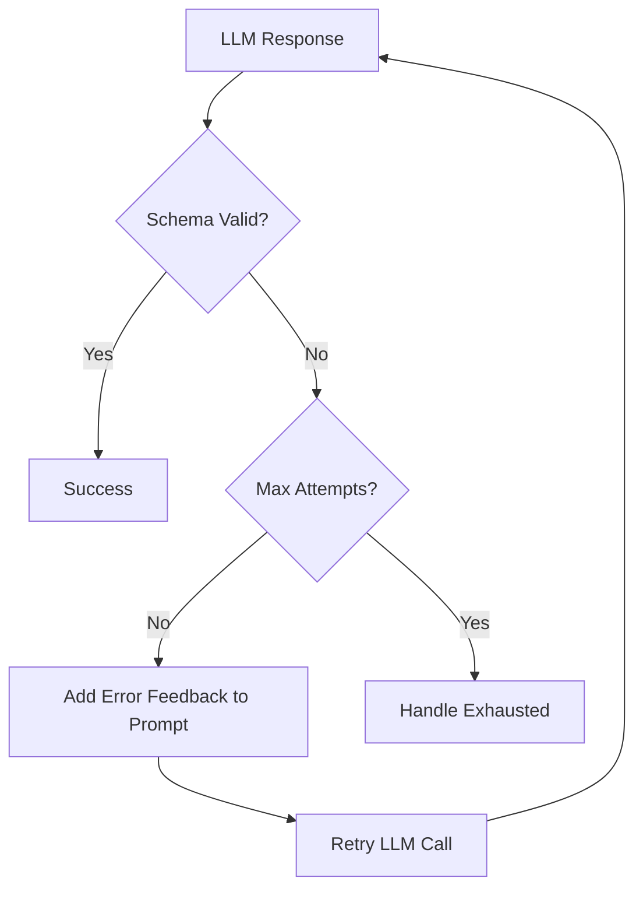
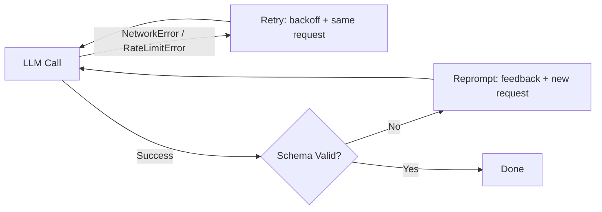

# Reprompting

What happens when an LLM returns malformed JSON or misses a required field? Without intervention, your agentic workflow fails. But often, the model just needs a second chance with clearer guidance.

Reprompting is Agent Actions' automatic retry system for validation errors. When an action's output fails validation, reprompting retries with the error context included in the prompt—giving the model specific feedback on what went wrong and how to fix it.

## Overview

The reprompting system provides:

- **Automatic retries** - Retry failed validations up to a configurable limit
- **Self-reflection** - Optionally instruct the model to analyze its failure before retrying
- **Configurable exhaustion** - Control what happens when all attempts fail

:::info Retry vs Reprompt
**Retry** handles transient errors (rate limits, network issues) - same request, wait, retry.
**Reprompt** handles validation errors (bad JSON, schema violations) - modify prompt with feedback, retry.

See [Retry & Error Handling](../execution/retry.md) for transient error handling.
:::

## Configuration

```yaml
defaults:
  reprompt:
    max_attempts: 2
    on_exhausted: return_last
```

To disable reprompting:

```yaml
defaults:
  reprompt: false
```

### Configuration Options

| Option | Type | Default | Description |
|--------|------|---------|-------------|
| `max_attempts` | integer | 2 | Maximum retry attempts |
| `on_exhausted` | string | `return_last` | Behavior when attempts exhausted |
| `use_self_reflection` | boolean | `false` | Include self-reflection instruction in retry prompts |

### Custom Validation Functions

Use `validation` to specify a Python function that checks the LLM response beyond schema validation. The function must be decorated with `@reprompt_validation`:

```yaml
actions:
  - name: classify_genre
    reprompt:
      validation: "check_valid_bisac"    # UDF function name
      max_attempts: 3
      on_exhausted: "return_last"
```

```python
from agent_actions import reprompt_validation

@reprompt_validation("BISAC code must be a valid category from the standard list")
def check_valid_bisac(response) -> bool:
    """Return True if valid, False triggers reprompt with the decorator's message."""
    codes = response.get("bisac_codes", [])
    return all(code.startswith(("FIC", "NON", "JUV", "YAF")) for code in codes)
```

When the validation function returns `False`, Agent Actions reprompts with the error message from the `@reprompt_validation` decorator, giving the LLM specific guidance on what to fix.

:::tip Typos are caught early
The static analyzer validates that the function name in `reprompt.validation` matches a `@reprompt_validation`-decorated function in your tools directory. If the name doesn't match, you'll get an error at validation time — before any LLM calls — listing the available validators.
:::

### Exhaustion Behavior

When a record exhausts all reprompt attempts, `on_exhausted` determines what happens:

| Value | Behavior |
|-------|----------|
| `return_last` | Return the last response (even if invalid), workflow continues (default) |
| `raise` | Raise an exception, workflow fails |

### Self-Reflection

By default, retry prompts include the validation error and the failed response — the model knows *what* failed but gets no help thinking about *why*. Self-reflection adds an instruction asking the model to analyze its failure before retrying:

```yaml
defaults:
  reprompt:
    max_attempts: 3
    use_self_reflection: true
```

When enabled, the retry prompt includes:

```
Before producing your corrected response, analyze what went wrong:
1. What specific error did you make in your previous response?
2. Why did you make this error?
3. What must be different in your next response to pass validation?

Now produce your corrected response.
```

This activates the model's reasoning about the failure rather than just re-rolling with the same prompt. It costs no extra API calls — it only modifies the retry prompt text.

## How It Works



### Step-by-Step Process

1. **Initial response** - LLM generates output
2. **Schema validation** - Check against action schema
3. **Error analysis** - On failure, analyze validation errors
4. **Retry prompt** - Construct enhanced prompt with error context
5. **Retry** - Call LLM again with enhanced prompt
6. **Repeat** - Until valid or max attempts reached

## Examples

### Basic Reprompting

For simple schemas:

```yaml
defaults:
  reprompt:
    max_attempts: 2
    on_exhausted: return_last
```

### Strict Reprompting

For critical workflows where correctness matters more than cost:

```yaml
defaults:
  reprompt:
    max_attempts: 5
    on_exhausted: raise  # Fail workflow if attempts exhausted
```

### Disable Reprompting

```yaml
defaults:
  reprompt: false

actions:
  - name: best_effort_action
    prompt: $prompts.optional_task
    schema: simple_schema
    # No retries - fails immediately on validation error
```

### Per-Action Override

```yaml
defaults:
  reprompt:
    max_attempts: 2
    on_exhausted: return_last

actions:
  - name: simple_classify
    # Inherits default reprompting

  - name: critical_extraction
    # Override for this action only
    reprompt:
      max_attempts: 5
      on_exhausted: raise

  - name: optional_enrichment
    reprompt: false  # Disable for this action
```

## Combined with Retry

Retry and reprompt solve different problems and can both trigger for the same record:

| | Retry | Reprompt |
|--|-------|---------|
| **Trigger** | LLM never responded (network error, rate limit, missing from batch) | LLM responded but output is invalid |
| **Action** | Resubmit same request, wait with backoff | Append error feedback to prompt, call LLM again |
| **Cost** | Same tokens (identical request) | More tokens (prompt grows with feedback) |

```yaml
defaults:
  retry:
    max_attempts: 3
    on_exhausted: raise

  reprompt:
    max_attempts: 4
    on_exhausted: return_last
```

### Online Mode

In online mode, retry and reprompt operate in sequence on each record:



A single record might be retried twice (transport failures), then reprompted once (schema failure) — that's 4 LLM calls total. The recovery metadata captures the full history.

### Batch Mode

In batch mode, recovery is two-phase. See [Batch Recovery](../execution/batch-recovery.md) for the complete flow.

1. **Phase 1 (Retry):** Detect missing records by comparing expected vs received IDs, resubmit as a new batch
2. **Phase 2 (Reprompt):** Validate all results against the configured UDF, resubmit failures with feedback

Retry metadata from Phase 1 is preserved through Phase 2 — a record that was missing and then failed validation will carry both `_recovery.retry` and `_recovery.reprompt` in its output.

## Best Practices

### 1. Match Max Attempts to Schema Complexity

| Schema Type | Recommended Max Attempts |
|-------------|-------------------------|
| Simple (1-3 fields) | 2-3 |
| Medium (4-8 fields) | 3-4 |
| Complex (9+ fields) | 4-5 |

### 2. Use `raise` for Critical Workflows

```yaml
reprompt:
  on_exhausted: raise
```

For critical workflows where validation failures should stop processing, use `raise` to fail fast.

### 3. Monitor Reprompt Rates

High reprompt rates are a signal:
- Prompts may need improvement (clearer instructions)
- Schema may be too strict (unrealistic constraints)
- Model capability mismatch (task too complex for the model)

## Error Handling

### Max Attempts Exceeded

```
RepromptError: Max attempts (3) exceeded for action 'extract_facts'
  Last error: Required field 'quote' missing
```

Options:
- Increase `max_attempts`
- Simplify schema
- Improve prompt clarity
- Use more capable model

### Persistent Validation Failure

Some responses may never validate—this is a limitation of reprompting. If the model fundamentally can't produce what you're asking for, no amount of retries will help. Consider:

- Making schema fields optional
- Adding default values
- Using `on_false: "skip"` guard on downstream actions
- Simplifying the task or using a more capable model

## Performance Considerations

Every retry has a cost:

| Factor | Impact |
|--------|--------|
| More attempts | Higher latency, higher cost |

For latency-sensitive workflows, use lower `max_attempts`. For critical outputs where correctness matters more than speed, higher attempts are worth the overhead.

## See Also

- [Retry & Error Handling](../execution/retry.md) - Handling transient errors
- [Output Validation](./output-validation.md) - Schema validation details
- [Troubleshooting](../../guides/troubleshooting.md) - Common error solutions
