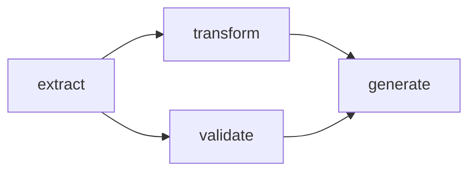
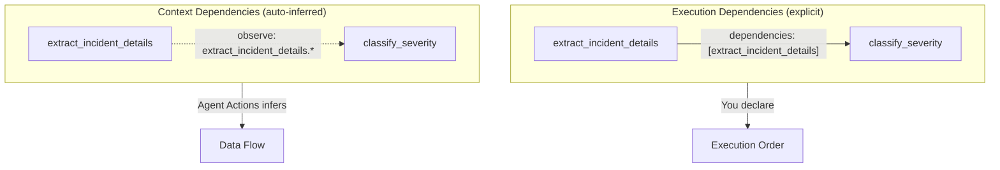
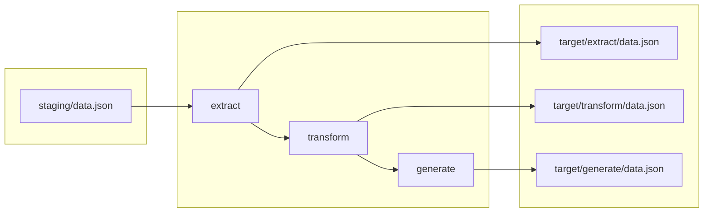

# Key Concepts

Let's explore the core ideas behind Agent Actions. Understanding these concepts will help you design effective agentic workflows.

## What is an Agentic Workflow?

An agentic workflow is a system where AI agents perform tasks autonomously, making decisions and taking actions to achieve a goal. Unlike simple prompt-response interactions, agentic workflows involve multiple steps, tool use, and coordination between components.

### How Agent Actions Models This

Agent Actions represents agentic workflows as a directed acyclic graph (DAG) of actions. Each action declares:
- Its **dependencies** (what must run first)
- Its **inputs** (what data it needs via context scope)
- Its **output schema** (what it will produce)
- Its **prompt** (instructions for the LLM)
- Its **model** (which provider and model to use)

Agent Actions uses these declarations to determine execution order, validate outputs, and parallelize where possible.



In this example, `transform` and `validate` both depend on `extract`, but are independent of each other. Agent Actions runs them in parallel.

This structure guarantees:
- Actions run only after their dependencies complete
- Data flows in one direction (no cycles)
- Independent actions run in parallel automatically

## Actions

An action is a single step in your agentic workflow—either an LLM call, a tool call (e.g., a Python function), or a human review gate (HITL).

**Why define actions in YAML instead of chaining API calls directly?**

- **Structure** — Actions declare dependencies and schemas, making the workflow self-documenting
- **Validation** — Output schemas are enforced automatically
- **Reusability** — Actions can be shared across workflows
- **Version control** — YAML configs are diffable and reviewable
- **Separation of concerns** — Prompts, schemas, and logic live in separate files
- **Progressive context disclosure** — Control exactly what data each action sees via context scope

```yaml
actions:
  - name: classify_genre
    intent: "Classify book into BISAC categories"
    dependencies: [extract_metadata]
    schema: classify_genre
    prompt: $book_catalog.Classify_Book_Genre  # Reference to prompt_store
    context_scope:
      observe:
        - extract_metadata.*
    reprompt:
      validation: "check_valid_bisac"
      max_attempts: 3
      on_exhausted: "return_last"
```

**Action fields:**

| Field | Description |
|-------|-------------|
| **name** | Unique identifier for this action |
| **intent** | Human-readable description of what this action does |
| **dependencies** | Actions that must complete first |
| **schema** | JSON Schema name for output validation |
| **prompt** | LLM instructions (inline or `$workflow.PromptName` reference) |
| **kind** | `llm` (default), `tool` for Python functions, or `hitl` for human review gates |
| **impl** | For tool actions, the function name to call |
| **hitl** | For hitl actions, configuration block (port, instructions, timeout, etc.) |
| **context_scope** | Progressive context disclosure—control exactly what data flows into this action (`observe`, `drop`, `passthrough`) |
| **reprompt** | Auto-retry config when validation fails |
| **model_vendor** | Which provider to use (inherited from defaults if not specified) |
| **model_name** | Which model to use (inherited from defaults if not specified) |
| **run_mode** | `online` or `batch` processing (inherited from defaults if not specified) |
| **granularity** | `Record` (per-item) or `File` (all items at once) processing (inherited from defaults if not specified) |

**Configuration inheritance:** Agent Actions uses a hierarchical config system. Settings cascade from `agent_actions.yml` → workflow `defaults` → individual actions. You only need to specify fields at the action level if you want to override the inherited values.

Actions are stateless—they receive input, process it, and produce validated output. This makes them easy to test, retry, and reason about.

### Action Kinds

Agent Actions supports three kinds of actions:

| Kind | When to Use | Example |
|------|-------------|---------|
| **`llm`** | Call an LLM to generate, classify, or transform data | Summarize text, extract entities, classify categories |
| **`tool`** | Execute Python functions for deterministic operations | Data validation, API calls, file I/O |
| **`hitl`** | Pause workflow for human review and approval | Quality gates, manual data verification, compliance checks |

**Example: Combining all three kinds**

```yaml
actions:
  - name: generate_report
    kind: llm  # LLM generates initial report
    prompt: "Generate a compliance report from the data..."

  - name: validate_report
    kind: tool  # Python validates report structure
    impl: validate_compliance_report
    dependencies: [generate_report]

  - name: review_report
    kind: hitl  # Human reviews before publishing
    dependencies: [validate_report]
    hitl:
      instructions: "Review the compliance report for accuracy"
    context_scope:
      observe:
        - validate_report.*

  - name: publish_report
    kind: tool  # Publish if approved
    impl: publish_to_portal
    dependencies: [review_report]
    guard:
      condition: "hitl_status == 'approved'"
      on_false: skip
```

See the [Human-in-the-Loop guide](../guides/human-in-the-loop.md) for more details on HITL actions.

### Dependency Types

Agent Actions distinguishes between two types of dependencies:

- **Execution dependencies**: Declared explicitly via `dependencies: action_name`. These control execution order—ensuring upstream actions complete before downstream actions start.
- **Context dependencies**: Auto-inferred from field references like `{{ action.field }}` in your prompts or `context_scope` declarations. The referenced field must be defined in that action's output schema—this is how Agent Actions knows the field exists and can pass it to downstream actions.

**Example: Execution dependency**

```yaml
# From incident-management sample
- name: classify_severity
  dependencies: [extract_incident_details]  # Must wait for extraction to complete
  intent: "Classify incident severity"
  prompt: $incident_triage.Classify_Severity
```

**Example: Context dependency (via context_scope)**

```yaml
# From incident-management sample
- name: classify_severity
  dependencies: [extract_incident_details]
  context_scope:
    observe:
      - extract_incident_details.*  # Pull all fields from upstream action's output
      - source.incident_report
```



You only need to declare execution dependencies explicitly. Context dependencies are handled automatically based on your prompt template or context_scope references.

## Field References

**How do actions share data?** Field references work like spreadsheet formulas. When you write `{{ extract_data.product_name }}`, you're pointing to a cell that will be filled in when that action completes.

```yaml
prompt: |
  Product: {{ extract_data.product_name }}
  Features: {{ extract_data.key_features }}
```

The `{{ action_name.field }}` syntax pulls data from completed upstream actions. Agent Actions validates these references at configuration time—you'll catch typos before making any API calls.

**Auto-inferred context**: When you reference a field like `{{ extract_data.product_name }}` in your prompt, Agent Actions automatically makes that field available in the action's context. You don't need to manually configure which fields to include. The system infers them from your template references.

## Schema Validation

**What happens when an LLM returns malformed JSON?** Every action output is validated against a JSON Schema. If you configure `reprompt` on an action, Agent Actions automatically retries until the output conforms.

```json
{
  "type": "object",
  "properties": {
    "sentiment": {
      "type": "string",
      "enum": ["positive", "negative", "neutral"]
    },
    "confidence": {
      "type": "number",
      "minimum": 0,
      "maximum": 1
    }
  },
  "required": ["sentiment", "confidence"]
}
```

Schemas can also be defined in YAML using the `fields` shorthand, which is more concise:

```yaml
# schema/my_workflow/sentiment_result.yml
name: sentiment_result
fields:
  - id: sentiment
    type: string
    description: "Detected sentiment"
  - id: confidence
    type: number
    description: "Confidence score 0-1"
required:
  - sentiment
  - confidence
```

This means downstream actions always receive well-structured data. However, schema validation catches structural errors but cannot verify semantic correctness—a response might match your schema but still contain incorrect information.

## Context Scope

Consider what happens when you have a large document. Do you really want to pass the entire raw HTML to every downstream action? Context scope lets you control what data flows between actions—keeping prompts focused and token costs down.

| Directive | Effect |
|-----------|--------|
| `observe` | Fields sent to the LLM prompt/context |
| `drop` | Fields excluded from context entirely |
| `passthrough` | Fields attached to output without going through the LLM |

```yaml
context_scope:
  observe:
    - extract_data.product_name
  drop:
    - source.raw_html
  passthrough:
    - source.id
```

This configuration sends `product_name` to the LLM, excludes raw HTML from context entirely, and attaches the source ID directly to the action's output (enrichment without LLM processing).

## Execution Flow

Let's trace how data moves through an agentic workflow from start to finish:



The flow:

1. Input data placed in `agent_io/staging/`
2. Agent Actions creates tracking references in `source/`
3. Actions execute in dependency order (parallel where possible)
4. Each action output is validated and written to `target/{action_name}/`

## Further Reading

- **[Field References](../reference/context/field-references)** — Reference syntax details
- **[Context Scope](../reference/context/context-scope)** — Data flow control
- **[Schemas](../reference/schemas/)** — Schema design patterns
- **[Guards](../reference/execution/guards)** — Conditional execution
