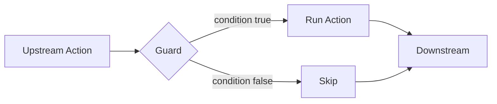

# Documentation Style Guide

This guide defines the tone, structure, and writing patterns for Agent Actions documentation.

## Core Principles

### 1. Approachable Authority

Write as a thoughtful guide, not a lecturer reciting specifications. Position yourself as walking alongside the reader through concepts. Use phrases that create warmth while maintaining credibility.

**Do:**
> Let's walk through how guards work. When an action depends on upstream data, you often want to skip it entirely if there's nothing to process.

**Don't:**
> The guard primitive implements conditional execution semantics based on upstream output evaluation.

**Inviting language:**
- "Let's explore..."
- "Consider what happens when..."
- "You might wonder..."
- "Here's where it gets interesting..."

### 2. Progressive Disclosure

Layer information from simple to complex. Start with what something does, then explain how it works, then show implementation details.

```
1. One-sentence definition
2. Why it matters (the problem it solves)
3. How it works (mechanics)
4. Concrete example
5. Implementation details (if relevant)
```

### 3. Analogies Bridge Understanding

Translate opaque technical concepts into familiar domains. Good analogies make novel ideas feel grounded.

**Do:**
> Think of an agentic workflow like an assembly line. Each action is a station that takes input, does its work, and passes output to the next station. Guards are quality checkpoints—if input doesn't meet standards, the station is skipped entirely.

**Do:**
> Field references work like spreadsheet formulas. When you write `{{ extract_facts.facts }}`, you're pointing to a cell that will be filled in when that action completes.

### 4. Concrete Over Abstract

Every concept needs a grounding example. Abstract explanations without examples are incomplete.

**Do:**
> Guards prevent unnecessary work. If `extract_facts` returns an empty list, there's no point running `validate_facts`. A guard checks the condition and skips the action.

**Don't:**
> Guards implement conditional execution semantics based on upstream output evaluation.

### 5. Question → Finding → Implication

Structure explanations as mini-narratives. Pose a question, reveal the answer, then explain why it matters.

**Example:**
> **How does Agent Actions handle missing dependencies?**
>
> When an action references a field that doesn't exist, Agent Actions catches this at configuration time—before any API calls are made. This means you discover typos and wiring errors immediately, not after processing thousands of records.

### 6. Acknowledge Limitations

Build credibility through honesty. When something has constraints, say so clearly.

**Do:**
> Batch mode works best for independent records. If your actions need to share state across records, use online mode instead.

**Do:**
> Schema validation catches structural errors but can't verify semantic correctness. A response might match your schema but still contain incorrect information.

---

## Document Structure

### Page Layout

Every documentation page should follow this structure:

```markdown
---
title: Feature Name
description: One-line description for SEO
sidebar_position: N
---

# Feature Name

One paragraph explaining what this feature does and why you'd use it.

## Overview / How It Works

Explain the mechanics with a diagram if helpful.

## Example: [Concrete Scenario]

Walk through a real usage scenario.

## [Feature-Specific Sections]

Details organized by topic.

## See Also

Links to related pages.
```

### Headers

- **H1 (`#`)**: Page title only, once per page
- **H2 (`##`)**: Major sections (Overview, Examples, Configuration)
- **H3 (`###`)**: Subsections within major sections
- **H4 (`####`)**: Rarely needed; use for deeply nested explanations

### Tables for Quick Reference

Use tables when comparing options, listing parameters, or showing protocol operations:

```markdown
| Option | Description | Default |
|--------|-------------|---------|
| `--quiet` | Suppress non-essential output | `false` |
| `--execution-mode` | Execution mode: `auto`, `parallel`, `sequential` | `auto` |
```

### Code Blocks

Always specify the language for syntax highlighting:

````markdown
```yaml
actions:
  - name: extract_facts
    prompt: $prompts.extract_facts
    schema: facts_schema
```
````

Include context comments when the code alone isn't self-explanatory:

````markdown
```yaml
# Skip validation if no facts were extracted
guard:
  condition: "extract_facts.facts != []"
  on_false: skip
```
````

### Diagrams

Diagrams aren't decorative—they illustrate specific mechanisms. Every diagram should have a purpose and interpretive context.

Use Mermaid for:
- **Flowcharts**: Decision trees, agentic workflow execution
- **Sequence diagrams**: Request/response flows
- **Architecture diagrams**: System components

**Guidelines:**
- Keep diagrams simple (max 10 nodes; break larger ones apart)
- Add explanatory text before or after the diagram
- Use consistent styling across the documentation

````markdown
The guard evaluates before the action runs. If the condition fails, the entire action is skipped:



Notice that both paths converge—downstream actions still run, they just won't receive output from skipped actions.
````

**Don't** drop diagrams without context. Always explain what the reader should observe.

---

## Writing Style

### Voice and Tone

| Aspect | Guideline |
|--------|-----------|
| Voice | Active, direct |
| Tense | Present tense for features; past tense for examples |
| Person | "You" for instructions; avoid "we" and "I" |
| Formality | Professional but conversational |

**Active voice:**
> Agent Actions validates your schema before running the agentic workflow.

**Not passive:**
> The schema is validated by Agent Actions before execution is performed.

### Sentence Structure

- **Lead with the action**: "Run `agac schema` to inspect field flow."
- **Keep sentences short**: Aim for 15-20 words. Break longer sentences.
- **One idea per sentence**: Don't chain unrelated concepts with "and."

### Paragraph Structure

- **Short paragraphs**: 2-4 sentences maximum
- **Topic sentence first**: Start with the main point
- **Supporting details follow**: Examples, caveats, details

### Lists

Use bulleted lists for:
- Unordered items (features, options, considerations)
- 3+ items that would be awkward in prose

Use numbered lists for:
- Sequential steps
- Ranked items
- Items that will be referenced by number

### Bold and Emphasis

- **Bold**: Key terms on first introduction, UI elements, important warnings
- *Italics*: Rarely; use for introducing new terminology or emphasis within a sentence
- `Code`: Commands, file names, field names, values

---

## Terminology

### Consistent Naming

| Use | Don't Use |
|-----|-----------|
| agentic workflow | agent, pipeline, workflow (alone) |
| action | step, task, node |
| `agac` | agent-actions (CLI) |
| field reference | variable, placeholder |
| upstream/downstream | before/after (for data flow) |

### Avoid Jargon Without Context

If you must use technical terms, explain them:

**Do:**
> Agent Actions executes agentic workflows as a DAG (directed acyclic graph)—actions run in dependency order, and each action runs only once.

**Don't:**
> Agent Actions implements DAG-based execution semantics.

### Acronyms

Spell out on first use, then use the acronym:

> User-Defined Functions (UDFs) let you add custom Python logic. UDFs are discovered automatically from your code directory.

---

## Examples and Scenarios

### Running Example

Use a consistent scenario throughout related documentation. For Agent Actions, the primary example is **fact extraction and validation** (an agentic workflow that processes documents):

- `extract_facts`: Pulls facts from source documents
- `validate_facts`: Checks extracted facts
- `format_output`: Formats validated facts

This provides continuity across pages.

### Example Format

Structure examples with context, code, and explanation:

```markdown
### Example: Conditional Execution

A validation action should only run if there are facts to validate:

```yaml
actions:
  - name: validate_facts
    dependencies: [extract_facts]
    guard:
      condition: "extract_facts.facts != []"
      on_false: skip
    prompt: Validate these facts...
```

The guard checks `extract_facts.facts`. If empty, the action is skipped entirely—no API call, no output.
```

### Before/After Comparisons

When showing improvements or changes:

```markdown
**Before (repetitive):**
```yaml
- name: action_1
  model_vendor: openai
  model_name: gpt-4o-mini
- name: action_2
  model_vendor: openai
  model_name: gpt-4o-mini
```

**After (using defaults):**
```yaml
defaults:
  model_vendor: openai
  model_name: gpt-4o-mini

actions:
  - name: action_1
  - name: action_2
```
```

---

## Admonitions

Use Docusaurus admonitions sparingly for important callouts:

```markdown
:::tip
Run `agac schema` to catch field reference errors before running your agentic workflow.
:::

:::warning
Guards skip actions entirely—no API calls are made for skipped actions.
:::

:::info
Batch mode requires JSON-serializable outputs.
:::
```

| Type | Use For |
|------|---------|
| `tip` | Helpful shortcuts, best practices |
| `info` | Additional context, non-critical notes |
| `warning` | Potential issues, caveats |
| `danger` | Data loss risks, breaking changes |

---

## Common Patterns

### "How It Works" Sections

Explain mechanics in 3-5 paragraphs:

```markdown
## How Guards Work

Guards evaluate conditions before an action runs. The condition references upstream outputs using field syntax: `action_name.field`.

When the condition evaluates to `false`, the guard's `on_false` behavior determines what happens:
- `skip`: The action doesn't run at all
- `filter`: The action runs only on items where the condition is true

Guards are evaluated at runtime after dependencies complete. This means you can guard on computed values, not just static configuration.
```

### CLI Command Documentation

Follow this structure for commands:

```markdown
## command-name

One-sentence description of what the command does.

```bash
agac command-name [options]
```

**Options:**

| Option | Description |
|--------|-------------|
| `-a, --agent TEXT` | Workflow name (required) |
| `--json` | Output as JSON |

**Examples:**

```bash
# Basic usage
agac command-name -a my_workflow

# With options
agac command-name -a my_workflow --json
```
```

### Feature Introduction

When introducing a new feature, follow this pattern:

1. **Problem**: What challenge does this solve?
2. **Solution**: How does the feature address it?
3. **Example**: Show it in action in an agentic workflow
4. **Details**: Dive into configuration/options

### Narrative Arc for Longer Pages

For comprehensive pages, build a narrative that moves the reader through understanding:

```
Curiosity → Understanding → Significance → Action
```

1. **Curiosity**: Hook with a question or problem ("What happens when an LLM returns malformed JSON?")
2. **Understanding**: Explain the mechanism with examples
3. **Significance**: Why this matters for their work
4. **Action**: What they can do now (try a command, configure a feature)

**Example structure for a feature page:**
- **Opening**: The problem this solves (hook)
- **How It Works**: Mechanics with diagrams
- **Example**: Walk through a real scenario
- **Configuration**: Options and customization
- **Best Practices**: When to use, when not to
- **See Also**: Related features

---

## Quality Checklist

Before publishing documentation, verify:

- [ ] Every concept has a concrete example
- [ ] No jargon without explanation
- [ ] Code examples are copy-pasteable and working
- [ ] Links are valid (run build to check)
- [ ] Headers follow the hierarchy (H2 → H3 → H4)
- [ ] Tables are used for comparisons and options
- [ ] Active voice throughout
- [ ] Consistent terminology (agentic workflow, action, `agac`)

---

## Anti-Patterns

### Avoid These

1. **Wall of text**: Break into paragraphs, use lists
2. **Passive voice**: "The workflow is executed" → "Agent Actions executes the agentic workflow"
3. **Vague benefits**: "Improves efficiency" → "Reduces API calls by skipping unnecessary actions"
4. **Missing examples**: Every feature needs at least one example
5. **Assuming knowledge**: Define terms before using them
6. **Over-explaining**: Trust readers to follow clear examples
7. **Marketing language**: "Revolutionary," "Best-in-class" → Just explain what it does

### Red Flags in Writing

If you find yourself writing these, rewrite:

- "It should be noted that..." → Just state the fact
- "In order to..." → "To..."
- "The fact that..." → Remove or rephrase
- "Basically..." → Remove and be specific
- "As mentioned above..." → Restate briefly or link

