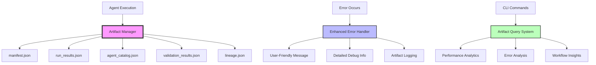

# Agent-Actions Artifact System Design

## Executive Summary

This document outlines the design for a comprehensive artifact system that provides observability, debugging, and operational insights for agent runs, inspired by dbt's successful approach to data transformation transparency. The system generates structured JSON artifacts that capture execution metadata, performance metrics, validation results, and lineage information to enable better monitoring, debugging, and optimization of agent workflows.

## Problem Statement

Currently, when agent runs fail, users see verbose error messages like:

```
Starting agent run for: new_quiz_run
Setting up project paths...
Rendering and loading configuration...
ERROR:agent_actions.cli.utils.error_handler:Template operation 'render' failed for /Users/randyorton/Documents/codeshop/agent_action_test/qanalabs/agent_workflow/quiz_maker/new_quiz_run/agent_config/new_quiz_run.yml
Traceback (most recent call last):
  File "/Users/randyorton/Documents/codeshop/virtual_env/dev_env/lib/python3.12/site-packages/agent_actions/workflow/render_workflow.py", line 53, in render_pipeline_with_templates
    data = yaml.safe_load(rendered_yaml_content)
...
yaml.parser.ParserError: while parsing a block collection
  in "<unicode string>", line 2, column 3:
      - agent_type: topic_classifier
      ^
expected <block end>, but found '?'
  in "<unicode string>", line 45, column 3:
      agent_type: fact_extractor
      ^
```

This creates several challenges:

1. **Poor User Experience**: Raw tracebacks overwhelm users instead of guiding them to solutions
2. **Lack of Observability**: No systematic way to track agent performance, success rates, or failure patterns
3. **Difficult Debugging**: Missing structured execution context and lineage information
4. **No Historical Analysis**: Cannot analyze trends, performance degradation, or optimization opportunities
5. **Manual Error Resolution**: Users must manually parse complex error messages to understand what went wrong

## Solution Overview

### Core Concept



### Key Features

1. **Structured Artifacts**: JSON files capturing execution metadata, similar to dbt's approach
2. **User-Friendly Error Messages**: Clear, actionable error descriptions instead of raw tracebacks
3. **Performance Monitoring**: Track execution times, success rates, and resource usage
4. **Debugging Support**: Detailed execution context when needed (--debug flag)
5. **Historical Analysis**: Query artifacts to understand patterns and optimize workflows
6. **Operational Insights**: Comprehensive view of agent ecosystem health

## Architecture Design

### Artifact Directory Structure

```
project_root/
├── artifacts/
│   ├── manifest.json           # Project structure and agent definitions
│   ├── run_results.json        # Latest execution results
│   ├── agent_catalog.json      # Agent metadata and capabilities
│   ├── validation_results.json # Validation and interceptor results
│   ├── lineage.json           # Agent dependencies and data flow
│   └── runs/
│       ├── run_20240115_143022/
│       │   ├── run_results.json
│       │   ├── validation_results.json
│       │   ├── error_context.json
│       │   └── logs/
│       │       └── execution.log
│       └── run_20240115_144512/
│           ├── run_results.json
│           └── logs/
└── logs/
    └── agent_actions.log
```

## Detailed Component Design

### 1. Artifact System Foundation

**File: `agent_actions/artifacts/base.py`**

```python
from abc import ABC, abstractmethod
from datetime import datetime
from pathlib import Path
from typing import Any, Dict, Optional
import json
import uuid

class ArtifactMetadata:
    """Standard metadata for all artifacts."""
    
    def __init__(self):
        self.generated_at = datetime.utcnow().isoformat() + "Z"
        self.agent_actions_version = self._get_version()
        self.invocation_id = str(uuid.uuid4())
        self.schema_version = "1.0.0"
    
    def _get_version(self) -> str:
        try:
            import agent_actions
            return agent_actions.__version__
        except:
            return "1.2.0"  # fallback
    
    def to_dict(self) -> Dict[str, Any]:
        return {
            'generated_at': self.generated_at,
            'agent_actions_version': self.agent_actions_version,
            'invocation_id': self.invocation_id,
            'schema_version': self.schema_version
        }

class BaseArtifact(ABC):
    """Base class for all artifacts."""
    
    def __init__(self, metadata: Optional[ArtifactMetadata] = None):
        self.metadata = metadata or ArtifactMetadata()
    
    @abstractmethod
    def to_dict(self) -> Dict[str, Any]:
        """Convert artifact to dictionary format."""
        pass
    
    def save(self, path: Path) -> None:
        """Save artifact to file."""
        path.parent.mkdir(parents=True, exist_ok=True)
        with open(path, 'w') as f:
            json.dump(self.to_dict(), f, indent=2, default=str)
    
    @classmethod
    def load(cls, path: Path) -> 'BaseArtifact':
        """Load artifact from file."""
        with open(path) as f:
            data = json.load(f)
        return cls.from_dict(data)
    
    @classmethod
    @abstractmethod
    def from_dict(cls, data: Dict[str, Any]) -> 'BaseArtifact':
        """Create artifact from dictionary."""
        pass
```

### 2. Manifest Artifact

**File: `agent_actions/artifacts/manifest.py`**

```python
from typing import Dict, List, Any
from .base import BaseArtifact, ArtifactMetadata

class ManifestArtifact(BaseArtifact):
    """Captures complete project structure and agent definitions."""
    
    def __init__(self, project_name: str, project_path: str, metadata: Optional[ArtifactMetadata] = None):
        super().__init__(metadata)
        self.project_name = project_name
        self.project_path = project_path
        self.agents: Dict[str, Dict[str, Any]] = {}
        self.workflows: Dict[str, Dict[str, Any]] = {}
        self.dependencies: Dict[str, List[str]] = {}
        self.project_config: Dict[str, Any] = {}
    
    def add_agent(self, unique_id: str, agent_config: Dict[str, Any]) -> None:
        """Add agent definition to manifest."""
        self.agents[unique_id] = {
            'unique_id': unique_id,
            'name': agent_config.get('name', unique_id.split('.')[-1]),
            'agent_type': agent_config.get('agent_type'),
            'model_vendor': agent_config.get('model_vendor'),
            'model_name': agent_config.get('model_name'),
            'config': agent_config,
            'depends_on': agent_config.get('depends_on', []),
            'tags': agent_config.get('tags', []),
            'meta': agent_config.get('meta', {}),
            'interceptors': agent_config.get('interceptors', [])
        }
    
    def add_workflow(self, unique_id: str, workflow_config: Dict[str, Any]) -> None:
        """Add workflow definition to manifest."""
        self.workflows[unique_id] = {
            'unique_id': unique_id,
            'name': workflow_config.get('name', unique_id.split('.')[-1]),
            'agents': workflow_config.get('agents', []),
            'dependencies': workflow_config.get('dependencies', []),
            'config': workflow_config
        }
    
    def to_dict(self) -> Dict[str, Any]:
        return {
            'metadata': {
                **self.metadata.to_dict(),
                'project_name': self.project_name,
                'project_path': self.project_path
            },
            'agents': self.agents,
            'workflows': self.workflows,
            'dependencies': self.dependencies,
            'project_config': self.project_config
        }
    
    @classmethod
    def from_dict(cls, data: Dict[str, Any]) -> 'ManifestArtifact':
        metadata_dict = data['metadata']
        manifest = cls(
            project_name=metadata_dict['project_name'],
            project_path=metadata_dict['project_path']
        )
        manifest.agents = data.get('agents', {})
        manifest.workflows = data.get('workflows', {})
        manifest.dependencies = data.get('dependencies', {})
        manifest.project_config = data.get('project_config', {})
        return manifest
```

### 3. Run Results Artifact

**File: `agent_actions/artifacts/run_results.py`**

```python
from typing import Dict, List, Any, Optional
from datetime import datetime
from .base import BaseArtifact, ArtifactMetadata

class ExecutionTiming:
    """Tracks execution timing for different phases."""
    
    def __init__(self, name: str):
        self.name = name
        self.started_at: Optional[str] = None
        self.completed_at: Optional[str] = None
    
    def start(self) -> None:
        self.started_at = datetime.utcnow().isoformat() + "Z"
    
    def complete(self) -> None:
        self.completed_at = datetime.utcnow().isoformat() + "Z"
    
    def to_dict(self) -> Dict[str, Any]:
        return {
            'name': self.name,
            'started_at': self.started_at,
            'completed_at': self.completed_at
        }

class AgentResult:
    """Result of a single agent execution."""
    
    def __init__(self, unique_id: str):
        self.unique_id = unique_id
        self.status = 'pending'  # pending, success, error, skipped
        self.timing: List[ExecutionTiming] = []
        self.thread_id: Optional[str] = None
        self.execution_time: float = 0.0
        self.message: Optional[str] = None
        self.failures: int = 0
        self.adapter_response: Dict[str, Any] = {}
        self.error_details: Optional[Dict[str, Any]] = None
    
    def add_timing(self, name: str) -> ExecutionTiming:
        timing = ExecutionTiming(name)
        self.timing.append(timing)
        return timing
    
    def to_dict(self) -> Dict[str, Any]:
        return {
            'unique_id': self.unique_id,
            'status': self.status,
            'timing': [t.to_dict() for t in self.timing],
            'thread_id': self.thread_id,
            'execution_time': self.execution_time,
            'message': self.message,
            'failures': self.failures,
            'adapter_response': self.adapter_response,
            'error_details': self.error_details
        }

class RunResultsArtifact(BaseArtifact):
    """Captures execution results and timing information."""
    
    def __init__(self, metadata: Optional[ArtifactMetadata] = None):
        super().__init__(metadata)
        self.elapsed_time: float = 0.0
        self.args: Dict[str, Any] = {}
        self.results: List[AgentResult] = []
    
    def add_result(self, result: AgentResult) -> None:
        self.results.append(result)
    
    def to_dict(self) -> Dict[str, Any]:
        return {
            'metadata': self.metadata.to_dict(),
            'elapsed_time': self.elapsed_time,
            'args': self.args,
            'results': [r.to_dict() for r in self.results]
        }
    
    @classmethod
    def from_dict(cls, data: Dict[str, Any]) -> 'RunResultsArtifact':
        artifact = cls()
        artifact.elapsed_time = data.get('elapsed_time', 0.0)
        artifact.args = data.get('args', {})
        # Note: Would need to reconstruct AgentResult objects from dict
        return artifact
```

### 4. Artifact Manager

**File: `agent_actions/artifacts/manager.py`**

```python
from pathlib import Path
from datetime import datetime
from typing import Optional, Dict, Any
import threading
from .manifest import ManifestArtifact
from .run_results import RunResultsArtifact, AgentResult
from .catalog import AgentCatalogArtifact
from .validation_results import ValidationResultsArtifact

class ArtifactManager:
    """Manages creation and persistence of artifacts."""
    
    def __init__(self, project_path: Path):
        self.project_path = project_path
        self.artifacts_dir = project_path / "artifacts"
        self.current_run_id = self._generate_run_id()
        self.current_run_dir = self.artifacts_dir / "runs" / self.current_run_id
        self._lock = threading.Lock()
        
        # Create directories
        self.artifacts_dir.mkdir(exist_ok=True)
        self.current_run_dir.mkdir(parents=True, exist_ok=True)
        
        # Initialize artifacts
        self.run_results = RunResultsArtifact()
        self.manifest: Optional[ManifestArtifact] = None
        self.validation_results = ValidationResultsArtifact()
    
    def _generate_run_id(self) -> str:
        return datetime.now().strftime("run_%Y%m%d_%H%M%S")
    
    def set_manifest(self, manifest: ManifestArtifact) -> None:
        """Set the project manifest."""
        with self._lock:
            self.manifest = manifest
    
    def record_agent_start(self, unique_id: str) -> AgentResult:
        """Record the start of agent execution."""
        with self._lock:
            result = AgentResult(unique_id)
            result.thread_id = threading.current_thread().name
            
            compile_timing = result.add_timing('compile')
            compile_timing.start()
            
            self.run_results.add_result(result)
            return result
    
    def record_agent_success(
        self, 
        result: AgentResult, 
        response: Any,
        execution_time: float,
        adapter_response: Optional[Dict[str, Any]] = None
    ) -> None:
        """Record successful agent execution."""
        with self._lock:
            result.status = 'success'
            result.execution_time = execution_time
            result.message = 'Completed successfully'
            result.adapter_response = adapter_response or {}
            
            # Complete timing
            if result.timing:
                result.timing[-1].complete()
    
    def record_agent_error(
        self,
        result: AgentResult,
        error: Exception,
        execution_time: float,
        context: Optional[Dict[str, Any]] = None
    ) -> None:
        """Record failed agent execution."""
        with self._lock:
            result.status = 'error'
            result.execution_time = execution_time
            result.message = str(error)
            result.failures = 1
            result.error_details = {
                'error_type': type(error).__name__,
                'error_message': str(error),
                'context': context or {}
            }
            
            # Complete timing
            if result.timing:
                result.timing[-1].complete()
    
    def record_validation_attempt(
        self,
        agent_id: str,
        validator_type: str,
        attempt: int,
        status: str,
        error: Optional[str] = None,
        response: Optional[str] = None
    ) -> None:
        """Record validation attempt."""
        self.validation_results.add_attempt(
            agent_id, validator_type, attempt, status, error, response
        )
    
    def save_artifacts(self) -> None:
        """Save all artifacts to disk."""
        with self._lock:
            # Save to current location
            self.run_results.save(self.artifacts_dir / "run_results.json")
            self.validation_results.save(self.artifacts_dir / "validation_results.json")
            
            if self.manifest:
                self.manifest.save(self.artifacts_dir / "manifest.json")
            
            # Save to run-specific location
            self.run_results.save(self.current_run_dir / "run_results.json")
            self.validation_results.save(self.current_run_dir / "validation_results.json")
    
    def record_error(
        self,
        error_type: str,
        operation: str,
        target: str,
        error: Exception,
        context: Optional[Dict[str, Any]] = None,
        user_message: Optional[str] = None
    ) -> None:
        """Record error for debugging and analysis."""
        error_context = {
            'error_type': error_type,
            'operation': operation,
            'target': target,
            'error_class': type(error).__name__,
            'error_message': str(error),
            'context': context or {},
            'user_message': user_message,
            'timestamp': datetime.utcnow().isoformat() + "Z"
        }
        
        # Save error context to run directory
        error_file = self.current_run_dir / "error_context.json"
        with open(error_file, 'w') as f:
            import json
            json.dump(error_context, f, indent=2)
```

### 5. Enhanced Error Handler

**File: `agent_actions/cli/utils/enhanced_error_handler.py`**

```python
import yaml
from pathlib import Path
from typing import Optional, Dict, Any
from .error_handler import ErrorHandler
from ..artifacts.manager import ArtifactManager

class UserFriendlyErrorFormatter:
    """Formats errors in a user-friendly way."""
    
    ERROR_TEMPLATES = {
        'yaml_syntax': """
❌ Configuration File Error

📍 Location: {file_path}
   Line {line}, Column {column}

🔍 Problem: {problem}

💡 Common fixes:
  • Check for missing colons after keys
  • Ensure consistent indentation (use spaces, not tabs)
  • Look for unclosed quotes or brackets
  • Verify list items start with '-'

📖 Need help? Visit: https://docs.agent-actions.com/troubleshooting/yaml-errors
        """,
        
        'agent_not_found': """
❌ Agent Configuration Missing

🔍 Agent '{agent_name}' not found in workflow '{workflow_name}'

Available agents in this workflow:
{available_agents}

💡 Possible solutions:
  • Check agent name spelling
  • Verify the agent is defined in your configuration
  • Ensure the workflow file exists and is readable

📖 Learn more: https://docs.agent-actions.com/guides/agent-configuration
        """,
        
        'template_render_error': """
❌ Template Rendering Failed

🔍 Template: {template_name}
   Error: {error_details}

💡 Common causes:
  • Missing template variables
  • Invalid Jinja2 syntax
  • Circular template dependencies
  • File permission issues

🛠️  Debug steps:
  1. Check template variables are defined
  2. Validate Jinja2 syntax
  3. Run with --debug for detailed logs

📖 Template guide: https://docs.agent-actions.com/guides/templating
        """,
        
        'file_not_found': """
❌ File Not Found

🔍 Could not find: {file_path}

💡 Check if:
  • File path is correct
  • File exists and is readable
  • You're in the right directory
  • File permissions are correct

📖 File structure guide: https://docs.agent-actions.com/guides/project-structure
        """
    }
    
    @classmethod
    def format_yaml_error(cls, error: yaml.parser.ParserError, file_path: str) -> str:
        """Format YAML parsing errors."""
        error_line = getattr(error, 'problem_mark', None)
        if error_line:
            line_num = error_line.line + 1
            col_num = error_line.column + 1
            
            return cls.ERROR_TEMPLATES['yaml_syntax'].format(
                file_path=file_path,
                line=line_num,
                column=col_num,
                problem=error.problem
            ).strip()
        
        return f"YAML parsing error in {file_path}: {error.problem}"
    
    @classmethod
    def format_agent_not_found(cls, agent_name: str, workflow_name: str, available_agents: list) -> str:
        """Format agent not found errors."""
        agents_list = '\n'.join([f"  • {agent}" for agent in available_agents]) if available_agents else "  (no agents found)"
        
        return cls.ERROR_TEMPLATES['agent_not_found'].format(
            agent_name=agent_name,
            workflow_name=workflow_name,
            available_agents=agents_list
        ).strip()
    
    @classmethod
    def format_template_error(cls, template_name: str, error_details: str) -> str:
        """Format template rendering errors."""
        return cls.ERROR_TEMPLATES['template_render_error'].format(
            template_name=template_name,
            error_details=error_details
        ).strip()
    
    @classmethod
    def format_file_not_found(cls, file_path: str) -> str:
        """Format file not found errors."""
        return cls.ERROR_TEMPLATES['file_not_found'].format(
            file_path=file_path
        ).strip()

class EnhancedErrorHandler(ErrorHandler):
    """Enhanced error handler with user-friendly messages and artifact logging."""
    
    def __init__(self, artifact_manager: Optional[ArtifactManager] = None, debug_mode: bool = False):
        self.artifact_manager = artifact_manager
        self.debug_mode = debug_mode
        self.formatter = UserFriendlyErrorFormatter()
    
    def handle_template_error(
        self,
        error: Exception,
        operation: str,
        template_name: str,
        context: Optional[Dict[str, Any]] = None
    ) -> None:
        """Handle template rendering errors with user-friendly messages."""
        
        # Create user-friendly message
        if isinstance(error, yaml.parser.ParserError):
            user_message = self.formatter.format_yaml_error(error, template_name)
        else:
            user_message = self.formatter.format_template_error(template_name, str(error))
        
        # Log to artifacts
        if self.artifact_manager:
            self.artifact_manager.record_error(
                error_type='template_error',
                operation=operation,
                target=template_name,
                error=error,
                context=context,
                user_message=user_message
            )
        
        # Display user-friendly message
        print(f"\n{user_message}")
        
        if self.debug_mode:
            print(f"\n🐛 Debug Information:")
            print(f"   Operation: {operation}")
            print(f"   Template: {template_name}")
            if context:
                print(f"   Context: {context}")
            print(f"\n   Full traceback:")
            import traceback
            traceback.print_exc()
        else:
            print(f"\n💡 Run with --debug for detailed error information")
        
        # Still raise for proper error handling upstream
        from agent_actions.cli.exceptions import TemplateRenderingError
        raise TemplateRenderingError(f"Template operation '{operation}' failed for {template_name}") from error
    
    def handle_file_error(
        self,
        error: Exception,
        operation: str,
        path: str,
        context: Optional[Dict[str, Any]] = None
    ) -> None:
        """Handle file operation errors."""
        
        if isinstance(error, FileNotFoundError):
            user_message = self.formatter.format_file_not_found(path)
        else:
            user_message = f"File operation failed: {operation} on {path}"
        
        # Log to artifacts
        if self.artifact_manager:
            self.artifact_manager.record_error(
                error_type='file_error',
                operation=operation,
                target=path,
                error=error,
                context=context,
                user_message=user_message
            )
        
        # Display user-friendly message
        print(f"\n{user_message}")
        
        if self.debug_mode:
            print(f"\n🐛 Debug Information:")
            import traceback
            traceback.print_exc()
        else:
            print(f"\n💡 Run with --debug for detailed error information")
        
        # Raise appropriate exception
        super().handle_file_error(error, operation, path, context)
```

### 6. Artifact Query System

**File: `agent_actions/artifacts/query.py`**

```python
from pathlib import Path
from typing import Dict, List, Any, Optional
import json
from datetime import datetime, timedelta

class ArtifactQuery:
    """Query system for analyzing artifacts."""
    
    def __init__(self, artifacts_dir: Path):
        self.artifacts_dir = artifacts_dir
    
    def get_recent_runs(self, limit: int = 10) -> List[Dict[str, Any]]:
        """Get recent run results."""
        runs_dir = self.artifacts_dir / "runs"
        if not runs_dir.exists():
            return []
        
        run_dirs = sorted(
            runs_dir.iterdir(), 
            key=lambda x: x.stat().st_mtime, 
            reverse=True
        )
        
        results = []
        for run_dir in run_dirs[:limit]:
            run_results_file = run_dir / "run_results.json"
            if run_results_file.exists():
                with open(run_results_file) as f:
                    run_data = json.load(f)
                    run_data['run_id'] = run_dir.name
                    results.append(run_data)
        
        return results
    
    def get_agent_performance(self, agent_id: str, days: int = 30) -> Dict[str, Any]:
        """Get performance metrics for a specific agent."""
        recent_runs = self.get_recent_runs(100)  # Get more data for analysis
        agent_results = []
        
        cutoff_date = datetime.now() - timedelta(days=days)
        
        for run in recent_runs:
            run_date = datetime.fromisoformat(run['metadata']['generated_at'].replace('Z', '+00:00'))
            if run_date < cutoff_date:
                continue
                
            for result in run.get('results', []):
                if result['unique_id'] == agent_id:
                    agent_results.append({
                        **result,
                        'run_date': run_date,
                        'run_id': run.get('run_id', 'unknown')
                    })
        
        if not agent_results:
            return {"error": f"No results found for agent {agent_id} in the last {days} days"}
        
        # Calculate metrics
        total_runs = len(agent_results)
        successful_runs = len([r for r in agent_results if r['status'] == 'success'])
        failed_runs = len([r for r in agent_results if r['status'] == 'error'])
        success_rate = successful_runs / total_runs if total_runs > 0 else 0
        
        execution_times = [r.get('execution_time', 0) for r in agent_results if r.get('execution_time')]
        avg_execution_time = sum(execution_times) / len(execution_times) if execution_times else 0
        
        recent_failures = [
            {
                'run_id': r['run_id'],
                'run_date': r['run_date'].isoformat(),
                'message': r.get('message', 'Unknown error'),
                'error_details': r.get('error_details', {})
            }
            for r in agent_results 
            if r['status'] == 'error'
        ][:5]
        
        return {
            "agent_id": agent_id,
            "analysis_period_days": days,
            "total_runs": total_runs,
            "successful_runs": successful_runs,
            "failed_runs": failed_runs,
            "success_rate": success_rate,
            "avg_execution_time": avg_execution_time,
            "recent_failures": recent_failures
        }
    
    def get_workflow_lineage(self, workflow_name: str) -> Dict[str, Any]:
        """Get dependency graph for a workflow."""
        manifest_file = self.artifacts_dir / "manifest.json"
        if not manifest_file.exists():
            return {"error": "Manifest file not found. Run an agent first to generate artifacts."}
        
        with open(manifest_file) as f:
            manifest = json.load(f)
        
        # Find workflow
        workflow = None
        for wf_id, wf_data in manifest.get('workflows', {}).items():
            if wf_data.get('name') == workflow_name or wf_id == workflow_name:
                workflow = wf_data
                break
        
        if not workflow:
            available_workflows = [wf['name'] for wf in manifest.get('workflows', {}).values()]
            return {
                "error": f"Workflow '{workflow_name}' not found",
                "available_workflows": available_workflows
            }
        
        return {
            "workflow_name": workflow_name,
            "agents": workflow.get('agents', []),
            "dependencies": workflow.get('dependencies', []),
            "config": workflow.get('config', {})
        }
    
    def get_error_analysis(self, days: int = 7) -> Dict[str, Any]:
        """Analyze recent errors for patterns."""
        runs_dir = self.artifacts_dir / "runs"
        if not runs_dir.exists():
            return {"error": "No run data found"}
        
        cutoff_date = datetime.now() - timedelta(days=days)
        error_patterns = {}
        total_errors = 0
        
        for run_dir in runs_dir.iterdir():
            if not run_dir.is_dir():
                continue
                
            # Check run date
            try:
                run_date = datetime.strptime(run_dir.name, "run_%Y%m%d_%H%M%S")
                if run_date < cutoff_date:
                    continue
            except ValueError:
                continue
            
            # Check for errors in run results
            run_results_file = run_dir / "run_results.json"
            if run_results_file.exists():
                with open(run_results_file) as f:
                    run_data = json.load(f)
                    
                for result in run_data.get('results', []):
                    if result['status'] == 'error':
                        total_errors += 1
                        error_type = result.get('error_details', {}).get('error_type', 'Unknown')
                        
                        if error_type not in error_patterns:
                            error_patterns[error_type] = {
                                'count': 0,
                                'examples': []
                            }
                        
                        error_patterns[error_type]['count'] += 1
                        if len(error_patterns[error_type]['examples']) < 3:
                            error_patterns[error_type]['examples'].append({
                                'run_id': run_dir.name,
                                'agent_id': result['unique_id'],
                                'message': result.get('message', 'No message')
                            })
        
        return {
            "analysis_period_days": days,
            "total_errors": total_errors,
            "error_patterns": error_patterns,
            "most_common_errors": sorted(
                error_patterns.items(),
                key=lambda x: x[1]['count'],
                reverse=True
            )[:5]
        }
```

### 7. CLI Commands

**File: `agent_actions/cli/commands/artifacts_command.py`**

```python
import click
from pathlib import Path
from ..artifacts.query import ArtifactQuery

@click.group()
def artifacts():
    """Manage and query agent execution artifacts."""
    pass

@artifacts.command()
@click.option('--limit', default=10, help='Number of recent runs to show')
@click.option('--verbose', '-v', is_flag=True, help='Show detailed information')
def list_runs(limit, verbose):
    """List recent agent runs."""
    artifacts_dir = Path.cwd() / "artifacts"
    if not artifacts_dir.exists():
        click.echo("❌ No artifacts found. Run an agent first to generate artifacts.")
        return
    
    query = ArtifactQuery(artifacts_dir)
    runs = query.get_recent_runs(limit)
    
    if not runs:
        click.echo("No recent runs found.")
        return
    
    click.echo(f"📊 Recent Runs (last {len(runs)}):\n")
    
    for i, run in enumerate(runs, 1):
        metadata = run.get('metadata', {})
        results = run.get('results', [])
        
        # Count statuses
        success_count = len([r for r in results if r['status'] == 'success'])
        error_count = len([r for r in results if r['status'] == 'error'])
        
        status_emoji = "✅" if error_count == 0 else "❌" if success_count == 0 else "⚠️"
        
        click.echo(f"{status_emoji} {i}. Run {run.get('run_id', 'unknown')}")
        click.echo(f"   Time: {metadata.get('generated_at', 'unknown')}")
        click.echo(f"   Duration: {metadata.get('elapsed_time', run.get('elapsed_time', 0)):.2f}s")
        click.echo(f"   Results: {success_count} success, {error_count} errors")
        
        if verbose and error_count > 0:
            click.echo("   Errors:")
            for result in results:
                if result['status'] == 'error':
                    click.echo(f"     • {result['unique_id']}: {result.get('message', 'Unknown error')}")
        
        click.echo()

@artifacts.command()
@click.argument('agent_id')
@click.option('--days', default=30, help='Number of days to analyze')
def performance(agent_id, days):
    """Show performance metrics for an agent."""
    artifacts_dir = Path.cwd() / "artifacts"
    query = ArtifactQuery(artifacts_dir)
    perf = query.get_agent_performance(agent_id, days)
    
    if "error" in perf:
        click.echo(f"❌ {perf['error']}")
        return
    
    click.echo(f"📈 Agent Performance: {agent_id}")
    click.echo(f"   Analysis Period: {perf['analysis_period_days']} days")
    click.echo(f"   Total Runs: {perf['total_runs']}")
    click.echo(f"   Success Rate: {perf['success_rate']:.1%}")
    click.echo(f"   Avg Execution Time: {perf['avg_execution_time']:.2f}s")
    
    if perf['recent_failures']:
        click.echo(f"\n🚨 Recent Failures:")
        for failure in perf['recent_failures']:
            click.echo(f"   • {failure['run_date'][:10]}: {failure['message']}")

@artifacts.command()
@click.argument('workflow_name')
def lineage(workflow_name):
    """Show workflow lineage and dependencies."""
    artifacts_dir = Path.cwd() / "artifacts"
    query = ArtifactQuery(artifacts_dir)
    lineage = query.get_workflow_lineage(workflow_name)
    
    if "error" in lineage:
        click.echo(f"❌ {lineage['error']}")
        if "available_workflows" in lineage:
            click.echo(f"Available workflows: {', '.join(lineage['available_workflows'])}")
        return
    
    click.echo(f"🔗 Workflow Lineage: {workflow_name}")
    click.echo(f"   Agents: {', '.join(lineage['agents'])}")
    if lineage['dependencies']:
        click.echo(f"   Dependencies: {', '.join(lineage['dependencies'])}")
    else:
        click.echo(f"   Dependencies: none")

@artifacts.command()
@click.option('--days', default=7, help='Number of days to analyze')
def errors(days):
    """Analyze recent error patterns."""
    artifacts_dir = Path.cwd() / "artifacts"
    query = ArtifactQuery(artifacts_dir)
    analysis = query.get_error_analysis(days)
    
    if "error" in analysis:
        click.echo(f"❌ {analysis['error']}")
        return
    
    click.echo(f"🚨 Error Analysis (last {days} days):")
    click.echo(f"   Total Errors: {analysis['total_errors']}")
    
    if analysis['most_common_errors']:
        click.echo(f"\n   Most Common Error Types:")
        for error_type, data in analysis['most_common_errors']:
            click.echo(f"   • {error_type}: {data['count']} occurrences")
            if data['examples']:
                example = data['examples'][0]
                click.echo(f"     Example: {example['message']}")
    else:
        click.echo("   No errors found! 🎉")

@artifacts.command()
def clean():
    """Clean old artifact runs."""
    artifacts_dir = Path.cwd() / "artifacts"
    runs_dir = artifacts_dir / "runs"
    
    if not runs_dir.exists():
        click.echo("No run artifacts to clean.")
        return
    
    # Keep last 10 runs
    run_dirs = sorted(runs_dir.iterdir(), key=lambda x: x.stat().st_mtime, reverse=True)
    
    if len(run_dirs) <= 10:
        click.echo("No old runs to clean (keeping last 10).")
        return
    
    to_delete = run_dirs[10:]
    
    if click.confirm(f"Delete {len(to_delete)} old run artifacts?"):
        import shutil
        for run_dir in to_delete:
            shutil.rmtree(run_dir)
        click.echo(f"✅ Deleted {len(to_delete)} old run artifacts.")
```

## Integration Points

### 1. Agent Builder Integration

**Modified: `agent_actions/models/agent_builder.py`**

```python
def create_dynamic_agent(
    agent_config: Dict[str, Any],
    udf: Any,
    context_data_str: Union[str, Dict],
    formatted_prompt: Optional[str] = None,
    tools_path: Optional[str] = None,
    tool_args: Optional[Dict[str, Any]] = None,
    source_content: Optional[Any] = None,
    artifact_manager: Optional[ArtifactManager] = None
) -> List[Any]:
    """Build and execute agent with artifact collection."""
    
    # Generate unique ID for this agent
    unique_id = f"{agent_config.get('project_name', 'default')}.{agent_config.get('agent_type', 'unknown')}"
    
    # Record start in artifacts
    agent_result = None
    if artifact_manager:
        agent_result = artifact_manager.record_agent_start(unique_id)
    
    start_time = datetime.utcnow()
    
    try:
        # Execute timing
        if agent_result:
            execute_timing = agent_result.add_timing('execute')
            execute_timing.start()
        
        # Existing agent execution logic...
        response_data = _invoke_vendor_handler(
            model_vendor, agent_config, prompt_config,
            context_data, schema, granularity, formatted_prompt,
            tool_args, source_content
        )
        
        # Record success
        execution_time = (datetime.utcnow() - start_time).total_seconds()
        
        if artifact_manager and agent_result:
            artifact_manager.record_agent_success(
                agent_result,
                response=response_data,
                execution_time=execution_time,
                adapter_response={
                    'model_vendor': model_vendor,
                    'model_name': agent_config.get('model_name'),
                    # Add token usage, cost, etc. if available
                }
            )
        
        return response_data
        
    except Exception as e:
        # Record failure
        execution_time = (datetime.utcnow() - start_time).total_seconds()
        
        if artifact_manager and agent_result:
            artifact_manager.record_agent_error(
                agent_result,
                error=e,
                execution_time=execution_time,
                context={
                    'agent_config': agent_config,
                    'formatted_prompt': formatted_prompt,
                    'tools_path': tools_path
                }
            )
        
        raise
```

### 2. CLI Integration

**Modified: `agent_actions/cli/main.py`**

```python
@click.group()
@click.option('--debug', is_flag=True, help='Enable debug mode with detailed error information')
@click.pass_context
def cli(ctx, debug):
    """Agent Actions CLI with artifact support."""
    ctx.ensure_object(dict)
    ctx.obj['debug'] = debug
    
    # Set up enhanced error handling
    project_path = Path.cwd()
    artifact_manager = ArtifactManager(project_path)
    
    ctx.obj['artifact_manager'] = artifact_manager
    ctx.obj['error_handler'] = EnhancedErrorHandler(artifact_manager, debug)

# Add artifacts commands
cli.add_command(artifacts)
```

## Implementation Checklist

### Phase 1: Foundation (Week 1)
- [ ] Create `agent_actions/artifacts/` directory structure
- [ ] Implement `base.py` with `ArtifactMetadata` and `BaseArtifact` classes
- [ ] Create `manifest.py` with `ManifestArtifact` class
- [ ] Create `run_results.py` with `RunResultsArtifact` and `AgentResult` classes
- [ ] Implement `manager.py` with `ArtifactManager` class
- [ ] Write unit tests for base artifact classes

### Phase 2: Error Handling (Week 2)
- [ ] Create `enhanced_error_handler.py` with user-friendly error formatting
- [ ] Implement `UserFriendlyErrorFormatter` with error templates
- [ ] Add YAML error parsing and formatting
- [ ] Create error message templates for common scenarios
- [ ] Test error handling with various error types

### Phase 3: Integration (Week 3)
- [ ] Modify `agent_builder.py` to accept and use `artifact_manager`
- [ ] Add timing and execution tracking to agent runs
- [ ] Integrate enhanced error handler with CLI
- [ ] Update existing error handling to use new system
- [ ] Test artifact generation during agent execution

### Phase 4: Query System (Week 4)
- [ ] Implement `query.py` with `ArtifactQuery` class
- [ ] Add performance analysis methods
- [ ] Create error pattern analysis
- [ ] Implement workflow lineage tracking
- [ ] Write comprehensive unit tests

### Phase 5: CLI Commands (Week 5)
- [ ] Create `artifacts_command.py` with CLI commands
- [ ] Implement `list-runs`, `performance`, `lineage`, `errors` commands
- [ ] Add artifact cleanup functionality
- [ ] Test CLI commands with real artifacts
- [ ] Write CLI documentation

### Phase 6: Documentation & Polish (Week 6)
- [ ] Write user documentation for artifact system
- [ ] Create troubleshooting guides
- [ ] Add examples of common use cases
- [ ] Performance testing and optimization
- [ ] Final integration testing

## Benefits

### For Users
1. **Clear Error Messages**: Understand what went wrong and how to fix it
2. **Performance Insights**: Track agent execution patterns and optimize workflows
3. **Debugging Support**: Access detailed information when needed without overwhelming output
4. **Operational Visibility**: Monitor agent ecosystem health and trends

### For Developers
1. **Structured Debugging**: Rich execution context and error details
2. **Performance Monitoring**: Identify bottlenecks and optimization opportunities
3. **Integration Ready**: APIs for external monitoring and analytics tools
4. **Consistent Logging**: Standardized artifact format across all components

### For Operations
1. **System Monitoring**: Integration with observability platforms
2. **Troubleshooting**: Historical analysis of failures and patterns
3. **Capacity Planning**: Understanding resource usage and scaling needs
4. **Audit Trail**: Complete lineage and execution history

## Security Considerations

1. **Sensitive Data**: Ensure no secrets or PII are logged in artifacts
2. **File Permissions**: Restrict artifact directory access appropriately
3. **Cleanup**: Automatic cleanup of old artifacts to prevent disk usage issues
4. **Error Context**: Sanitize error messages to avoid information leakage

## Performance Considerations

1. **Asynchronous Writes**: Non-blocking artifact persistence
2. **Selective Logging**: Configurable levels of detail to minimize overhead
3. **Compression**: Compress older artifacts to save disk space
4. **Indexing**: Efficient queries over large artifact collections

## Conclusion

This artifact system provides comprehensive observability and debugging capabilities for agent-actions, transforming the user experience from cryptic error messages to clear, actionable guidance. By following dbt's proven approach to structured artifacts, we create a foundation for monitoring, optimization, and operational excellence that scales with project complexity.

The system's modular design ensures easy integration with existing components while providing extensibility for future enhancements. Users benefit from immediate improvements in error clarity and debugging capability, while operations teams gain the insights needed for effective system management.