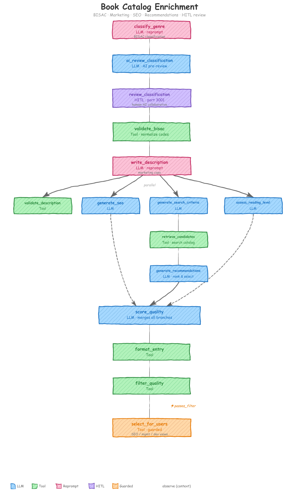

# Book Catalog Enrichment

<p align="center"></p>

An [agent-actions](https://github.com/Muizzkolapo/agent-actions) example that turns raw book metadata into production-ready catalog entries -- BISAC classification, marketing copy, SEO metadata, reading-level assessment, grounded recommendations, and per-user views.

With **15 actions**, it's the most complex example in the repository and the **only one** demonstrating **Human-in-the-Loop (HITL) review** and **reprompt validation** -- two patterns critical for production AI pipelines that need human oversight and automatic output correction.

---

## What You'll Learn

- **HITL (Human-in-the-Loop) review** -- how to insert a human approval step into an automated pipeline, and how to pair it with an AI pre-review so the human reviewer gets actionable context instead of raw output.
- **Reprompt validation** -- how to register a validation function that automatically rejects bad LLM output and reprompts with feedback, up to N attempts, before accepting the best result.
- **Grounded recommendations** -- how to prevent hallucinated suggestions by splitting the task into three steps: LLM generates search criteria, a tool retrieves real candidates from a catalog, and the LLM ranks only from those real results.
- **4-way parallel fan-out** -- how to declare independent branches that run concurrently, then merge at a single downstream action.
- **Guard-based filtering** -- how to conditionally skip an action based on a field value from a prior step.
- **Multi-stage validation** -- how to chain LLM output through deterministic tool validation before downstream actions consume it.

---

## The Problem

Publishers, digital bookstores, and library systems receive books with minimal metadata: an ISBN, a title, author names, and a one-line description. That's not enough to sell or surface a book in a modern catalog.

To publish a book you need: BISAC category codes for shelving, a 150-250 word marketing description, SEO keywords for discoverability, a reading-level assessment, similar-title recommendations, and a quality gate that prevents half-enriched records from reaching production. Different teams (SEO, product management, engineering) each need a different view of the enriched data.

Manual enrichment at scale is slow and inconsistent. This workflow automates the entire pipeline -- human oversight at the critical classification step, automatic validation at every LLM output.

---

## How It Works

### Phase 1: Classification with HITL Review

| Step | Action | Type | What It Does |
|------|--------|------|--------------|
| 1 | `classify_genre` | LLM (Ollama `llama3.2:latest`) | Assigns primary and secondary BISAC codes. BISAC is a fixed taxonomy so a local model suffices. Uses **reprompt validation** to retry if codes are malformed. |
| 2 | `ai_review_classification` | LLM (Groq `llama-3.1-8b-instant`) | Simple QA check -- fast and cheap. Flags issues and provides a confidence score for the human reviewer. |
| 3 | `review_classification` | **HITL** | A human reviews the classification alongside the AI assessment. Approves, corrects, or overrides. |
| 4 | `validate_bisac` | Tool | Deterministically validates and normalizes BISAC codes (format, prefix, length). |

### Phase 2: Marketing Description with Reprompt Validation

| Step | Action | Type | What It Does |
|------|--------|------|--------------|
| 5 | `write_description` | LLM | Writes a marketing description with hook sentence, benefits, and target audience. Uses **reprompt validation** to retry if word count is below threshold. |
| 6 | `validate_description` | Tool | Checks word count, benefit count, and scans for placeholder text. |

### Phase 3: Parallel Enrichment (4-way fan-out from `write_description`)

These four branches run concurrently -- none depends on the others:

| Branch | Action(s) | Type | What It Does |
|--------|-----------|------|--------------|
| A | `generate_seo` | LLM | Generates primary/long-tail keywords, meta title, meta description. |
| B | `generate_search_criteria` | LLM | Generates genre + keyword search parameters for the catalog. |
| B | `retrieve_candidates` | Tool | Searches the seed catalog (`book_catalog.json`) for real matching books. |
| B | `generate_recommendations` | LLM | Ranks and selects top recommendations from real candidates only. |
| C | `assess_reading_level` | LLM | Assesses difficulty, prerequisites, and estimated reading time. |
| D | `validate_description` | Tool | Validates marketing description quality (runs in parallel with A/B/C). |

### Phase 4: Quality Scoring, Filtering, and Output

| Step | Action | Type | What It Does |
|------|--------|------|--------------|
| 8 | `score_quality` | LLM | Merges all parallel branches. Scores overall enrichment quality (1-5) across 4 dimensions. |
| 9 | `format_entry` | Tool | Assembles all enriched data into a single consolidated catalog record. |
| 10 | `filter_quality` | Tool | Marks each record `passes_filter: true/false` based on minimum thresholds. |
| 11 | `select_for_users` | Tool (guarded) | Builds SEO, management, and developer views. **Skipped** if `passes_filter` is false. |

---

## Key Patterns Explained

### HITL Review

The `review_classification` action uses `kind: hitl` to pause the pipeline and present the record to a human reviewer in a browser-based UI. No other example in the repository includes this step.

```yaml
- name: review_classification
  dependencies: [ai_review_classification]
  kind: hitl
  run_mode: online
  intent: "Human reviews BISAC classification alongside AI assessment"
  schema: review_classification
  granularity: file
  hitl:
    port: 3001
    instructions: |
      **Human-AI Collaborative Review of BISAC Classification**

      The AI has pre-reviewed this classification. Review both the original
      classification and the AI's assessment, then approve or correct.

      - If AI status is PASS with high confidence, a quick confirmation may suffice.
      - If AI status is FLAG or REJECT, pay close attention to the issues found.
  context_scope:
    observe:
      - classify_genre.primary_bisac_code
      - classify_genre.primary_bisac_name
      - classify_genre.secondary_bisac_codes
      - classify_genre.classification_reasoning
      - ai_review_classification.review_status
      - ai_review_classification.confidence_score
      - ai_review_classification.issues_found
      - ai_review_classification.suggested_correction
      - ai_review_classification.review_reasoning
      - source.title
      - source.authors
      - source.description
```

Key details:

- **`kind: hitl`** tells the framework to pause and serve a review UI on the specified port.
- **`granularity: file`** -- the human reviews all records in a batch at once, not one at a time.
- **`hitl.instructions`** -- guidance displayed to the reviewer in the UI.
- `context_scope.observe` controls exactly what data the reviewer sees: both the original classification and the AI's pre-review assessment.

### Reprompt Validation

When an LLM produces output that fails a registered validation function, the framework automatically reprompts with the failure reason. The LLM gets another chance to fix its output. No other example in the repository uses this pattern.

Two actions use reprompt validation in this workflow:

**`classify_genre`** (Ollama `llama3.2:latest`) -- validates BISAC code format:

```yaml
- name: classify_genre
  intent: "Classify book into BISAC categories based on title, author, and description"
  schema: classify_genre
  prompt: $book_catalog_enrichment.Classify_Book_Genre
  model_vendor: ollama                 # Fixed BISAC taxonomy -- local model suffices
  model_name: llama3.2:latest
  prompt_debug: true
  reprompt:
    validation: "check_valid_bisac"   # Registered @reprompt_validation UDF
    max_attempts: 3                    # Retry up to 3 times
    on_exhausted: "return_last"        # Accept best attempt if all retries fail
```

**`write_description`** -- validates minimum word count:

```yaml
- name: write_description
  dependencies: [validate_bisac]
  intent: "Write compelling marketing description for the book"
  schema: write_description
  prompt: $book_catalog_enrichment.Write_Marketing_Description
  reprompt:
    validation: check_description_word_count  # Must produce at least 50 words
    max_attempts: 3
    on_exhausted: return_last
```

The cycle:

1. The LLM produces output.
2. The framework runs the registered validation function (e.g., `check_valid_bisac`) against it.
3. Validation fails? The framework reprompts, appending the failure reason to the original prompt.
4. Steps 1-3 repeat up to `max_attempts` times.
5. If all attempts fail, `on_exhausted: return_last` accepts the best result rather than raising an error.

Set `prompt_debug: true` on the action to see the reprompt feedback in your logs.

### AI-Assisted Human Review

Rather than asking a human to review raw LLM output cold, the workflow inserts an AI pre-review step (`ai_review_classification`) between the LLM action and the human review. The AI reviewer:

- Assigns a review status: `PASS`, `FLAG`, or `REJECT`
- Provides a confidence score
- Lists specific issues found
- Suggests corrections if needed

The human reviewer then sees both the original classification **and** the AI's assessment:

- **PASS with high confidence** -- approve quickly.
- **FLAG or REJECT** -- focus attention on the specific issues listed.

Reusable pattern: any time you have a HITL step, consider preceding it with an AI pre-review. The human's job gets faster and more consistent.

### Grounded Recommendations

A naive approach would ask the LLM to "suggest similar books" -- and get plausible-sounding but entirely invented titles. The workflow uses a three-step grounded retrieval pattern instead:

```
LLM generates search criteria --> Tool searches real catalog --> LLM ranks from real candidates only
```

Three separate actions, chained by dependencies:

```yaml
# Step 1: LLM generates search parameters
- name: generate_search_criteria
  dependencies: [write_description]
  intent: "Generate search criteria to find similar books in catalog"
  schema: search_criteria
  prompt: $book_catalog_enrichment.Generate_Search_Criteria
  context_scope:
    observe:
      - validate_bisac.*
      - write_description.*

# Step 2: Tool searches the real seed catalog
- name: retrieve_candidates
  dependencies: [generate_search_criteria]
  kind: tool
  impl: search_book_catalog     # Swap backend anytime (vector DB, SQL, etc.)
  intent: "Search catalog for similar books (vector/SQL/JSON)"
  schema: search_book_catalog
  context_scope:
    observe:
      - generate_search_criteria.*

# Step 3: LLM ranks only from real candidates
- name: generate_recommendations
  dependencies: [retrieve_candidates]
  intent: "Rank and select top recommendations from retrieved candidates"
  schema: generate_recommendations
  prompt: $book_catalog_enrichment.Rank_Recommendations
  context_scope:
    observe:
      - validate_bisac.*
      - write_description.*
      - retrieve_candidates.*       # Only real books from the catalog
```

The ranking prompt explicitly forbids inventing titles. Every recommendation traces back to a real entry in `seed_data/book_catalog.json`. To swap the search backend (e.g., from JSON to a vector database), change the `impl` on `retrieve_candidates`. The rest of the pipeline stays the same.

### 4-Way Parallel Fan-Out

After `write_description` completes, four independent branches run concurrently:

```
                        write_description
                              |
            +---------+-------+--------+-----------+
            |         |                |            |
       generate_seo   |       assess_reading_level  validate_description
                      |
              generate_search_criteria
                      |
              retrieve_candidates
                      |
              generate_recommendations
```

This happens automatically. Each action lists `write_description` (or a derivative) as its dependency, but none depends on the others. The framework detects the independence and runs them in parallel.

`score_quality` then merges all branches by observing outputs from every parallel path:

```yaml
- name: score_quality
  dependencies: [generate_recommendations]
  context_scope:
    observe:
      - generate_recommendations.*
      - generate_seo.*
      - write_description.*
      - validate_bisac.*
      - assess_reading_level.*
```

`score_quality` only lists `generate_recommendations` as an explicit dependency (the longest branch), but it observes fields from all branches. The framework ensures all observed data is available before execution.

### Guard as Filter

`select_for_users`, the final action, guards on a boolean field from the prior step:

```yaml
- name: select_for_users
  dependencies: [filter_quality]
  kind: tool
  impl: select_for_users
  guard:
    condition: 'passes_filter'
    on_false: filter
```

- `condition: 'passes_filter'` evaluates the field from `filter_quality`'s output.
- `on_false: filter` silently skips the record (not an error).

Only records that pass quality thresholds (score >= 3.0, >= 3 enriched fields, marked publication-ready) reach the final output. Half-enriched or low-quality records never appear in the consumer views.

---

## Quick Start

### Prerequisites

- Python 3.10+
- An OpenAI API key (the workflow defaults to `gpt-4o-mini`)
- A Groq API key (for `ai_review_classification`)
- Ollama running locally (for `classify_genre`)

### Install

```bash
pip install agent-actions
```

Optionally, install AI coding assistant skills for workflow-aware help inside your editor:

```bash
agac skills install --claude   # Claude Code
agac skills install --codex    # OpenAI Codex
```

### Configure

Copy the sample environment file and add your key:

```bash
cd /Users/muizz/agac-examples/book_catalog_enrichment
cp .env.sample .env
# Edit .env and set:
#   OPENAI_API_KEY=sk-...
#   GROQ_API_KEY=gsk_...
# Ollama must be running locally (no API key needed)
```

### Run

```bash
agac run -a book_catalog_enrichment
```

By default the workflow processes 2 records (`record_limit: 2` in the config). Remove or increase that setting to process the full 80-book sample in `agent_io/staging/`.

When the pipeline reaches `review_classification`, a browser-based HITL review UI will open on port 3001. Review and approve the classifications to continue.

Output is written to `agent_io/target/select_for_users/` with three views per book: `seo_view`, `management_view`, and `developer_view`.

### Input Format

Drop your own catalog data into `agent_io/staging/` as JSON:

```json
[
  {
    "isbn": "9780134685991",
    "title": "Effective Java",
    "authors": ["Joshua Bloch"],
    "publisher": "Addison-Wesley Professional",
    "publish_year": 2018,
    "page_count": 412,
    "description": "Best practices for the Java platform."
  }
]
```

---

## Project Structure

```
book_catalog_enrichment/
├── README.md
├── docs/
├── agent_actions.yml
├── agent_workflow/
│   └── book_catalog_enrichment/
│       ├── README.md                     # Design philosophy and patterns
│       ├── agent_config/
│       │   └── book_catalog_enrichment.yml
│       ├── agent_io/
│       │   ├── staging/
│       │   └── target/
│       └── seed_data/
│           └── book_catalog.json
├── prompt_store/
│   └── book_catalog_enrichment.md
├── schema/
│   └── book_catalog_enrichment/
│       ├── classify_genre.yml
│       ├── ai_review_classification.yml
│       ├── review_classification.yml
│       ├── validate_bisac.yml
│       ├── write_description.yml
│       ├── validate_description.yml
│       ├── generate_seo.yml
│       ├── search_criteria.yml
│       ├── search_book_catalog.yml
│       ├── generate_recommendations.yml
│       ├── assess_reading_level.yml
│       ├── score_quality.yml
│       ├── format_catalog_entry.yml
│       ├── filter_quality.yml
│       └── select_for_users.yml
└── tools/
    ├── book_catalog_enrichment/
    │   ├── filter_by_quality.py
    │   ├── format_catalog_entry.py
    │   ├── search_book_catalog.py
    │   ├── select_for_users.py
    │   ├── validate_bisac_codes.py
    │   └── validate_description.py
    └── shared/
        └── reprompt_validations.py
```

For the full design philosophy, detailed action table, and customization guide, see [`agent_workflow/book_catalog_enrichment/README.md`](agent_workflow/book_catalog_enrichment/README.md).
