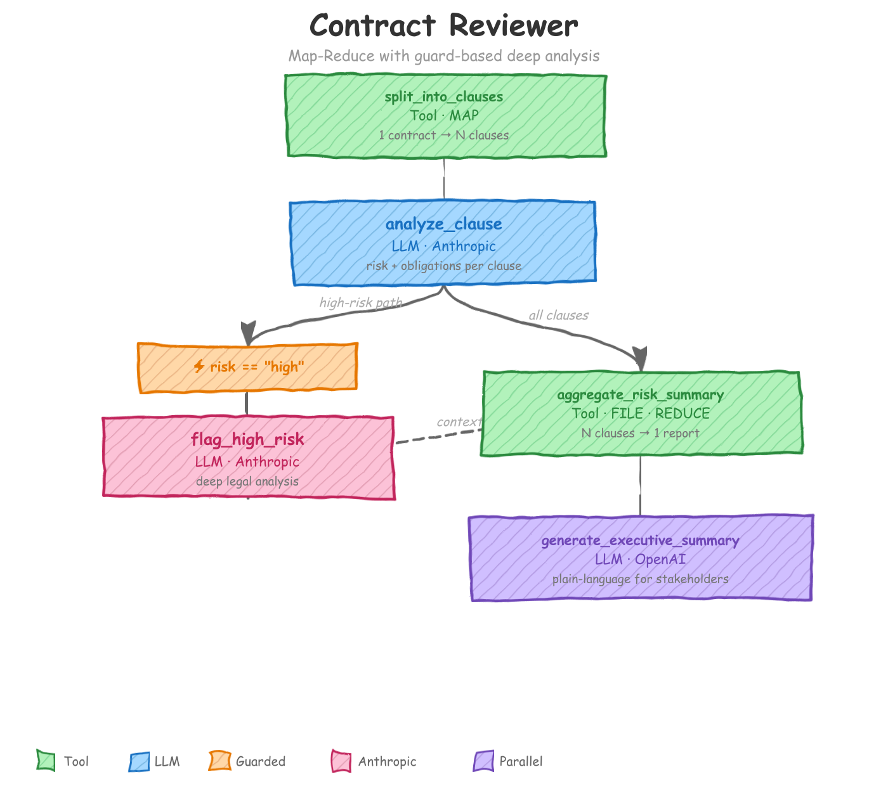

# Contract Reviewer

<p align="center"></p>

## What You'll Learn

This is the **only example** in the repository that demonstrates the **Map-Reduce pattern** and **FILE granularity**. You'll learn how to:

- **Split one input record into many** (the "map" step) using a Tool action that returns a list.
- **Process each fragment independently** with per-record LLM actions.
- **Collect all fragments back into one** (the "reduce" step) using a Tool action with `granularity: File`, which receives every record from the file at once instead of one at a time.
- **Filter records with a guard** so that an expensive LLM action only runs on records that match a condition.
- **Mix model vendors in a single workflow** -- Anthropic for legal reasoning, OpenAI for executive summarization.

---

## The Problem

A legal team needs to review contracts before signing. Each contract contains many clauses -- payment, IP, liability, termination -- and each clause carries different risk. Reviewing a whole contract in a single LLM call works poorly. The model loses focus. The output is unstructured. And you can't selectively deep-dive into the dangerous parts.

The Map-Reduce pattern solves this naturally:

1. **Map** -- split the contract into individual clauses so each one is analyzed in isolation with full attention.
2. **Process** -- run each clause through a risk-analysis prompt that scores it against seed-data criteria.
3. **Filter** -- only send high-risk clauses to an expensive deep-analysis step.
4. **Reduce** -- aggregate all clause-level results into a single contract-level risk report.
5. **Summarize** -- generate a plain-language executive summary from the aggregated report.

---

## How It Works

The workflow contains five actions executed in sequence. Here's what each one does and which YAML settings matter.

### 1. `split_into_clauses` (Tool)

Parses the contract's `full_text` field and emits **one record per clause**. One contract goes in, N clause records come out.

- **Kind**: `tool` -- Python function, no LLM call.
- **Impl**: `split_contract_by_clause` -- regex finds numbered headings (`1. DEFINITIONS`, `Section 2: ...`, etc.) and slices the text.
- **Output fields**: `clause_number`, `clause_title`, `clause_text`
- **Context scope**: observes only `source.full_text`, `source.contract_id`, and `source.title`; passes through metadata (`contract_id`, `title`, `parties`) so downstream actions can reference the contract.

### 2. `analyze_clause` (LLM / Anthropic)

Analyzes **each** clause against the risk criteria from seed data. The default granularity is `Record`, so the framework invokes this action once per clause.

- **Model**: `claude-sonnet-4-20250514` via Anthropic -- chosen for strong legal reasoning.
- **Prompt**: classify risk as high/medium/low, extract obligations and deadlines, recommend an action (accept, negotiate, reject, or flag_for_legal).
- **Seed data**: `risk_criteria.json` is injected through `context_scope.observe`, giving the model a rubric with concrete indicators for each risk level.
- **Output fields**: `risk_level`, `risk_score`, `risk_indicators`, `obligations`, `deadlines`, `reasoning`, `recommended_action`

### 3. `flag_high_risk` (LLM / Anthropic, guarded)

Deep legal analysis **only on clauses classified as high-risk**. Clauses that don't match the guard are silently filtered out.

- **Guard**: `risk_level == "high"` with `on_false: filter` -- non-matching records drop entirely.
- **Model**: same Anthropic model as the previous step.
- **Context**: observes the full `analyze_clause.*` output plus `source.full_text` (the entire original contract) for cross-referencing, and `seed.risk_criteria`.
- **Output fields**: `severity`, `legal_exposure`, `financial_impact`, `cross_references`, `negotiation_points`, `precedent_concerns`, `mitigation_strategy`

### 4. `aggregate_risk_summary` (Tool, FILE granularity)

The reduce step. Collects **all** clause-level analyses into a single contract-level risk report. FILE granularity is essential here -- without it, the framework passes records one at a time and the tool can't compute cross-clause aggregates.

- **Kind**: `tool` -- Python function.
- **Granularity**: `File` -- input is a `list[dict]` of every record, not a single record.
- **Impl**: `aggregate_clause_analyses` -- counts risk levels, computes average risk scores, collects obligations and deadlines, builds a prioritized negotiation list.
- **Output fields**: `overall_risk_level`, `overall_risk_score`, `risk_distribution`, `high_risk_clauses`, `total_obligations`, `key_deadlines`, `negotiation_priority`

### 5. `generate_executive_summary` (LLM / OpenAI)

Plain-language summary for VP/C-level stakeholders. It deliberately **doesn't** see individual clause analyses -- only the aggregated report -- keeping context tight.

- **Model**: `gpt-4o-mini` via OpenAI (the workflow default).
- **Context scope**: observes only `aggregate_risk_summary.*`; explicitly drops `analyze_clause.*`, `flag_high_risk.*`, and `split_into_clauses.*`.
- **Output fields**: `executive_summary`, `risk_verdict`, `top_concerns`, `recommended_next_steps`, `approval_conditions`, `estimated_negotiation_effort`

---

## Key Patterns Explained

### Map-Reduce Pattern

Split a large document into pieces, process each piece independently, then combine the results. In AGAC: a Tool action returns a list (the map step), normal per-record actions process each element, and a `granularity: File` action merges everything back (the reduce step).

**Map step** -- the tool returns a Python `list[dict]`, and the framework automatically fans out one record per list element:

```yaml
- name: split_into_clauses
  kind: tool
  impl: split_contract_by_clause
  intent: "Split contract full_text into individual numbered clauses"
  schema: split_into_clauses
  context_scope:
    observe:
      - source.full_text
      - source.contract_id
      - source.title
    passthrough:
      - source.contract_id
      - source.title
      - source.parties
```

After this action, the workflow has N records (one per clause) where before it had 1. Every subsequent action (until the reduce step) runs once per clause.

**Reduce step** -- the `granularity: File` setting tells the framework to batch all records from the same file back into a single call:

```yaml
- name: aggregate_risk_summary
  dependencies: [analyze_clause]
  kind: tool
  impl: aggregate_clause_analyses
  intent: "Aggregate all clause analyses into a unified contract risk report"
  schema: aggregate_risk_summary
  granularity: File
  context_scope:
    observe:
      - analyze_clause.*
      - flag_high_risk.*
      - source.contract_id
      - source.title
      - source.parties
```

### FILE Granularity

By default, every action uses `granularity: Record` -- one record at a time. Set `granularity: File`, and the action receives **all records from the input file in a single call**.

This matters whenever your logic needs a cross-record view: computing averages, counting distributions, sorting by priority, producing one output from many inputs. Without it, the aggregation tool would see one clause at a time and could never build a contract-level summary.

A FILE granularity tool in Python receives a `list[dict]` and returns a `list[dict]`:

```python
from agent_actions import udf_tool
from agent_actions.config.types import Granularity

@udf_tool(granularity=Granularity.FILE)
def aggregate_clause_analyses(data: list[dict[str, Any]]) -> list[dict[str, Any]]:
    # data contains ALL clause records at once
    # ... aggregate logic ...
    return [single_summary_dict]
```

The framework handles all metadata propagation (`source_guid`, lineage) automatically — tools just return business data.

### Guard as Filter

The `flag_high_risk` action uses a guard to skip clauses that aren't high-risk. The key setting is `on_false: filter` -- records that fail the condition are **dropped from the pipeline entirely** for this action. They aren't passed through unchanged; they simply don't reach it.

```yaml
- name: flag_high_risk
  dependencies: [analyze_clause]
  intent: "Perform deep legal analysis of high-risk clauses with full contract context"
  schema: flag_high_risk
  prompt: $contract_reviewer.Flag_High_Risk
  model_vendor: anthropic
  model_name: claude-sonnet-4-20250514
  api_key: ANTHROPIC_API_KEY
  guard:
    condition: 'risk_level == "high"'
    on_false: "filter"
```

A cost and latency win. Eight clauses, two high-risk? The expensive deep-analysis LLM call runs twice, not eight times.

### Multi-Vendor

Two LLM providers in one workflow. The `defaults` block sets OpenAI as the baseline; individual actions override to Anthropic where legal reasoning quality matters more:

```yaml
defaults:
  model_vendor: openai
  model_name: gpt-4o-mini
  api_key: OPENAI_API_KEY

actions:
  - name: analyze_clause
    model_vendor: anthropic
    model_name: claude-sonnet-4-20250514
    api_key: ANTHROPIC_API_KEY
    # ...

  - name: flag_high_risk
    model_vendor: anthropic
    model_name: claude-sonnet-4-20250514
    api_key: ANTHROPIC_API_KEY
    # ...

  - name: generate_executive_summary
    # inherits defaults: openai / gpt-4o-mini
    # ...
```

Balance cost and quality stage by stage. Legal clause analysis benefits from a stronger model; the executive summary, operating on already-structured data, works fine with a lighter one.

### Retry and Reprompt

All LLM actions inherit retry from defaults -- transient API errors (rate limits, timeouts) are retried up to 2 times with backoff:

```yaml
defaults:
  retry:
    enabled: true
    max_attempts: 2
```

`analyze_clause` also has reprompt validation. If the LLM returns null values for `risk_score` or other required fields, the framework rejects the output and reprompts automatically:

```yaml
reprompt:
  validation: check_required_fields    # Rejects any response with null values
  max_attempts: 2
  on_exhausted: return_last            # Accept best attempt if retries fail
```

The `check_required_fields` UDF in `tools/shared/reprompt_validations.py` is generic -- it checks that no field in the response is null, without hardcoding field names.

---

## Quick Start

Install the CLI:

```bash
pip install agent-actions-cli
```

Copy the environment sample and fill in your API keys:

```bash
cp .env.sample .env
# Edit .env with your OPENAI_API_KEY and ANTHROPIC_API_KEY
```

Run the workflow:

```bash
agac run -a contract_reviewer
```

By default the workflow processes 2 records (`record_limit: 2` in the config). Remove or increase that setting to process the full dataset.

The sample input (`agent_io/staging/contracts.json`) includes three contracts of varying risk levels. After the run completes, check the output database for per-clause analyses, high-risk flags, aggregated risk summaries, and executive summaries.

---

## Project Structure

```
contract_reviewer/
├── README.md
├── docs/
├── agent_actions.yml
├── agent_workflow/
│   └── contract_reviewer/
│       ├── agent_config/
│       │   └── contract_reviewer.yml
│       ├── agent_io/
│       │   ├── staging/
│       │   │   └── contracts.json
│       │   └── target/
│       └── seed_data/
│           └── risk_criteria.json
├── prompt_store/
│   └── contract_reviewer.md
├── schema/
│   └── contract_reviewer/
│       ├── split_into_clauses.yml
│       ├── analyze_clause.yml
│       ├── flag_high_risk.yml
│       ├── aggregate_risk_summary.yml
│       └── generate_executive_summary.yml
└── tools/
    ├── contract_reviewer/
    │   ├── split_contract_by_clause.py
    │   └── aggregate_clause_analyses.py
    └── shared/
        └── reprompt_validations.py
```
