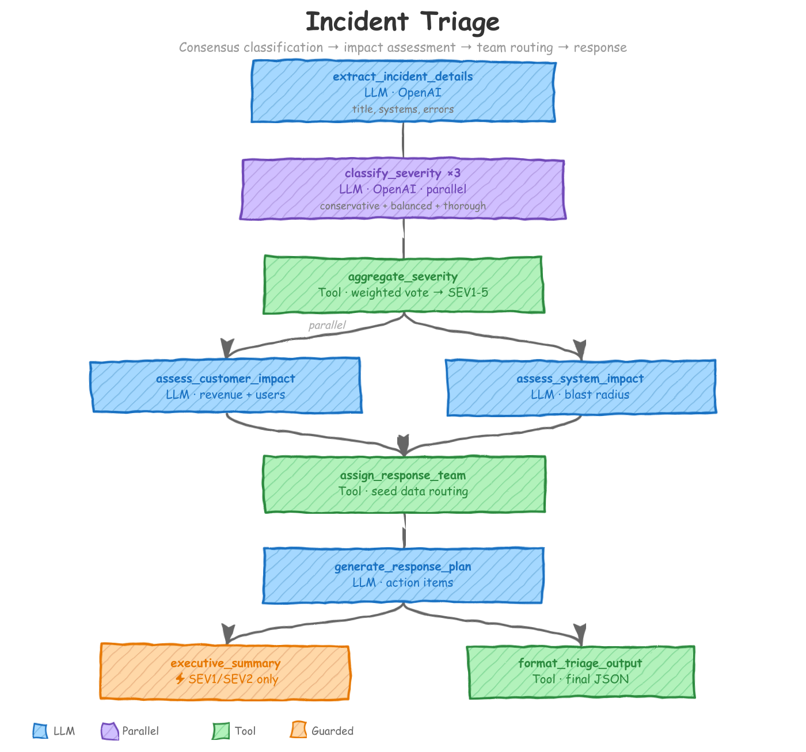

# Incident Triage

An automated incident triage workflow that classifies severity through parallel consensus voting, assesses customer and system impact in parallel, dynamically assigns response teams using seed data, and conditionally escalates to leadership for high-severity incidents.

<p align="center"></p>

## What You'll Learn

This example demonstrates several intermediate-to-advanced agac patterns:

- **Parallel versioned actions** -- running multiple instances of the same LLM action concurrently with distinct personas
- **Version merge/aggregation** -- consuming parallel version outputs into a single tool action using the `merge` pattern
- **Conditional execution with guards** -- skipping actions based on runtime data (severity level)
- **Multi-seed data injection** -- loading external JSON files (team roster, service catalog, runbooks) into the workflow context
- **Parallel branching** -- running independent LLM actions concurrently when they share the same dependency
- **Tool actions** -- using deterministic Python functions alongside LLM actions for aggregation, routing, and formatting
- **Context scoping with `observe` and `passthrough`** -- controlling exactly which upstream fields each action can see

## The Problem

When a production incident hits, the first 15 minutes matter most. Human triage is slow, inconsistent, and often bottlenecked on a single on-call engineer's judgment. This workflow automates the entire triage process: it extracts structured details from a raw incident report, classifies severity through a three-voter ensemble (reducing single-classifier bias), assesses both customer and system impact simultaneously, assigns the right response team based on real organizational data, and generates a response plan -- all in seconds.

## How It Works

The workflow is defined in a single YAML config with 8 actions arranged across 8 stages. Each action is either an LLM call or a deterministic tool.

### Stage 1: extract_incident_details (LLM)

**Model**: Groq (`llama-3.1-8b-instant`) -- simple structured extraction, fast and cheap.

```yaml
- name: extract_incident_details
  intent: "Extract structured information from raw incident report"
  schema: extract_incident_details
  prompt: $incident_triage.Extract_Incident_Details
  model_vendor: groq
  model_name: llama-3.1-8b-instant
  api_key: GROQ_API_KEY
  context_scope:
    observe:
      - source.incident_report
      - source.monitoring_data
      - source.timestamp
```

The entry point. It reads the raw incident report and monitoring data from the input record and produces a structured JSON object: title, description, affected systems, error messages, impact signals.

The input record may contain fields irrelevant to extraction. Listing only `source.incident_report`, `source.monitoring_data`, and `source.timestamp` in `observe` limits the LLM's context window to exactly the data it needs. Narrow observation reduces noise and token cost.

### Stage 2: classify_severity (LLM, x3 parallel)

**Model**: Ollama (`llama3.2:latest`) -- classification task; parallel voting compensates for the weaker model.

```yaml
- name: classify_severity
  dependencies: [extract_incident_details]
  intent: "Classify incident severity using multiple independent evaluators"
  versions:
    range: [1, 3]
    mode: parallel
  schema: classify_severity
  prompt: $incident_triage.Classify_Severity
  context_scope:
    observe:
      - extract_incident_details.*
      - source.incident_report
```

This is the core pattern. Instead of asking one LLM call to classify severity, we run three independent classifiers in parallel. Each version gets a different persona -- conservative, balanced, thorough -- injected through the prompt template using `{{ i }}`, `{{ version.first }}`, and `{{ version.last }}`.

A single classifier can be overconfident or miss edge cases. Three independent votes with different risk perspectives produce a more robust severity rating. The `parallel` mode means all three run concurrently -- no time penalty. Outputs land as `classify_severity_1`, `classify_severity_2`, and `classify_severity_3` in the context.

### Stage 3: aggregate_severity (Tool, merge pattern)

```yaml
- name: aggregate_severity
  dependencies: [classify_severity]
  kind: tool
  impl: aggregate_severity_votes
  schema: aggregate_severity
  intent: "Aggregate severity classifications using weighted consensus"
  version_consumption:
    source: classify_severity
    pattern: merge
  context_scope:
    observe:
      - classify_severity_1.*
      - classify_severity_2.*
      - classify_severity_3.*
    passthrough:
      - extract_incident_details.*
```

This tool action consumes all three classifier outputs and produces a single final severity rating via weighted voting. `version_consumption` with `pattern: merge` tells agac this is the aggregation point for the parallel versions from Stage 2.

Aggregation logic -- weighted vote, tie-breaking -- is deterministic. A Python function (`aggregate_severity_votes`) is faster, cheaper, and fully reproducible. Reserve LLM actions for tasks that actually require judgment.

The `passthrough` list forwards `extract_incident_details.*` downstream without the aggregate action itself needing those fields. Context keeps flowing through the pipeline; intermediate actions don't have to re-observe everything.

### Stage 4: assess_customer_impact and assess_system_impact (LLM, parallel branches)

```yaml
- name: assess_customer_impact
  dependencies: [aggregate_severity]
  intent: "Assess impact on customers and revenue"
  schema: assess_customer_impact
  prompt: $incident_triage.Assess_Customer_Impact
  context_scope:
    observe:
      - extract_incident_details.*
      - aggregate_severity.*

- name: assess_system_impact
  dependencies: [aggregate_severity]
  intent: "Assess technical system impact and blast radius"
  schema: assess_system_impact
  prompt: $incident_triage.Assess_System_Impact
  context_scope:
    observe:
      - extract_incident_details.*
      - aggregate_severity.*
```

These two actions share the same dependency (`aggregate_severity`) and don't depend on each other. agac runs them in parallel automatically. One focuses on customer/revenue impact; the other on technical blast radius and cascading failure risk.

Each assessment requires a different analytical lens. Separating them produces more focused, higher-quality outputs -- and parallel execution means there's no latency cost for the split.

### Stage 5: assign_response_team (Tool, seed data)

```yaml
- name: assign_response_team
  dependencies: [assess_customer_impact, assess_system_impact]
  kind: tool
  impl: assign_team_based_on_impact
  schema: assign_response_team
  intent: "Dynamically assign response team based on affected systems and severity"
  context_scope:
    observe:
      - aggregate_severity.final_severity
      - assess_system_impact.affected_services
      - seed.team_roster
      - seed.service_catalog
    passthrough:
      - aggregate_severity.*
      - assess_customer_impact.*
      - assess_system_impact.*
```

This tool action reads the severity level and affected services, then looks up the correct response team from the seed data. The `seed.team_roster` and `seed.service_catalog` references pull in the JSON files declared in the `defaults.context_scope.seed_path` block at the top of the config.

Team rosters and service ownership change frequently. Loading them from external JSON files lets you update routing logic without modifying the workflow config or redeploying. The tool function receives the full roster and catalog as context, then makes a deterministic routing decision.

### Stage 6: generate_response_plan (LLM)

```yaml
- name: generate_response_plan
  dependencies: [assign_response_team]
  intent: "Generate initial incident response plan with action items"
  schema: generate_response_plan
  prompt: $incident_triage.Generate_Response_Plan
  context_scope:
    observe:
      - assign_response_team.*
      - extract_incident_details.*
      - assess_customer_impact.customer_impact_level
```

With the severity classified, impact assessed, and team assigned, this LLM action generates concrete immediate actions, investigation steps, a communication plan, and escalation criteria.

The response plan only needs the impact level -- not the full breakdown of estimated customer counts and revenue figures. Selecting `assess_customer_impact.customer_impact_level` instead of the wildcard keeps the prompt focused.

### Stage 7: generate_executive_summary (LLM, guarded)

```yaml
- name: generate_executive_summary
  dependencies: [generate_response_plan]
  intent: "Generate executive summary for high-severity incidents"
  guard:
    condition: 'aggregate_severity.final_severity == "SEV1" or aggregate_severity.final_severity == "SEV2"'
    on_false: "filter"
  schema: generate_executive_summary
  prompt: $incident_triage.Generate_Executive_Summary
  context_scope:
    observe:
      - aggregate_severity.*
      - assess_customer_impact.*
      - generate_response_plan.*
```

This action only runs for SEV1 and SEV2 incidents. The `guard` block evaluates a condition against runtime context. SEV3 or lower? The action gets filtered -- skipped entirely -- saving LLM cost and avoiding unnecessary leadership notifications.

With `"filter"`, the action is silently skipped and downstream actions proceed without its output. `"block"` would halt the entire pipeline instead. The final formatting stage still needs to run for lower-severity incidents, so `"filter"` is correct here.

### Stage 8: format_triage_output (Tool)

```yaml
- name: format_triage_output
  dependencies: [generate_response_plan, generate_executive_summary]
  kind: tool
  impl: format_incident_triage
  schema: format_triage_output
  intent: "Format complete triage output with all assessments"
  context_scope:
    observe:
      - extract_incident_details.*
      - aggregate_severity.*
      - assess_customer_impact.*
      - assess_system_impact.*
      - assign_response_team.*
      - generate_response_plan.*
      - generate_executive_summary.*
      - source.timestamp
```

The final tool action assembles all upstream outputs into a single structured triage record. It observes every prior action's output. When the executive summary was filtered (SEV3+), `generate_executive_summary.*` is simply absent from context -- the tool handles that gracefully.

## Key Patterns Explained

### Parallel Voting with Versions

The `versions` block creates multiple instances of the same action. Each instance gets a unique index (`{{ i }}`), and the prompt template uses `{{ version.first }}` and `{{ version.last }}` to assign different personas:

```yaml
versions:
  range: [1, 3]
  mode: parallel
```

This produces three concurrent LLM calls: `classify_severity_1`, `classify_severity_2`, and `classify_severity_3`. `range: [1, 3]` means versions 1 through 3 inclusive. `mode: parallel` means they run concurrently, not sequentially.

In the prompt, version-aware templating assigns each classifier a distinct perspective:

```
You are classifier {{ i }} of {{ version.length }} in a severity classification ensemble.


**Your role**: Be CONSERVATIVE. When in doubt, classify higher severity.

**Your role**: Be THOROUGH. Consider all possible impacts comprehensively.

**Your role**: Be BALANCED. Focus on evidence-based assessment.

```

### Version Merge (Aggregation)

After parallel versions complete, a downstream action consumes them using `version_consumption`:

```yaml
version_consumption:
  source: classify_severity
  pattern: merge
```

`pattern: merge` tells agac to wait for all versions of `classify_severity` to finish, then expose their outputs as `classify_severity_1.*`, `classify_severity_2.*`, and `classify_severity_3.*` in the consuming action's context. Standard fan-in after a fan-out.

### Conditional Escalation with Guards

Guards let you skip actions based on runtime values:

```yaml
guard:
  condition: 'aggregate_severity.final_severity == "SEV1" or aggregate_severity.final_severity == "SEV2"'
  on_false: "filter"
```

The `condition` is evaluated against the accumulated context. If it returns false, `on_false` determines the behavior:
- `"filter"` -- skip this action silently; downstream actions still run
- `"block"` -- halt the pipeline at this point

This avoids wasting LLM calls on low-severity incidents that don't need executive attention.

### Multi-Seed Data Loading

Seed data is declared once in `defaults` and made available across all actions:

```yaml
defaults:
  context_scope:
    seed_path:
      team_roster: $file:team_roster.json
      service_catalog: $file:service_catalog.json
      runbook_catalog: $file:runbook_catalog.json
```

Individual actions reference seed data via the `seed.` prefix in their `observe` lists:

```yaml
context_scope:
  observe:
    - seed.team_roster
    - seed.service_catalog
```

The `$file:` prefix tells agac to load the JSON file from the `seed_data/` directory -- that's how organizational knowledge (team rosters, service ownership maps, runbook catalogs) gets into tool actions without being hardcoded in the workflow config.

### Parallel Branches (Implicit)

When two actions share the same dependency and don't depend on each other, agac runs them in parallel automatically:

```yaml
- name: assess_customer_impact
  dependencies: [aggregate_severity]
  # ...

- name: assess_system_impact
  dependencies: [aggregate_severity]
  # ...
```

No special keyword needed. The DAG scheduler detects that both actions become runnable at the same time and executes them concurrently. `assign_response_team` lists both as dependencies, so it waits for both to finish:

```yaml
- name: assign_response_team
  dependencies: [assess_customer_impact, assess_system_impact]
```

### Retry and Reprompt

All LLM actions inherit retry from defaults -- transient API errors (rate limits, timeouts) are retried up to 2 times with backoff:

```yaml
defaults:
  retry:
    enabled: true
    max_attempts: 2
```

`extract_incident_details` and `classify_severity` also have reprompt validation. If the LLM returns null fields or incomplete structured output, the framework rejects the response and reprompts automatically:

```yaml
reprompt:
  validation: check_required_fields    # Rejects any response with null values
  max_attempts: 2
  on_exhausted: return_last            # Accept best attempt if retries fail
```

The `check_required_fields` UDF in `tools/shared/reprompt_validations.py` is generic -- it checks that no field in the response is null, without hardcoding field names.

## Quick Start

Install the CLI:

```bash
pip install agent-actions-cli
```

Set your environment variables:

```bash
export OPENAI_API_KEY=...
export GROQ_API_KEY=...
# Ollama must be running locally (no API key needed)
```

Run the workflow:

```bash
agac run -a incident_triage
```

By default the workflow processes 2 records (`record_limit: 2` in the config). Remove or increase that setting to process the full dataset.

The input data lives in `agent_workflow/incident_triage/agent_io/staging/incidents.json` and contains three sample incidents (checkout 502 errors, auth service failure, Elasticsearch cluster outage). Results are written to `agent_workflow/incident_triage/agent_io/target/`.

## Project Structure

```
incident_triage/
├── README.md
├── docs/
├── agent_actions.yml
├── agent_workflow/
│   └── incident_triage/
│       ├── agent_config/
│       │   └── incident_triage.yml
│       ├── agent_io/
│       │   ├── staging/
│       │   │   └── incidents.json
│       │   └── target/
│       └── seed_data/
│           ├── team_roster.json
│           ├── service_catalog.json
│           └── runbook_catalog.json
├── prompt_store/
│   └── incident_triage.md
├── schema/
│   └── incident_triage/
│       ├── extract_incident_details.yml
│       ├── classify_severity.yml
│       ├── aggregate_severity.yml
│       ├── assess_customer_impact.yml
│       ├── assess_system_impact.yml
│       ├── assign_response_team.yml
│       ├── generate_response_plan.yml
│       ├── generate_executive_summary.yml
│       └── format_triage_output.yml
└── tools/
    ├── incident_triage/
    │   ├── aggregate_severity_votes.py
    │   ├── assign_team_based_on_impact.py
    │   └── format_incident_triage.py
    └── shared/
        └── reprompt_validations.py
```
