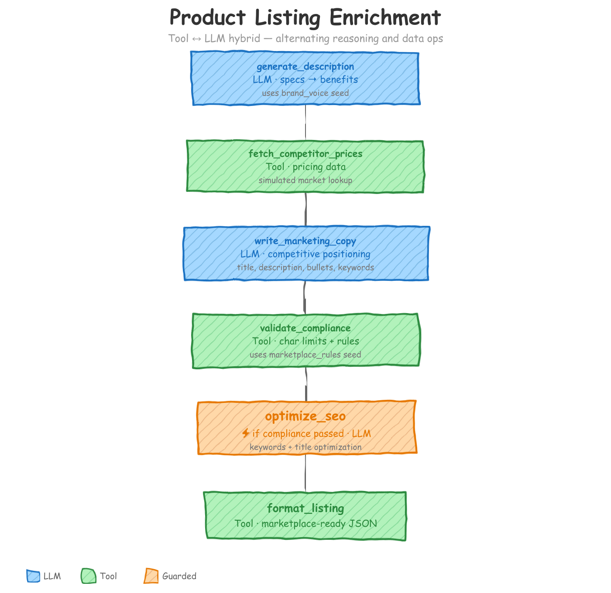

# Product Listing Enrichment

<p align="center"></p>

A six-action pipeline that transforms raw product specs into marketplace-ready listings. It alternates strictly between LLM actions (language generation) and Tool actions (deterministic operations), demonstrating how to divide work by capability: LLMs handle language, tools handle data.

## What You'll Learn

This example teaches four patterns that appear repeatedly in production agent workflows:

1. **LLM/Tool hybrid pipeline** -- structuring a workflow so that LLMs and tools alternate, each doing what the other cannot.
2. **Progressive context disclosure** -- controlling exactly what each action sees, and dropping context once it's been distilled into a better form.
3. **Guard-based conditional skip** -- making an action run only when a previous action's output meets a condition.
4. **Seed data injection** -- providing static reference material (brand guidelines, marketplace rules) that shapes LLM behavior without being part of the input records.

## The Problem

A marketplace seller has raw product data -- technical specs, images, a category, and a price. Turning that into a published listing requires several kinds of work:

- **Language work**: describing specs in human terms, writing persuasive copy, optimizing for search. These require understanding nuance, tone, and intent. An LLM is the right tool.
- **Data work**: looking up competitor prices, checking character limits, assembling final JSON. These are deterministic and exact. A traditional function is the right tool.

Mixing these responsibilities in a single LLM call produces unreliable results -- LLMs miscount characters and hallucinate pricing data. A strict LLM-Tool-LLM-Tool-LLM-Tool pipeline gives you the best of both.

## How It Works

The pipeline has exactly 6 actions in strict alternation:

### Action 1: `generate_description` (LLM)

**Model**: Gemini (`gemini-2.5-flash`) -- cheap extraction from technical specs.

Takes the raw specs, product images description, and brand voice seed data. The LLM translates technical specifications into a benefit-oriented description, key features, search keywords, and use cases. Pure language work. No tool could turn `"driver_size": "40mm"` into "rich, detailed sound from 40mm custom drivers."

It observes (`observe`) `source.raw_specs`, `source.product_images_description`, `source.product_name`, `source.brand`, and `seed.brand_voice`. It passes through `source.product_id`, `source.product_category`, and `source.current_price` unchanged.

### Action 2: `fetch_competitor_prices` (Tool)

A deterministic function that looks up competitor pricing based on category and price. In production this would call a pricing API. No LLM needed -- pure data lookup.

Observes `generate_description.search_keywords`, `source.product_category`, `source.current_price`.

### Action 3: `write_marketing_copy` (LLM)

**Model**: OpenAI (`gpt-4o-mini`) -- creative writing needs stronger reasoning.

Now the LLM has both the product description (from step 1) and competitor pricing (from step 2). It writes marketplace listing copy that positions the product against the competition. This is where `source.raw_specs` gets dropped -- the LLM already distilled it into readable language in step 1, so there's no reason to pass the raw data forward.

It observes `generate_description.*`, `fetch_competitor_prices.competitor_prices`, `fetch_competitor_prices.price_position`, `seed.brand_voice`, and `seed.marketplace_rules`. It drops `source.raw_specs`.

### Action 4: `validate_compliance` (Tool)

Checks the marketing copy against marketplace rules: character limits, required fields, prohibited content. A tool does this perfectly. No ambiguity about whether a string is 200 or 201 characters.

Observes `write_marketing_copy.*` and `seed.marketplace_rules`.

### Action 5: `optimize_seo` (LLM, guarded)

**Model**: OpenAI (`gpt-4o-mini`) -- SEO reasoning benefits from the stronger default model.

Optimizes keywords and titles for search ranking. This action is **guarded**: it only runs if `compliance_passed == true` from the previous step. No point optimizing copy that'll be rejected.

Observes `write_marketing_copy.*`, `validate_compliance.*`, `source.product_category`, `source.brand`.

### Action 6: `format_listing` (Tool)

Assembles all upstream outputs into the final marketplace-ready JSON structure. Just packaging -- no creativity needed.

Sees everything from all prior actions, plus source identifiers.

## Key Patterns Explained

### 1. LLM/Tool Hybrid Pipeline

The core design principle: LLMs do language, tools do data. Every action in this workflow is explicitly typed. LLM actions have a `prompt` reference. Tool actions have `kind: tool` and an `impl` pointing to a Python function.

```yaml
# LLM action -- has a prompt, uses a per-action model override
- name: generate_description
  intent: "Generate a structured product description from raw technical specs and image context"
  schema: generate_description
  prompt: $product_listing_enrichment.Generate_Product_Description
  model_vendor: gemini                # Cheap extraction from specs
  model_name: gemini-2.5-flash
  api_key: GEMINI_API_KEY

# Tool action -- has kind: tool and impl, no model involved
- name: fetch_competitor_prices
  dependencies: [generate_description]
  kind: tool
  impl: fetch_competitor_prices
  intent: "Look up competitor pricing data for competitive positioning"
  schema: fetch_competitor_prices
```

The alternation is strict: LLM, Tool, LLM, Tool, LLM, Tool. Each LLM action generates language that a tool then processes or validates. Each tool action produces structured data that the next LLM action uses as context.

### 2. Progressive Context Disclosure

Each action sees only what it needs. The `context_scope` block controls this with three directives:

- **`observe`** -- the action can read these fields (they appear in the prompt or tool input)
- **`passthrough`** -- these fields are forwarded to the next action unchanged, without the current action processing them
- **`drop`** -- these fields are explicitly removed from the context going forward

The most important use of `drop` in this workflow is removing `raw_specs` after the first action:

```yaml
- name: write_marketing_copy
  dependencies: [fetch_competitor_prices]
  context_scope:
    observe:
      - generate_description.*
      - fetch_competitor_prices.competitor_prices
      - fetch_competitor_prices.price_position
      - seed.brand_voice
      - seed.marketplace_rules
    drop:
      - source.raw_specs
    passthrough:
      - source.product_id
      - source.product_category
      - source.current_price
      - source.brand
```

Why drop `raw_specs`? Because `generate_description` already distilled the raw technical data into readable language. Passing both the raw specs and the distilled description to `write_marketing_copy` would waste tokens and risk the LLM contradicting its own earlier output. Once information has been transformed into a better form, drop the original.

### 3. Guard-Based Conditional Skip

The `optimize_seo` action uses a guard to skip itself when compliance validation fails:

```yaml
- name: optimize_seo
  dependencies: [validate_compliance]
  guard:
    condition: 'compliance_passed == true'
    on_false: "skip"
  context_scope:
    observe:
      - write_marketing_copy.*
      - validate_compliance.*
      - source.product_category
      - source.brand
```

`condition` references a field from the previous action's output (`validate_compliance.compliance_passed`). When it evaluates to `false`, the entire action is skipped -- no LLM call is made, no tokens are spent. The `on_false: "skip"` directive means downstream actions still run; the pipeline does not abort.

Guards prevent wasting tokens on actions whose preconditions aren't met. Other common examples: skipping translation when the source language already matches the target, or skipping summarization when the input is already short enough.

### 4. Seed Data Injection

Seed data provides static reference material that shapes LLM behavior. It's defined once in `defaults` and made available to any action that lists it in `observe`:

```yaml
defaults:
  context_scope:
    seed_path:
      brand_voice: $file:brand_voice.json
      marketplace_rules: $file:marketplace_rules.json
```

The `brand_voice.json` file contains tone guidelines, prohibited words, preferred phrases, and formatting rules. The `marketplace_rules.json` file defines character limits, required fields, and prohibited content for each listing component.

Actions reference seed data the same way they reference any other context:

```yaml
context_scope:
  observe:
    - seed.brand_voice
    - seed.marketplace_rules
```

Configuration stays in JSON files, not prompts. Brand voice changes? Edit `brand_voice.json`. Marketplace updates its rules? Edit `marketplace_rules.json`. No prompt surgery needed.

### 5. Retry and Reprompt

All LLM actions inherit retry from defaults -- transient API errors (rate limits, timeouts) are retried up to 2 times with backoff:

```yaml
defaults:
  retry:
    enabled: true
    max_attempts: 2
```

`generate_description` and `write_marketing_copy` also have reprompt validation. If the LLM returns null fields or incomplete structured output, the framework rejects the response and reprompts automatically:

```yaml
reprompt:
  validation: check_required_fields    # Rejects any response with null values
  max_attempts: 2
  on_exhausted: return_last            # Accept best attempt if retries fail
```

The `check_required_fields` UDF in `tools/shared/reprompt_validations.py` is generic -- it checks that no field in the response is null, without hardcoding field names.

## Quick Start

Install the CLI:

```bash
pip install agent-actions-cli
```

Set your environment variables:

```bash
export OPENAI_API_KEY=...
export GEMINI_API_KEY=...
```

Run the agent:

```bash
agac run -a product_listing_enrichment
```

By default the workflow processes 2 records (`record_limit: 2` in the config). Remove or increase that setting to process the full dataset.

The pipeline will process each product record in `agent_io/staging/products.json` through all six actions and write the results to `agent_io/target/`.

## Project Structure

```
product_listing_enrichment/
├── README.md
├── docs/
├── agent_actions.yml
├── agent_workflow/
│   └── product_listing_enrichment/
│       ├── agent_config/
│       │   └── product_listing_enrichment.yml
│       ├── agent_io/
│       │   ├── staging/
│       │   │   └── products.json
│       │   └── target/
│       └── seed_data/
│           ├── brand_voice.json
│           └── marketplace_rules.json
├── prompt_store/
│   └── product_listing_enrichment.md
├── schema/
│   └── product_listing_enrichment/
│       ├── generate_description.yml
│       ├── fetch_competitor_prices.yml
│       ├── write_marketing_copy.yml
│       ├── validate_compliance.yml
│       ├── optimize_seo.yml
│       └── format_listing.yml
└── tools/
    ├── product_listing_enrichment/
    │   ├── fetch_competitor_prices.py
    │   ├── validate_marketplace_compliance.py
    │   └── format_marketplace_listing.py
    └── shared/
        └── reprompt_validations.py
```
