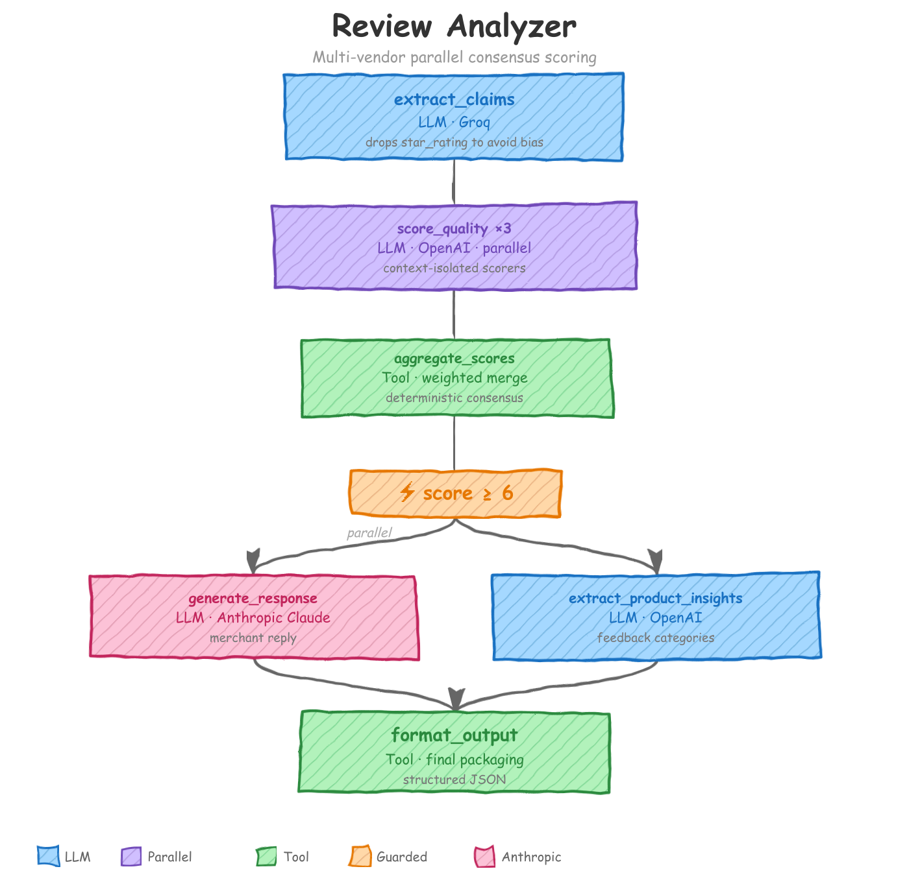

# Review Analyzer

Multi-model pipeline that scores product review quality via parallel consensus voting, drafts merchant responses, and extracts product insights -- a context engineering showcase for agac.

<p align="center"></p>

## What You'll Learn

- **Multi-vendor model selection** -- choosing Groq, OpenAI, or Anthropic per action based on the task's cost/quality tradeoff
- **Parallel consensus voting** -- running 3 independent scorer versions with context isolation so no scorer can anchor on another
- **Guard-based conditional execution** -- skipping expensive LLM calls for records that fail a quality threshold
- **Progressive context disclosure** -- using `observe`, `drop`, and `passthrough` to control exactly which fields each action sees
- **Seed data injection** -- loading a shared evaluation rubric from JSON so scoring criteria live outside prompts
- **Version consumption with merge pattern** -- fanning out to 3 parallel versions and deterministically merging them back

## The Problem

E-commerce platforms receive thousands of product reviews daily. Most are low quality -- vague praise, single-sentence complaints, or suspected fakes. Merchants need a system that (1) objectively scores review quality without being biased by the reviewer's star rating, (2) generates thoughtful merchant responses only for reviews worth responding to, and (3) extracts structured product insights for the product team. This pipeline solves all three with minimal token waste.

## How It Works

### 1. extract_claims

**Model**: Groq (`llama-3.1-8b-instant`) -- fast and cheap, because extraction doesn't need expensive reasoning.

Pulls factual claims, product aspects, and sentiment signals from the raw review text. The critical design decision is the `drop` directive on `star_rating`:

```yaml
context_scope:
  observe:
    - source.review_text
    - source.review_title
    - source.product_name
    - source.product_category
  drop:
    - source.star_rating          # Excluded: avoid anchoring bias
    - source.verified_purchase
  passthrough:
    - source.review_id            # Flows to output, zero tokens
    - source.reviewer_name
    - source.review_date
    - source.product_name
    - source.product_category
```

If the LLM sees a 5-star rating, it unconsciously biases extraction toward positive framing. Dropping `star_rating` forces the model to work from the text alone. `passthrough` fields like `review_id` flow into the output record without ever entering the LLM's context window. Zero tokens, zero cost -- but the data is preserved for downstream actions.

### 2. score_quality (x3 parallel)

**Model**: Ollama (`llama3.2:latest`) -- parallel voting compensates for the weaker model, keeping cost near zero.

Three independent scorers evaluate each review against the same rubric. The entire fan-out is two lines of YAML:

```yaml
versions:
  param: scorer_id
  range: [1, 2, 3]
  mode: parallel
```

Each scorer is context-isolated -- it sees the extracted claims and the seed rubric, but never another scorer's output. That prevents herding (scorer 2 anchoring on scorer 1's number). The prompt template uses version metadata to shift each scorer's focus:

```
You are quality scorer {{ i }} of {{ version.length }}...


**Your focus**: Prioritize HELPFULNESS.

**Your focus**: Prioritize AUTHENTICITY.

**Your focus**: Prioritize SPECIFICITY.

```

The context scope also continues to drop `star_rating`, keeping the scoring unbiased end to end:

```yaml
context_scope:
  observe:
    - extract_claims.factual_claims
    - extract_claims.product_aspects
    - extract_claims.sentiment_signals
    - source.review_text
    - seed.rubric
  drop:
    - source.star_rating          # Still excluded from scoring
```

### 3. aggregate_scores

**Kind**: Tool (`aggregate_quality_scores`) -- deterministic math, no LLM needed.

Merges the three parallel scorer outputs into a single weighted consensus score via the `version_consumption` directive:

```yaml
kind: tool
impl: aggregate_quality_scores
version_consumption:
  source: score_quality           # Declarative fan-in
  pattern: merge                  #   from parallel versions
context_scope:
  observe:
    - score_quality_1.*
    - score_quality_2.*
    - score_quality_3.*
  passthrough:
    - extract_claims.*
```

Weighted averaging is deterministic -- an LLM would add latency, cost, and the possibility of arithmetic hallucination. The `merge` pattern collects all three versioned outputs (`score_quality_1`, `score_quality_2`, `score_quality_3`) into a single context so the tool function can access them all.

### 4. generate_response

**Model**: OpenAI (`gpt-4o-mini`) -- needs reasoning for nuanced, empathetic merchant replies.

Drafts a professional merchant response, but only for reviews that scored high enough. The guard prevents wasting tokens on junk reviews:

```yaml
guard:
  condition: 'consensus_score >= 6'
  on_false: "filter"              # LLM never fires for junk reviews
```

The context scope is deliberately curated. The response writer sees the original review, extracted claims, and aggregate score -- but NOT the individual scorer reasoning. Clean context, better output:

```yaml
context_scope:
  observe:
    - source.review_text
    - source.review_title
    - extract_claims.factual_claims
    - extract_claims.product_aspects
    - extract_claims.sentiment_signals
    - aggregate_scores.consensus_score
    - aggregate_scores.strengths
    - aggregate_scores.weaknesses
  drop:
    - score_quality.*             # Does NOT see individual scorer reasoning
```

### 5. extract_product_insights

**Model**: OpenAI (`gpt-4o-mini`) -- needs reasoning for structured extraction against known categories.

Classifies actionable feedback into product improvement categories defined in the seed data. Runs in **parallel** with `generate_response` -- both depend only on `aggregate_scores`:

```yaml
dependencies: [aggregate_scores]  # Same as generate_response
guard:
  condition: 'consensus_score >= 6'
  on_false: "filter"
context_scope:
  observe:
    - source.review_text
    - extract_claims.factual_claims
    - extract_claims.product_aspects
    - seed.rubric.product_feedback_categories
```

Notice it reaches into a specific nested field of the seed data (`seed.rubric.product_feedback_categories`) rather than loading the entire rubric. The insights extractor doesn't need scoring weights, so why send them?

### 6. format_output

**Kind**: Tool (`format_analysis_output`) -- deterministic packaging, no LLM needed.

Fans in from both parallel branches (`generate_response` and `extract_product_insights`) and assembles the complete output record:

```yaml
dependencies: [generate_response, extract_product_insights]
kind: tool
impl: format_analysis_output
context_scope:
  observe:
    - generate_response.*
    - extract_product_insights.*
    - extract_claims.*
    - aggregate_scores.*
    - source.*
```

## Key Patterns Explained

### Multi-Vendor Model Selection

Each action uses the model best suited to its task. The workflow sets a default vendor and overrides per action:

```yaml
defaults:
  model_vendor: openai
  model_name: gpt-4o-mini

actions:
  - name: extract_claims
    model_vendor: groq                # Fast, cheap extraction
    model_name: llama-3.1-8b-instant
    api_key: GROQ_API_KEY

  - name: score_quality
    model_vendor: ollama              # Parallel voting compensates for weaker model
    model_name: llama3.2:latest

  - name: generate_response           # Uses default (OpenAI) -- needs reasoning
  - name: extract_product_insights    # Uses default (OpenAI) -- needs reasoning
```

Not every step needs the same model. Extraction is high-volume, low-complexity -- Groq's small Llama handles it at a fraction of the cost. Scoring runs three parallel voters, so the consensus compensates for a weaker local model -- Ollama's Llama 3.2 keeps that cost at zero. Response generation and product insight extraction need reasoning, so they stay on the OpenAI default. Match the model to the task.

### Parallel Consensus Voting

Three independent scorers produce three opinions. None can see the others:

```yaml
- name: score_quality
  versions:
    param: scorer_id
    range: [1, 2, 3]
    mode: parallel

- name: aggregate_scores
  version_consumption:
    source: score_quality
    pattern: merge
```

The `versions` block creates three parallel instances. `merge` in `aggregate_scores` collects all three into a single context for deterministic aggregation. Think of it as an ensemble method: if two out of three scorers flag a review as low quality, the consensus score reflects that regardless of the third.

### Progressive Context Disclosure

Every action gets a precisely scoped context window using three directives:

| Directive     | Effect                                              | Token cost |
|---------------|-----------------------------------------------------|------------|
| `observe`     | Field is included in the LLM context                | Tokens consumed |
| `drop`        | Field is explicitly excluded, even if it exists      | Zero |
| `passthrough` | Field flows to the output record, never enters LLM  | Zero |

Example from `extract_claims`:

```yaml
context_scope:
  observe:
    - source.review_text          # LLM sees this
    - source.product_name         # LLM sees this
  drop:
    - source.star_rating          # LLM never sees this
  passthrough:
    - source.review_id            # Forwarded to output, zero tokens
```

Uncontrolled context is the #1 cause of poor LLM output. Drop `star_rating` and you prevent anchoring bias. Pass through `review_id` and you preserve traceability without burning tokens. Each action's context should be a deliberate editorial decision, not a dump of everything available.

### Guard-Based Conditional Execution

Guards prevent expensive actions from running on records that don't meet a threshold:

```yaml
- name: generate_response
  guard:
    condition: 'consensus_score >= 6'
    on_false: "filter"
```

When `consensus_score` is below 6, the action is skipped entirely. No prompt assembled, no API call, no tokens consumed. The threshold of 6 comes from the seed data (`evaluation_rubric.json`), so business logic stays outside the YAML config.

Both `generate_response` and `extract_product_insights` share the same guard. They run in parallel for records that pass the gate. Records that don't? Both skipped.

### Retry and Reprompt

All LLM actions inherit retry from defaults -- transient API errors (rate limits, timeouts) are retried up to 2 times with backoff:

```yaml
defaults:
  retry:
    enabled: true
    max_attempts: 2
```

`score_quality` also has reprompt validation. If the LLM returns null scores or missing fields, the framework rejects the output and reprompts automatically:

```yaml
reprompt:
  validation: check_required_fields    # Rejects any response with null values
  max_attempts: 2
  on_exhausted: return_last            # Accept best attempt if retries fail
```

The `check_required_fields` UDF in `tools/shared/reprompt_validations.py` is generic -- it checks that no field in the response is null, without hardcoding field names.

## Quick Start

Install the CLI:

```bash
pip install agent-actions-cli
```

Set your environment variables (or copy `.env.sample` to `.env`):

```bash
export OPENAI_API_KEY=...
export GROQ_API_KEY=...
# Ollama must be running locally (no API key needed)
```

Run the agent:

```bash
agac run -a review_analyzer
```

By default the workflow processes 2 records (`record_limit: 2` in the config). Remove or increase that setting to process the full dataset.

Input reviews go in `agent_workflow/review_analyzer/agent_io/staging/reviews.json`. Results appear in `agent_workflow/review_analyzer/agent_io/target/run_results.json`.

## Project Structure

```
review_analyzer/
├── README.md
├── docs/                              # Pipeline diagram
├── agent_actions.yml                     # Top-level config
├── agent_workflow/
│   └── review_analyzer/
│       ├── agent_config/
│       │   └── review_analyzer.yml       # Workflow definition (actions, guards, context)
│       ├── agent_io/
│       │   ├── staging/
│       │   │   └── reviews.json          # Input reviews
│       │   └── target/                   # Output results
│       └── seed_data/
│           └── evaluation_rubric.json    # Scoring rubric and feedback categories
├── prompt_store/
│   └── review_analyzer.md               # All prompt templates
├── schema/
│   └── review_analyzer/
│       ├── extract_claims.yml
│       ├── score_quality.yml
│       ├── aggregate_scores.yml
│       ├── generate_response.yml
│       ├── extract_product_insights.yml
│       └── format_output.yml
└── tools/
    ├── review_analyzer/
    │   ├── aggregate_quality_scores.py
    │   └── format_analysis_output.py
    └── shared/
        └── reprompt_validations.py       # check_required_fields UDF
```
