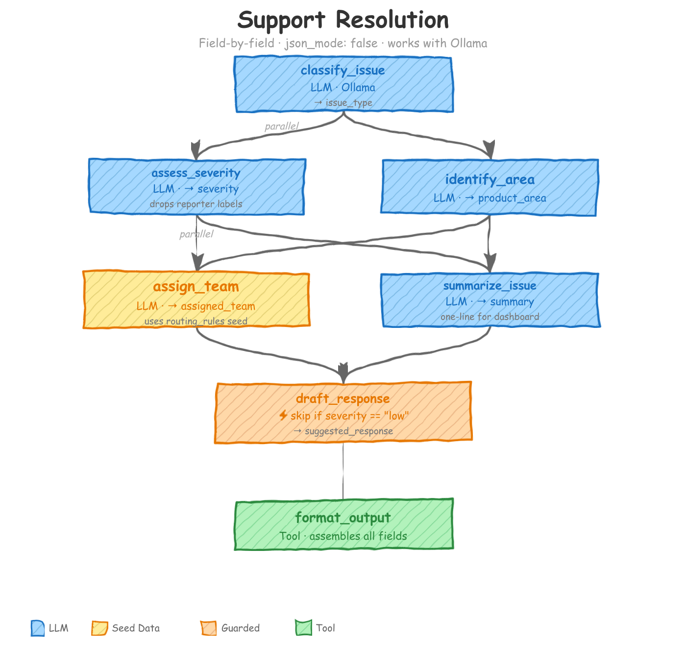

# Support Resolution

<p align="center"></p>

## What You'll Learn

This example teaches you how to build an agent workflow that **skips JSON mode entirely**. Every other example in this repository sets `json_mode: true` and asks the model to produce structured JSON. This one turns that off. Instead, each action asks the model for a single plain-text answer, names that answer with `output_field`, and a final tool action assembles everything into a structured record.

Why does this matter? Small and local models -- the kind you run on your own laptop with Ollama -- often can't produce valid JSON reliably. Decomposing a complex task into steps that each require only one word or one sentence makes the pipeline accessible to *any* model that can follow a simple instruction. You'll learn:

- How `output_field` replaces schema-based extraction when JSON mode is off.
- How to default an entire workflow to a local Ollama model.
- How to use a guard as a cost-control mechanism (skip expensive LLM calls for low-value tickets).
- How to override the model on a single action when one step needs more capability than the rest.
- How seed data (routing rules) works in non-JSON mode.

---

## The Problem

A support team receives tickets with a title, body, labels, and reporter metadata. Each ticket must be triaged: classified by type, assessed for severity, routed to the right team, summarized for a dashboard, and (for non-trivial tickets) given a draft customer response.

A single monolithic prompt that returns a JSON object works fine with GPT-4o or Claude. Smaller models choke on it. The ticket body can be long, the output schema has many fields, and a 3B-parameter model will regularly produce malformed JSON, missing keys, or hallucinated field names.

The fix: break the task into seven narrow steps. Each step receives only the context it needs and produces a single value. The model never juggles multiple fields at once. Even `llama3.2:latest` running locally can answer "classify this ticket into one of five categories" reliably.

---

## How It Works

The workflow has seven actions. They don't all run sequentially -- the DAG allows parallelism where dependencies permit.

### 1. classify_issue (LLM)

Reads the ticket title, body, and labels. Produces a single value for `issue_type` (one of: `bug`, `feature_request`, `question`, `account_issue`, `performance`). Every later step depends on this classification.

### 2. assess_severity (LLM)

Depends on `classify_issue`. Reads the title, body, and the upstream `issue_type`. Produces `severity` (one of: `critical`, `high`, `medium`, `low`). It **drops** `source.labels` to avoid anchoring on the reporter's own priority guess.

### 3. identify_area (LLM) -- parallel with assess_severity

Depends on `classify_issue` but *not* on `assess_severity`, so it runs in parallel with step 2. Produces `product_area` (one of: `authentication`, `api`, `billing`, `reports`, `integrations`, `ui`, `infrastructure`, `documentation`).

### 4. assign_team (LLM)

Depends on both `assess_severity` and `identify_area`. Reads the three upstream fields plus `seed.routing_rules` (a JSON file mapping teams to areas and issue types). Produces `assigned_team`.

### 5. summarize_issue (LLM) -- parallel with assign_team

Also depends on `assess_severity` and `identify_area`, running in parallel with step 4. Produces `summary` -- a single sentence (max 20 words) for the triage dashboard.

### 6. draft_response (LLM, guarded)

Depends on `summarize_issue` and `assign_team`. Produces `suggested_response` -- a short customer-facing reply. If `severity == "low"`, the guard skips this action entirely. The model is never called.

### 7. format_output (Tool)

A Python tool (`package_triage_result`) that collects all upstream `output_field` values and assembles them into a single triage record. No LLM involved. Just deterministic code.

---

## Key Patterns Explained

### Non-JSON Mode + output_field

The defining pattern of this example. In the defaults block:

```yaml
defaults:
  json_mode: false                    # Plain text responses, no JSON required
```

And on every LLM action, instead of pointing to a schema, you name a single field:

```yaml
- name: classify_issue
  intent: "Classify the support ticket into a category"
  output_field: issue_type           # Names the field, no schema needed
  prompt: $support_resolution.Classify_Issue
```

The prompt itself reinforces the contract by ending with a directive like:

```
Answer with the category name only. Nothing else.
```

The model's entire response becomes the value of `issue_type`. No parsing, no JSON extraction, no schema validation. The framework stores the plain-text response under the field name you specified.

Ask a model for ONE thing and even a small model gets it right. Ask for a JSON object with seven fields and small models break.

---

### Local Model Support

The defaults configure Ollama as the model vendor:

```yaml
defaults:
  model_vendor: ollama
  model_name: llama3.2:latest
  api_key: OLLAMA_API_KEY
  run_mode: online                    # Ollama doesn't support batch mode
```

Every action runs against a model on your local machine. No API keys for hosted services needed. The `run_mode: online` setting is required because Ollama doesn't support batch/async request queuing.

The combination of `json_mode: false` and `output_field` is what makes local models viable. A 3B model prompted with "classify this ticket into one of five categories -- answer with the category name only" succeeds nearly every time. The same model prompted with "return a JSON object with fields issue_type, severity, product_area, assigned_team, summary, and suggested_response" fails frequently.

---

### Guard as Cost Control

The `draft_response` action uses a guard to skip execution for low-severity tickets:

```yaml
- name: draft_response
  dependencies: [summarize_issue, assign_team]
  output_field: suggested_response
  guard:
    condition: 'severity != "low"'
    on_false: "skip"
```

When `severity` (produced by `assess_severity` earlier in the pipeline) equals `"low"`, the guard evaluates to false and the action is skipped. The model is never called. The downstream `format_output` tool still runs -- it just receives an empty string for `suggested_response`.

Drafting a customer response is the most token-expensive step (it produces multiple sentences, not a single word). Low-severity tickets like typos don't need a crafted response, so skipping the call saves both latency and compute. On a local Ollama setup, that's time. With a hosted model, that's money.

---

### Per-Action Model Override

The workflow config includes a commented-out override on `draft_response`:

```yaml
- name: draft_response
  # model_vendor: openai              # Override: use a stronger model here
  # model_name: gpt-4o-mini
  # api_key: OPENAI_API_KEY
```

Most of the pipeline runs on a cheap/local model. One action switches to a stronger hosted model. Classification, severity assessment, and area identification are constrained-choice tasks -- a small model handles them well. Drafting a customer-facing response benefits from better fluency and tone.

To activate this, uncomment the three lines and set `OPENAI_API_KEY` in your environment. Every other action continues to use Ollama locally; only `draft_response` calls OpenAI.

---

### Seed Data

The `assign_team` action uses seed data -- a static JSON file loaded into the context:

```yaml
defaults:
  context_scope:
    seed_path:
      routing_rules: $file:routing_rules.json
```

The file `routing_rules.json` maps teams to product areas and issue types:

```json
{
  "teams": {
    "backend": {
      "areas": ["api", "authentication", "infrastructure"],
      "handles": ["bug", "performance"]
    },
    "billing": {
      "areas": ["billing", "account_issue"],
      "handles": ["account_issue", "bug", "question"]
    }
  },
  "escalation": {
    "critical": "Route to backend regardless of area",
    "high": "Route to area-specific team"
  }
}
```

The `assign_team` action observes `seed.routing_rules` in its context scope:

```yaml
- name: assign_team
  context_scope:
    observe:
      - classify_issue.issue_type
      - assess_severity.severity
      - identify_area.product_area
      - seed.routing_rules
```

The model sees the routing rules as part of its prompt context and follows them to pick the right team. Non-JSON mode doesn't matter here -- the model only outputs a team name. The seed data is input, not output.

---

## Quick Start

**Prerequisites**: Python 3.10+, the `agent-actions-cli` package, and (for the default config) [Ollama](https://ollama.ai) running locally with the `llama3.2:latest` model pulled.

1. Install the CLI:

```bash
pip install agent-actions-cli
```

2. Pull the local model (if you haven't already):

```bash
ollama pull llama3.2:latest
```

3. Set environment variables:

```bash
# For the default Ollama setup, no real API key is needed --
# but the variable must exist:
export OLLAMA_API_KEY=ollama

# If you uncomment the per-action OpenAI override on draft_response:
# export OPENAI_API_KEY=sk-...
```

4. Run the workflow:

```bash
agac run -a support_resolution
```

By default the workflow processes 2 records (`record_limit: 2` in the config). Remove or increase that setting to process the full dataset.

The input tickets are in `agent_workflow/support_resolution/agent_io/staging/issues.json`. The pipeline processes each ticket through all seven actions and writes the triage records to the target directory.

---

## Project Structure

```
support_resolution/
├── README.md
├── docs/
├── agent_actions.yml
├── agent_workflow/
│   └── support_resolution/
│       ├── agent_config/
│       │   └── support_resolution.yml
│       ├── agent_io/
│       │   ├── staging/
│       │   │   └── issues.json
│       │   └── target/
│       └── seed_data/
│           └── routing_rules.json
├── prompt_store/
│   └── support_resolution.md
├── schema/
│   └── support_resolution/
│       └── format_output.yml
└── tools/
    └── support_resolution/
        └── package_triage_result.py
```
