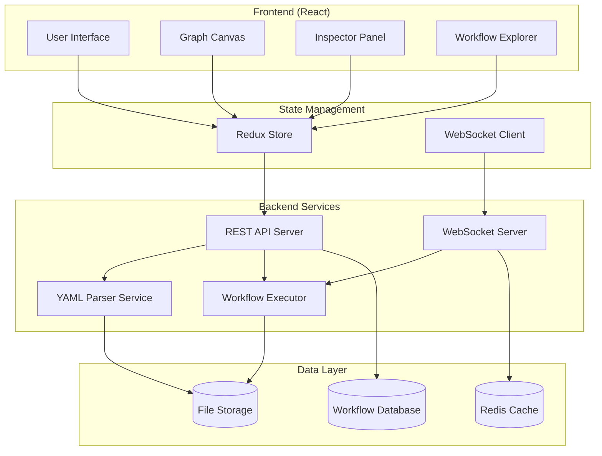

# Design Document

## Overview

The Workflow Visualization Interface is a React-based web application that provides an interactive graph visualization for AI workflow pipelines. The system combines a Figma-style canvas experience with GitHub Actions-like execution monitoring, enabling users to understand, debug, and optimize complex workflow structures.

## Architecture

### High-Level Architecture



### Technology Stack

**Frontend:**
- React 18 with TypeScript
- Redux Toolkit for state management
- React Flow for graph visualization
- Monaco Editor for code editing
- Tailwind CSS for styling
- Framer Motion for animations

**Backend:**
- Node.js with Express
- Socket.io for real-time updates
- PostgreSQL for workflow metadata
- Redis for execution state caching
- Bull Queue for job processing

## Components and Interfaces

### Core Components

#### 1. WorkflowCanvas Component
```typescript
interface WorkflowCanvasProps {
  workflow: WorkflowDefinition;
  executionState?: ExecutionState;
  onNodeSelect: (nodeId: string) => void;
  onNodeEdit: (nodeId: string, changes: Partial<ActionConfig>) => void;
}

interface Node {
  id: string;
  type: 'action' | 'tool';
  position: { x: number; y: number };
  data: {
    label: string;
    intent: string;
    model?: string;
    status: ExecutionStatus;
    metrics?: ExecutionMetrics;
    guards?: GuardCondition[];
  };
}

interface Edge {
  id: string;
  source: string;
  target: string;
  type: 'dependency' | 'data-flow';
  data: {
    dataFields: string[];
    animated: boolean;
  };
}
```

#### 2. InspectorPanel Component
```typescript
interface InspectorPanelProps {
  selectedNode?: Node;
  selectedEdge?: Edge;
  onConfigChange: (config: ActionConfig) => void;
}

interface ActionConfig {
  name: string;
  intent: string;
  model_vendor?: string;
  model_name?: string;
  prompt?: string;
  schema?: JSONSchema;
  context_scope?: ContextScope;
  guards?: GuardCondition[];
}
```

#### 3. WorkflowExplorer Component
```typescript
interface WorkflowExplorerProps {
  workflow: WorkflowDefinition;
  executionHistory: ExecutionRecord[];
  onPhaseToggle: (phaseId: string) => void;
  onNodeFilter: (filter: NodeFilter) => void;
}

interface WorkflowPhase {
  id: string;
  name: string;
  description: string;
  actions: string[];
  collapsed: boolean;
}
```

#### 4. ExecutionControls Component
```typescript
interface ExecutionControlsProps {
  workflow: WorkflowDefinition;
  currentExecution?: ExecutionState;
  onStart: (config: ExecutionConfig) => void;
  onPause: () => void;
  onStop: () => void;
  onRetry: (nodeId: string) => void;
}

interface ExecutionConfig {
  startFromNode?: string;
  skipNodes?: string[];
  inputOverrides?: Record<string, any>;
}
```

### Data Models

#### WorkflowDefinition
```typescript
interface WorkflowDefinition {
  name: string;
  description: string;
  version: string;
  defaults: WorkflowDefaults;
  actions: ActionDefinition[];
  plan: string[];
  metadata?: {
    phases: WorkflowPhase[];
    layout: LayoutConfig;
  };
}

interface ActionDefinition {
  name: string;
  kind?: 'llm' | 'tool';
  intent: string;
  model_vendor?: string;
  model_name?: string;
  api_key?: string;
  schema?: JSONSchema;
  prompt?: string;
  context_scope?: ContextScope;
  dependencies?: string[];
  guard?: GuardCondition;
  granularity?: 'file' | 'record';
}
```

#### ExecutionState
```typescript
interface ExecutionState {
  id: string;
  workflowId: string;
  status: 'pending' | 'running' | 'completed' | 'failed' | 'paused';
  startTime: Date;
  endTime?: Date;
  currentNode?: string;
  nodeStates: Record<string, NodeExecutionState>;
  metrics: ExecutionMetrics;
}

interface NodeExecutionState {
  status: 'pending' | 'running' | 'completed' | 'failed' | 'skipped';
  startTime?: Date;
  endTime?: Date;
  inputRecords?: number;
  outputRecords?: number;
  duration?: number;
  cost?: number;
  error?: string;
}
```

### API Interfaces

#### REST API Endpoints
```typescript
// Workflow Management
GET    /api/workflows                    // List all workflows
GET    /api/workflows/:id               // Get workflow definition
POST   /api/workflows                   // Create new workflow
PUT    /api/workflows/:id               // Update workflow
DELETE /api/workflows/:id               // Delete workflow

// Execution Management
POST   /api/workflows/:id/execute       // Start execution
GET    /api/executions/:id              // Get execution state
POST   /api/executions/:id/pause        // Pause execution
POST   /api/executions/:id/resume       // Resume execution
POST   /api/executions/:id/stop         // Stop execution
POST   /api/executions/:id/retry/:node  // Retry specific node

// Analytics
GET    /api/workflows/:id/analytics     // Get workflow analytics
GET    /api/executions/:id/metrics      // Get execution metrics
GET    /api/workflows/:id/history       // Get execution history
```

#### WebSocket Events
```typescript
// Client -> Server
interface ClientEvents {
  'join-workflow': { workflowId: string };
  'leave-workflow': { workflowId: string };
  'subscribe-execution': { executionId: string };
}

// Server -> Client
interface ServerEvents {
  'execution-started': { executionId: string; workflowId: string };
  'node-status-changed': { executionId: string; nodeId: string; status: NodeExecutionState };
  'execution-completed': { executionId: string; metrics: ExecutionMetrics };
  'execution-failed': { executionId: string; error: string };
  'data-flow': { executionId: string; fromNode: string; toNode: string; recordCount: number };
}
```

## Error Handling

### Frontend Error Boundaries
- Canvas rendering errors with fallback UI
- Inspector panel validation errors with inline feedback
- Network connectivity issues with retry mechanisms
- WebSocket disconnection handling with automatic reconnection

### Backend Error Handling
- YAML parsing errors with detailed validation messages
- Workflow execution failures with node-level error isolation
- Database connection failures with graceful degradation
- Rate limiting for API endpoints with proper HTTP status codes

### User Experience
- Loading states for all async operations
- Optimistic updates with rollback on failure
- Toast notifications for user actions
- Progress indicators for long-running operations

## Testing Strategy

### Unit Testing
- Component testing with React Testing Library
- Redux store testing with mock actions
- API endpoint testing with supertest
- Utility function testing with Jest

### Integration Testing
- End-to-end workflow execution testing
- WebSocket communication testing
- Database integration testing
- File system operations testing

### Performance Testing
- Large workflow rendering performance
- Real-time update performance with many concurrent users
- Memory usage testing for long-running executions
- API response time testing under load

### Accessibility Testing
- Keyboard navigation for all interactive elements
- Screen reader compatibility for graph elements
- Color contrast validation for status indicators
- Focus management for modal dialogs and panels

## Security Considerations

### Authentication & Authorization
- JWT-based authentication for API access
- Role-based access control for workflow operations
- API key management for external service integrations
- Session management with secure cookie handling

### Data Protection
- Input sanitization for all user-provided data
- SQL injection prevention with parameterized queries
- XSS protection with content security policies
- Secure file upload handling with type validation

### Infrastructure Security
- HTTPS enforcement for all communications
- WebSocket connection security with origin validation
- Rate limiting to prevent abuse
- Audit logging for all workflow modifications

## Performance Optimization

### Frontend Optimization
- Virtual scrolling for large node lists
- Canvas viewport culling for off-screen nodes
- Debounced search and filter operations
- Lazy loading of workflow details and history

### Backend Optimization
- Database indexing for workflow queries
- Redis caching for frequently accessed data
- Connection pooling for database operations
- Horizontal scaling with load balancing

### Real-time Updates
- Efficient WebSocket message batching
- Selective updates based on user viewport
- Compression for large data payloads
- Heartbeat mechanism for connection health